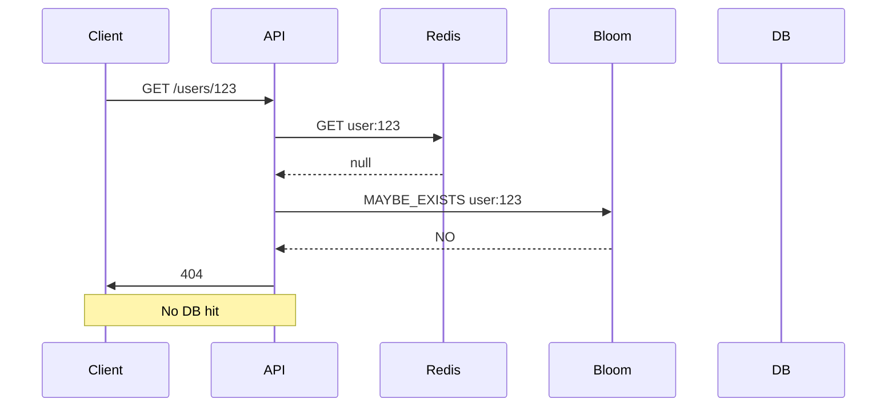

<!-- Generated by Groq via GitHub Actions -->
<!-- Topic ID: T056 -->
<!-- Category: Caching -->
<!-- Generated at UTC: 2026-10-05T21:17:49.842282+00:00 -->

# Cache penetration

## 1. What problem does this solve?

**Motivation**  
When a cache sits in front of a database, the ideal is that most read requests hit the cache.  
Cache penetration happens when a request asks for a key that **does not exist** in the cache **and also does not exist in the backing store**.  
Because the cache cannot answer, the request is forwarded to the database, which then returns “not found”.  
If many clients repeatedly request the same missing key, the database sees a flood of “miss” queries, which defeats the purpose of caching.

**What problem exists**  
- Unnecessary database load for non‑existent data  
- Increased latency for clients (they wait for the DB round‑trip)  
- Potential denial‑of‑service if the pattern is abused (e.g., a bot repeatedly querying random IDs)

**Why the problem matters**  
Databases are expensive resources. A sudden spike in “miss” queries can saturate CPU, I/O, or connection pools, causing slowdowns for legitimate traffic.  
In a distributed system, this can cascade: the cache layer becomes a bottleneck, and the database becomes a single point of failure.

**What happens if this concept is not used**  
- DB thrashing: many “not found” queries  
- Higher latency for clients  
- Increased operational costs (more DB instances, higher CPU usage)  
- Potential outages if the DB cannot keep up

**Where this concept appears in real backend systems**  
- User profile lookups where the user may have been deleted  
- Product catalog queries for discontinued SKUs  
- Session lookups for expired or invalid tokens  
- Any “lookup‑by‑ID” endpoint that may return null

---

## 2. Mental model

**Analogy**  
Imagine a library with a digital catalog (the cache).  
If a patron asks for a book that is not in the catalog **and** does not exist in the library’s physical collection, the librarian has to check the entire collection, which takes time.  
If many patrons ask for the same missing book, the librarian is overwhelmed.  
To avoid this, the library keeps a *“not found”* note in the catalog: “This book does not exist.”  
Future patrons see the note instantly and don’t waste time searching.

**Engineering model**  
- **Cache**: fast in‑memory store (Redis, Memcached)  
- **Null cache entry**: a special value (e.g., `null` or a sentinel) stored with a TTL that indicates “this key is known to be missing”  
- **Bloom filter** (optional): probabilistic set that quickly tells if a key *might* exist, reducing unnecessary DB hits

---

## 3. Deep explanation

| Term | Meaning |
|------|---------|
| **Cache miss** | Requested key not found in cache |
| **Cache penetration** | Repeated cache misses for keys that are absent in the backing store |
| **Null caching** | Storing a placeholder for missing keys to avoid repeated DB lookups |
| **Bloom filter** | Probabilistic data structure that can say “probably not present” with a small false‑positive rate |
| **TTL (time‑to‑live)** | Expiration time for cache entries |

### Internals
1. Client requests key `K`.  
2. Cache lookup: if `K` exists → hit.  
3. If `K` is missing → cache miss.  
4. Application queries DB for `K`.  
5. DB returns either data or “not found”.  
6. Application stores result in cache:  
   - If data → normal cache entry.  
   - If “not found” → store a null placeholder with a short TTL.

### Trade‑offs
| Approach | Pros | Cons |
|----------|------|------|
| **Null caching** | Reduces DB load, simple to implement | Uses cache memory for nulls, risk of stale nulls if data is added later |
| **Bloom filter** | Very low memory, fast membership test | False positives cause unnecessary DB hits; needs periodic rebuild |
| **No protection** | Zero overhead | DB thrashing, potential DoS |

### Failure modes
- **Stale null**: If a record is inserted after a null cache entry expires, the next request will hit the DB again.  
- **Race condition**: Two concurrent requests for a missing key may both miss the cache and hit the DB simultaneously, creating duplicate DB load.  
- **Cache eviction**: If the null entry is evicted before the TTL, the next request will again hit the DB.

### Limitations
- Only mitigates *misses* for non‑existent keys; does not help with hot data or cache evictions.  
- Requires careful TTL tuning: too short → wasted DB hits; too long → wasted memory.

### Where it fits
- **Cache layer**: sits between application and DB.  
- **Cache strategy**: part of read‑through or write‑through patterns.  
- **Interaction**: works with cache warming, eviction policies, and consistency models.

### Interaction with related concepts
- **Cache warming**: pre‑populate cache with known hot data; cache penetration is orthogonal.  
- **Cache invalidation**: null entries may need to be invalidated when data is inserted.  
- **Rate limiting**: can be combined to protect DB from bursty miss traffic.

---

## 4. How it works

1. **Client** requests resource `GET /users/:id`.  
2. **API** checks Redis for key `user:{id}`.  
3. **Cache hit** → return cached user JSON.  
4. **Cache miss** → check Bloom filter (optional).  
   - If Bloom filter says “probably exists”, proceed to DB.  
   - If Bloom filter says “definitely not”, skip DB and return 404 immediately.  
5. **DB query** for user.  
6. **DB result**  
   - If user found → cache `user:{id}` with TTL, return data.  
   - If not found → cache `user:{id}` with a *null* placeholder and short TTL, return 404.  
7. **Subsequent requests** for same missing ID hit the null cache entry and return 404 instantly.



---

## 5. Practical implementation

### TypeScript/Node.js example with Redis

```ts
// src/cache.ts
import { createClient } from 'redis';
import { promisify } from 'util';

const redis = createClient(); // default localhost:6379
redis.on('error', console.error);

export const getAsync = promisify(redis.get).bind(redis);
export const setAsync = promisify(redis.set).bind(redis);
export const expireAsync = promisify(redis.expire).bind(redis);
```

```ts
// src/userService.ts
import { getAsync, setAsync, expireAsync } from './cache';
import { getUserFromDB } from './db'; // pretend async fn

const NULL_TTL = 60; // 1 minute for missing users
const USER_TTL = 3600; // 1 hour for real users

export async function getUser(id: string) {
  const cacheKey = `user:${id}`;

  // 1. Try cache
  const cached = await getAsync(cacheKey);
  if (cached !== null) {
    // Cached value could be a JSON string or a sentinel "NULL"
    if (cached === 'NULL') return null;
    return JSON.parse(cached);
  }

  // 2. Cache miss → DB lookup
  const user = await getUserFromDB(id);

  if (user) {
    // 3a. Cache real data
    await setAsync(cacheKey, JSON.stringify(user));
    await expireAsync(cacheKey, USER_TTL);
    return user;
  } else {
    // 3b. Cache null placeholder
    await setAsync(cacheKey, 'NULL');
    await expireAsync(cacheKey, NULL_TTL);
    return null;
  }
}
```

```ts
// src/server.ts
import express from 'express';
import { getUser } from './userService';

const app = express();

app.get('/users/:id', async (req, res) => {
  const user = await getUser(req.params.id);
  if (!user) return res.status(404).json({ error: 'User not found' });
  res.json(user);
});

app.listen(3000, () => console.log('API listening on :3000'));
```

**Key lines explained**

- `await getAsync(cacheKey)` – fast lookup in Redis.  
- `if (cached === 'NULL')` – sentinel value indicating known absence.  
- `await setAsync(cacheKey, 'NULL')` – store null placeholder.  
- `NULL_TTL` – short TTL to keep memory usage low but still protect against bursty miss traffic.

---

## 6. Production considerations

| Concern | How to address |
|---------|----------------|
| **Scalability** | Use a distributed Redis cluster or Redis‑Cluster mode; keep TTLs short to free memory. |
| **Reliability** | Fallback to DB if Redis is down; use a circuit breaker. |
| **Security** | Encrypt Redis traffic (TLS) if cross‑region; restrict IP access. |
| **Observability** | Instrument cache hit/miss ratios, null cache hits, and Bloom filter stats. |
| **Performance** | Benchmark TTLs; monitor memory usage; use `EXPIRE` instead of `SETEX` for separate TTL logic. |
| **Error handling** | Gracefully handle Redis errors; retry with exponential backoff. |
| **Resource usage** | Null entries consume memory; tune `NULL_TTL` to balance memory vs DB load. |
| **Operational concerns** | Automate Redis scaling; monitor eviction rates; set up alerts for high miss rates. |
| **Failure recovery** | If Redis fails, allow DB to serve directly; once Redis recovers, repopulate cache. |
| **Deployment** | Use Docker Compose or Kubernetes with Redis StatefulSet; keep config in ConfigMaps/Secrets. |

---

## 7. Common mistakes

| Mistake | Why it’s problematic |
|---------|----------------------|
| **No null caching** | Every miss hits the DB → DB thrashing. |
| **Too long NULL_TTL** | Wastes memory; stale nulls block new data from being cached. |
| **Using `null` as cache value** | Redis treats `null` as key deletion; need sentinel string. |
| **Ignoring race conditions** | Two concurrent misses can both hit DB, doubling load. |
| **Bloom filter false positives** | Causes unnecessary DB hits; tune `p` parameter. |
| **Not invalidating nulls on data creation** | New records may never be cached if null placeholder still exists. |
| **Hard‑coding TTLs** | Different data types need different TTLs; one size fits all is suboptimal. |
| **Not monitoring cache metrics** | Misses go unnoticed, leading to silent performance degradation. |

---

## 8. Senior engineer perspective

### What changes at scale?

- **Architecture decisions**  
  - Choose a *distributed* cache (Redis‑Cluster, Amazon ElastiCache) to avoid single‑point bottlenecks.  
  - Decide whether to use a Bloom filter; evaluate memory vs false‑positive trade‑off.  
  - Consider *multi‑region* cache for global latency.

- **Trade‑offs**  
  - Null caching vs Bloom filter: Bloom filter saves memory but introduces false positives; null caching is deterministic but consumes memory.  
  - Short TTLs reduce memory but increase DB load; long TTLs reduce DB load but risk stale nulls.

- **Bottlenecks**  
  - Cache eviction policy (LRU vs LFU) can evict nulls prematurely.  
  - Network latency to cache can dominate if cache is remote.

- **Failure scenarios**  
  - Cache partitioning: ensure graceful degradation.  
  - Cache warm‑up after restart: pre‑populate hot keys.

- **Monitoring**  
  - Cache hit/miss ratio, null cache hit ratio, eviction count, latency distribution.  
  - Alert on spike in DB “not found” queries.

- **Cost/performance**  
  - Memory cost of null entries vs savings on DB queries.  
  - Evaluate whether the cost of a larger cache outweighs DB scaling.

- **When NOT to use**  
  - If your workload has *no* missing keys (e.g., all IDs are guaranteed to exist).  
  - If the cache is already saturated and adding nulls would worsen memory pressure.  
  - If the DB is cheap and can handle occasional miss traffic (e.g., small micro‑service).

---

## 9. Interview questions

1. **Beginner** – *What is cache penetration and why does it matter?*  
   *Answer:* Repeated cache misses for non‑existent keys cause unnecessary DB load, increasing latency and cost.

2. **Beginner** – *How can you mitigate cache penetration in a simple key‑value cache?*  
   *Answer:* Store a sentinel value (e.g., `"NULL"`) for missing keys with a short TTL (null caching).

3. **Senior** – *Explain the trade‑offs between using a Bloom filter versus null caching for cache penetration.*  
   *Answer:* Bloom filter uses little memory but can give false positives, causing DB hits; null caching guarantees no DB hit but consumes cache memory and can become stale.

4. **Senior** – *Describe a scenario where null caching could lead to a data consistency problem and how you would solve it.*  
   *Answer:* If a user is created after a null cache entry expires, the next request will hit the DB again. Solution: set a short TTL or invalidate the null entry when a new record is inserted.

5. **Scenario/Debugging** – *Your service shows a sudden spike in DB “not found” queries, but cache hit ratio is unchanged. What could be happening and how would you investigate?*  
   *Answer:* Likely a cache penetration attack or a bug causing many requests for non‑existent keys. Investigate request patterns, check Bloom filter usage, monitor null cache entries, and add rate limiting or stricter validation.

---

## 10. Hands‑on task

**Goal:** Add null caching to the existing `/users/:id` endpoint in the repository.

1. Clone the repo and run `npm install`.  
2. Implement the `getUser` function in `src/userService.ts` using the pattern shown above.  
3. Add a new route `/users/:id` that returns 404 if the user is missing.  
4. Write a test that repeatedly requests a non‑existent user ID and verifies that after the first DB hit, subsequent requests hit the cache (you can mock Redis or inspect logs).  
5. Measure the number of DB queries before and after adding null caching.

---

## 11. Quick revision

- Cache penetration = repeated misses for non‑existent keys → DB thrashing.  
- Null caching: store a sentinel (e.g., `"NULL"`) with a short TTL.  
- Bloom filter: probabilistic “might exist” check; saves memory but can cause false positives.  
- Null cache TTL: balance memory vs DB load.  
- Race condition: two concurrent misses → both hit DB; mitigate with locking or atomic set.  
- Cache hit/miss ratio + null hit ratio are key metrics.  
- In production, use a distributed cache, monitor eviction, and handle cache failures gracefully.  
- Avoid null caching if data is always present or cache is already memory‑constrained.  
- Remember to invalidate null entries when data is inserted.  
- Use `EXPIRE` or `SETEX` for TTL; avoid storing `null` directly.  
- Monitor DB “not found” query counts as an indirect indicator of cache penetration.

---

## 12. References

- Redis documentation – [https://redis.io/docs/](https://redis.io/docs/)  
- Node.js Redis client – [https://github.com/redis/node-redis](https://github.com/redis/node-redis)  
- Bloom filter overview – [https://en.wikipedia.org/wiki/Bloom_filter](https://en.wikipedia.org/wiki/Bloom_filter)  
- Redis Bloom module – [https://redis.io/docs/stack/search/](https://redis.io/docs/stack/search/)  
- FastAPI documentation (Python) – [https://fastapi.tiangolo.com/](https://fastapi.tiangolo.com/)  
- PostgreSQL documentation – [https://www.postgresql.org/docs/](https://www.postgresql.org/docs/)  
- MongoDB caching patterns – [https://www.mongodb.com/docs/manual/core/caching/](https://www.mongodb.com/docs/manual/core/caching/)
