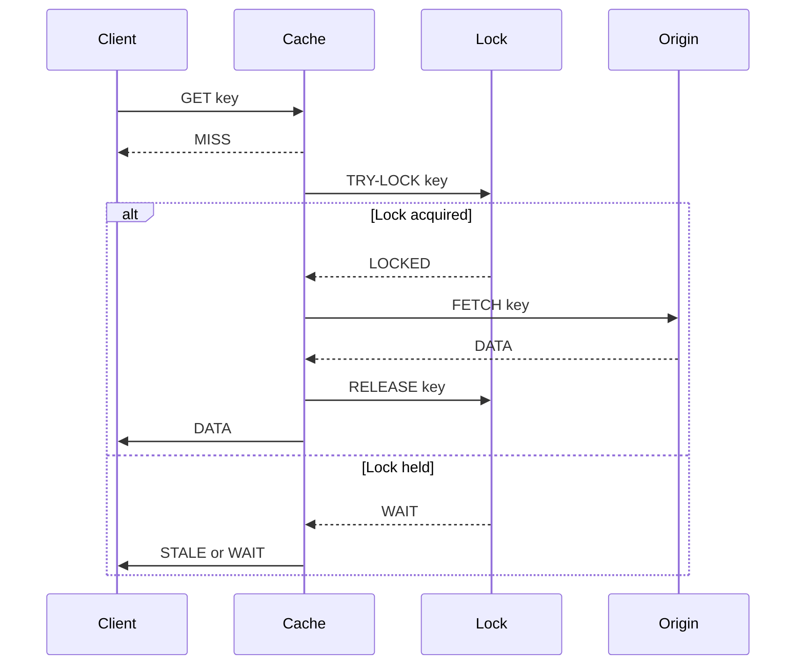

<!-- Generated by Groq via GitHub Actions -->
<!-- Topic ID: T057 -->
<!-- Category: Caching -->
<!-- Generated at UTC: 2026-10-06T07:43:56.662947+00:00 -->

# Cache avalanche

## 1. What problem does this solve?

When a cache entry expires, the next request that hits the cache must fetch the data from the origin (DB, API, etc.) and repopulate the cache. If many requests arrive at the same time for the same key, they all hit the origin concurrently. This can overwhelm the backend, cause cascading failures, and degrade overall system performance.

- **Problem**: A sudden spike of cache misses for the same key.
- **Why it matters**: The origin may not be able to handle the load, leading to timeouts, increased latency, or even service outages.
- **What happens if ignored**: The backend can become a bottleneck, user experience suffers, and the system may need to throttle or shut down.
- **Real‑world appearance**:  
  - A popular product page in an e‑commerce site where the cache expires at midnight.  
  - A leaderboard API that refreshes every 5 minutes.  
  - A microservice that serves user profiles with a 10 s TTL.

## 2. Mental model

**Analogy**: Imagine a library that keeps a copy of a popular book on a shelf (cache). When the copy is removed for repair (expiration), every patron who wants the book must go to the main archive (origin). If 100 patrons arrive at once, they all queue up at the archive, causing a stampede. To avoid this, the library can:

1. **Reserve a spare copy** (pre‑warm the cache).  
2. **Let only one patron fetch** while others wait for the copy to be returned (lock or singleflight).  

**Engineering model**:  
- **Cache entry** → key/value with TTL.  
- **Origin** → database, external API, or computation.  
- **Singleflight / lock** → mechanism that ensures only one request performs the expensive fetch while others wait or use a fallback.

## 3. Deep explanation

### Internals

- **TTL expiration**: Cache entries are invalidated after a time‑to‑live.  
- **Cache miss**: Request must fetch from origin.  
- **Singleflight**: A concurrency primitive that deduplicates in‑flight requests for the same key.  
- **Stale‑while‑revalidate**: Serve stale data while refreshing in the background.

### Important terminology

| Term | Meaning |
|------|---------|
| **Cache miss** | The key is not present or expired. |
| **Cache hit** | The key is present and valid. |
| **TTL** | Time‑to‑live, the duration a cache entry is considered fresh. |
| **Stale** | Data that has expired but may still be served temporarily. |
| **Singleflight** | Ensures only one goroutine (or async task) performs a given operation. |
| **Back‑off** | Gradually increasing wait times before retrying. |

### Trade‑offs

| Approach | Pros | Cons |
|----------|------|------|
| **No mitigation** | Simplicity | Risk of overload. |
| **Pre‑warm** | Reduces miss spikes | Extra compute, may serve stale data. |
| **Singleflight** | Prevents stampede | Adds latency for waiting requests. |
| **Stale‑while‑revalidate** | Faster response | Serves potentially stale data. |
| **Rate limiting** | Protects origin | May increase latency for legitimate traffic. |

### Failure modes

- **Deadlock**: If the lock is never released (e.g., crash during fetch).  
- **Cache poisoning**: Malicious requests could fill the cache with bad data.  
- **Cold start**: First request after deployment may hit a stampede.

### Limitations

- **Distributed locks**: In a multi‑node environment, a singleflight must be coordinated across nodes (e.g., Redis `SETNX`).  
- **Memory pressure**: Pre‑warming many keys can consume cache memory.  
- **Complexity**: Adding singleflight logic increases code complexity.

### Where it fits

- **Cache layer**: Redis, Memcached, in‑memory.  
- **API gateway**: Handles request routing and can enforce singleflight.  
- **Microservice**: Each service can implement its own singleflight logic.

### Interaction with related concepts

- **Cache invalidation**: Proper TTL or explicit invalidation prevents stale data.  
- **Rate limiting**: Works alongside singleflight to protect the origin.  
- **Circuit breaker**: Fallbacks when origin is down.  
- **Observability**: Metrics on cache hit/miss, lock contention, and latency.

## 4. How it works

1. **Request arrives** → Check cache for key.  
2. **Cache hit** → Return value.  
3. **Cache miss** → Attempt to acquire a lock for the key.  
4. **Lock acquired** → Fetch from origin, store in cache, release lock.  
5. **Lock not acquired** → Wait for lock release or serve stale data if allowed.  
6. **Return result** → Either fresh data or stale fallback.



## 5. Practical implementation

### TypeScript/Node.js example with Redis and `async-mutex`

```ts
import { createClient } from 'redis';
import { Mutex } from 'async-mutex';

const redis = createClient();
await redis.connect();

// A map of mutexes per key to avoid creating many mutexes
const mutexes = new Map<string, Mutex>();

async function getWithCache(key: string, ttl: number): Promise<string> {
  // 1. Try cache
  const cached = await redis.get(key);
  if (cached) return cached;

  // 2. Get or create mutex for this key
  let mutex = mutexes.get(key);
  if (!mutex) {
    mutex = new Mutex();
    mutexes.set(key, mutex);
  }

  // 3. Acquire lock
  return await mutex.runExclusive(async () => {
    // Double‑check cache after acquiring lock
    const cachedAfterLock = await redis.get(key);
    if (cachedAfterLock) return cachedAfterLock;

    // 4. Fetch from origin (simulate DB call)
    const data = await fetchFromOrigin(key);

    // 5. Store in cache
    await redis.set(key, data, {
      EX: ttl, // seconds
    });

    return data;
  });
}

// Simulated origin fetch
async function fetchFromOrigin(key: string): Promise<string> {
  // Replace with real DB/API call
  await new Promise(r => setTimeout(r, 200)); // 200ms latency
  return `data-for-${key}`;
}
```

**Key points**

- `Mutex` from `async-mutex` ensures only one request per key fetches from origin.  
- Double‑check after acquiring the lock to avoid race conditions.  
- TTL is set on the cache entry.  
- The map of mutexes is a simple in‑process lock; in a distributed system use Redis `SETNX` or a library like `redlock`.

### Distributed lock example with Redis `SETNX`

```ts
async function getWithRedisLock(key: string, ttl: number): Promise<string> {
  const lockKey = `lock:${key}`;
  const lockValue = Date.now() + 5000; // 5s lock

  // Try to acquire lock
  const acquired = await redis.set(lockKey, lockValue, {
    NX: true,
    PX: 5000, // 5s
  });

  if (acquired) {
    try {
      // Fetch and cache
      const data = await fetchFromOrigin(key);
      await redis.set(key, data, { EX: ttl });
      return data;
    } finally {
      await redis.del(lockKey);
    }
  } else {
    // Wait for lock to be released or fallback to stale
    await new Promise(r => setTimeout(r, 50));
    return await getWithRedisLock(key, ttl); // retry
  }
}
```

## 6. Production considerations

| Concern | How to address |
|---------|----------------|
| **Scalability** | Use distributed locks (Redis, etcd) to coordinate across nodes. |
| **Reliability** | Fallback to stale data or circuit breaker if lock acquisition fails. |
| **Security** | Ensure lock keys are namespaced; avoid leaking sensitive data in cache. |
| **Observability** | Metrics: cache hit/miss ratio, lock contention time, number of retries. |
| **Performance** | Keep lock TTL short; use async/await to avoid blocking event loop. |
| **Error handling** | Release lock in `finally`; retry with exponential back‑off. |
| **Resource usage** | Limit number of concurrent locks; clean up mutex map. |
| **Operational concerns** | Monitor Redis memory, eviction policy, and latency. |
| **Failure recovery** | If origin fails, serve stale or return error; do not block all traffic. |
| **Deployment** | Use feature flags to enable singleflight gradually; test under load. |

## 7. Common mistakes

| Mistake | Why it’s problematic |
|---------|----------------------|
| **No lock, just cache miss** | Causes stampede, overloads origin. |
| **Long lock TTL** | Locks may never release if fetch hangs, blocking all requests. |
| **Ignoring stale data** | Serving stale data can mislead users; need clear policy. |
| **Per‑request mutex creation** | Creates many mutexes, memory leak. |
| **Not handling lock acquisition failure** | Leads to infinite retry loops or deadlocks. |
| **Using in‑process lock in multi‑node** | Only protects a single instance; other nodes still stampede. |
| **Over‑caching** | Cache too many keys, evicting useful data. |
| **Not measuring metrics** | Hard to detect lock contention or cache performance issues. |

## 8. Senior engineer perspective

### What changes at scale?

- **Distributed coordination**: Must use a shared lock service (Redis, etcd, Consul).  
- **Cache partitioning**: Shard Redis to handle high key volume.  
- **Back‑pressure**: Combine singleflight with rate limiting or a token bucket.  
- **Observability**: Dashboards for lock contention, cache hit ratios, and origin latency.  
- **Failover**: If Redis goes down, fallback to direct DB access or a secondary cache.  
- **Cost**: Extra Redis memory for locks, potential increased latency.  
- **Security**: Ensure lock keys are not guessable; use proper authentication.

### Design decisions

| Decision | Trade‑offs |
|----------|------------|
| **Singleflight vs. Stale‑while‑revalidate** | Singleflight reduces origin load but increases latency for waiting requests; stale‑while‑revalidate improves latency but may serve outdated data. |
| **Lock granularity** | Key‑level locks reduce contention but increase lock count; global lock is simpler but can become a bottleneck. |
| **Lock mechanism** | Redis `SETNX` is simple but may suffer from network latency; distributed consensus (etcd) offers stronger guarantees but higher overhead. |
| **Cache eviction policy** | LRU vs. LFU vs. TTL; choose based on access patterns. |
| **Monitoring** | Add metrics for lock acquisition time, cache hit/miss, origin latency. |

### When NOT to use

- If the origin can handle the load of concurrent requests (e.g., a cheap microservice).  
- If the data changes rarely and TTL is long; stampede risk is low.  
- If the system is single‑node and lock contention is negligible.

## 9. Interview questions

1. **Beginner**: *What is a cache avalanche and why does it happen?*  
   *Answer*: A cache avalanche occurs when many requests simultaneously hit a cache entry that has just expired, causing a surge of origin requests. It happens because the cache no longer has the data and all requests try to fetch it at once.

2. **Beginner**: *How can you prevent a cache avalanche in a single‑node application?*  
   *Answer*: Use a singleflight pattern (e.g., `sync.Once` in Go, `async-mutex` in Node) so that only one request fetches from the origin while others wait or use stale data.

3. **Senior**: *Describe how you would implement a distributed singleflight mechanism using Redis. What are the pitfalls?*  
   *Answer*: Use `SETNX` to acquire a lock key with a short TTL. The first process sets the lock and fetches the data; others poll or block until the lock is released. Pitfalls: lock expiration may be too short, leading to duplicate fetches; network latency can cause delays; lock cleanup is essential to avoid stale locks.

4. **Senior**: *Explain the trade‑offs between using stale‑while‑revalidate and singleflight for cache avalanche mitigation.*  
   *Answer*: Stale‑while‑revalidate serves stale data immediately, reducing latency but risking data freshness. Singleflight blocks waiting requests, ensuring fresh data but increasing latency for those requests. The choice depends on consistency requirements and user experience.

5. **Scenario/Debugging**: *You notice that after a cache expiry, the origin service is receiving a 5‑fold increase in traffic and starts timing out. What steps would you take to diagnose and fix the issue?*  
   *Answer*:  
   - Check cache hit/miss metrics to confirm the spike.  
   - Inspect lock acquisition logs to see if a singleflight mechanism is in place.  
   - Verify lock TTL and retry logic.  
   - Add a rate limiter or circuit breaker to protect the origin.  
   - Consider pre‑warming or increasing TTL.  
   - Monitor Redis latency and memory usage.

## 10. Hands‑on task

**Task**: Implement a simple Express middleware that protects a route from cache avalanche using Redis distributed locks.

1. Create an Express server with a `/profile/:id` endpoint.  
2. Use Redis to cache user profiles with a 30 s TTL.  
3. On cache miss, acquire a lock `lock:profile:{id}` with a 5 s TTL.  
4. If lock acquired, fetch a fake profile (simulate DB call with `setTimeout`).  
5. Store in cache, release lock, and return response.  
6. If lock not acquired, wait 50 ms and retry up to 3 times.  
7. Log lock acquisition attempts and cache hits/misses.

**Goal**: Observe that after the cache expires, only one request triggers the DB fetch while others wait.

## 11. Quick revision

- Cache avalanche = many concurrent cache misses for the same key.  
- Causes origin overload, latency spikes, possible outages.  
- Mitigations: singleflight, distributed locks, stale‑while‑revalidate, pre‑warm.  
- Singleflight ensures only one fetch per key; others wait or use stale data.  
- Distributed locks use Redis `SETNX` + TTL.  
- Watch for lock TTL too long/short, deadlocks, and stale locks.  
- Monitor hit/miss ratio, lock contention, origin latency.  
- In production, combine with rate limiting and circuit breakers.  
- Use feature flags to roll out gradually.  
- Avoid singleflight in single‑node if origin can handle load.  
- Always clean up locks in `finally` blocks.

## 12. References

- [Redis SETNX command](https://redis.io/commands/setnx/)  
- [Redis Redlock algorithm](https://redis.io/topics/distlock)  
- [Node.js async-mutex](https://github.com/asyncly/async-mutex)  
- [Express.js](https://expressjs.com/)  
- [FastAPI caching patterns](https://fastapi.tiangolo.com/tutorial/caching/)  
- [Go singleflight package](https://pkg.go.dev/golang.org/x/sync/singleflight)  
- [AWS ElastiCache best practices](https://docs.aws.amazon.com/AmazonElastiCache/latest/red-ug/BestPractices.html)
