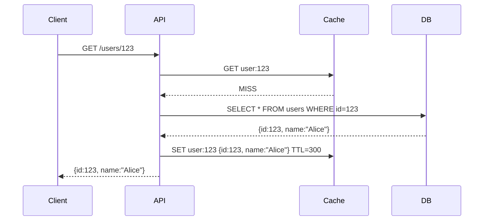

<!-- Generated by Groq via GitHub Actions -->
<!-- Topic ID: T058 -->
<!-- Category: Caching -->
<!-- Generated at UTC: 2026-10-06T07:43:56.662947+00:00 -->

# Distributed caching

## 1. What problem does this solve?

When a backend serves many users, the same data is often read repeatedly (e.g., user profiles, product catalogs, session tokens).  
**Problem**: Each read hits the primary datastore (PostgreSQL, MongoDB, etc.), causing CPU, I/O, and network load.  
**Why it matters**:  
- **Latency**: Database round‑trips add 10‑50 ms per request; with millions of requests, the cumulative delay hurts user experience.  
- **Throughput**: Databases have a finite number of connections and queries per second; heavy read traffic can saturate them, throttling writes and other services.  
- **Cost**: Cloud DB instances scale with IOPS; more traffic means higher bills.  

**What happens if we don’t cache**:  
- Users experience slower pages.  
- The database becomes a bottleneck, potentially causing timeouts or throttling.  
- Scaling becomes expensive and complex.  

**Real‑world appearance**:  
- E‑commerce sites cache product listings.  
- Social media feeds cache user timelines.  
- SaaS dashboards cache aggregated metrics.  
- AI inference services cache model embeddings or pre‑computed results.

---

## 2. Mental model

### Analogy: The Library & the Librarian’s Desk

Imagine a library where every patron must ask a librarian for a book. The librarian fetches the book from the shelf, reads it, and hands it over. If many patrons ask for the same book, the librarian spends a lot of time retrieving it each time.

Now, place a **copy** of the book on a desk near the entrance. Patrons can grab it instantly. The librarian only needs to restock the desk when the copy is missing or outdated.

**Key takeaways**:  
- The *desk* is the cache.  
- The *books* are the data items.  
- The *librarian* is the primary datastore.  
- *Restocking* is cache invalidation or refresh.

### Engineering model

- **Cache nodes**: In-memory data stores (Redis, Memcached, Hazelcast, etc.) distributed across machines.  
- **Key‑value mapping**: Each data item is stored under a unique key.  
- **Cache strategy**: Read‑through, write‑through, write‑back, or cache‑aside.  
- **Consistency model**: Strong, eventual, or stale‑while‑revalidate.  
- **Partitioning**: Data is sharded across nodes (consistent hashing, modulo, etc.).  
- **Replication**: For fault tolerance, each shard may have replicas.  

---

## 3. Deep explanation

### Internals

| Component | Role |
|-----------|------|
| **Client library** (e.g., `ioredis`, `node-cache`) | Handles serialization, connection pooling, retry logic. |
| **Cluster manager** | Maintains node list, health checks, and routing (e.g., Redis Cluster, Consul). |
| **Sharding algorithm** | Maps keys to nodes; consistent hashing minimizes data movement on topology changes. |
| **Replication** | Primary‑secondary or master‑slave setups; ensures high availability. |
| **Eviction policy** | LRU, LFU, TTL, or custom logic to free memory. |

### Important terminology

- **Cache miss**: Requested key not present; fallback to datastore.  
- **Cache hit**: Key found; return immediately.  
- **Cache stampede**: Many concurrent misses for the same key, overwhelming the backend.  
- **Cache coherence**: Ensuring all replicas see the same data.  
- **Cache invalidation**: Explicitly removing or updating stale entries.  
- **Cache warming**: Pre‑loading hot data at startup or during low traffic.  

### Trade‑offs

| Aspect | Trade‑off |
|--------|-----------|
| **Consistency vs. Latency** | Strong consistency (write‑through) adds latency; eventual consistency (cache‑aside) reduces latency but may serve stale data. |
| **Memory vs. Cost** | Larger cache reduces miss rate but increases RAM cost. |
| **Complexity vs. Simplicity** | Distributed cache adds operational overhead (cluster management, monitoring). |
| **Eviction policy** | LRU works for many workloads; LFU better for skewed access patterns. |

### Failure modes

- **Network partitions**: Some nodes become unreachable; clients may get stale or missing data.  
- **Node crashes**: Data loss if not replicated.  
- **Cache corruption**: Corrupted entries can propagate if not validated.  
- **Hot spot**: One key receives disproportionate traffic, exhausting a node’s memory.  

### Limitations

- **Not a replacement for persistence**: Cache is volatile; data must still reside in a durable store.  
- **Limited query capabilities**: Most caches support simple key‑value lookups; complex queries require the database.  
- **Serialization overhead**: Large objects can bloat memory and increase CPU.  

### Where it fits

```
Client --> API Gateway --> Service Layer --> Cache (Redis Cluster) --> DB (PostgreSQL)
```

- **Read‑heavy services**: Cache sits between service and DB.  
- **Write‑heavy services**: Use write‑through or write‑back to keep cache and DB in sync.  
- **Microservices**: Each service may have its own cache or share a cluster.

### Interaction with related concepts

- **Rate limiting**: Cache can store request counters.  
- **Session management**: Store session data in cache for fast access.  
- **CQRS**: Read models can be cached for quick reads.  
- **Event sourcing**: Cache can hold projections.  

---

## 4. How it works

1. **Client request** arrives at the API.  
2. Service checks **cache** for key `user:{id}`.  
3. **Cache hit** → return data.  
4. **Cache miss** → query **database**.  
5. Store result in **cache** with TTL.  
6. Return data to client.  



---

## 5. Practical implementation

### TypeScript/Node.js example with `ioredis`

```ts
// cache.ts
import Redis from 'ioredis';

const redis = new Redis({
  host: process.env.REDIS_HOST ?? 'localhost',
  port: Number(process.env.REDIS_PORT ?? 6379),
  // Cluster mode if you have multiple nodes
  // cluster: true,
});

export default redis;
```

```ts
// userService.ts
import redis from './cache';
import { Pool } from 'pg';

const pool = new Pool({
  connectionString: process.env.DATABASE_URL,
});

export async function getUser(id: string) {
  const cacheKey = `user:${id}`;

  // 1️⃣ Try cache
  const cached = await redis.get(cacheKey);
  if (cached) {
    console.log('Cache hit');
    return JSON.parse(cached);
  }

  console.log('Cache miss, querying DB');
  const res = await pool.query('SELECT id, name, email FROM users WHERE id = $1', [id]);

  if (res.rows.length === 0) throw new Error('User not found');

  const user = res.rows[0];

  // 2️⃣ Store in cache with TTL (5 minutes)
  await redis.set(cacheKey, JSON.stringify(user), 'EX', 300);

  return user;
}
```

#### Notes

- **Serialization**: `JSON.stringify`/`parse` is simple; for binary data use `msgpack`.  
- **TTL**: Prevents stale data; adjust based on update frequency.  
- **Cache invalidation**: After an update, delete or update the key:

```ts
await redis.del(cacheKey); // after UPDATE users SET ... WHERE id=$1
```

- **Cluster**: If using Redis Cluster, `ioredis` automatically routes keys.

---

## 6. Production considerations

| Concern | Recommendation |
|---------|----------------|
| **Scalability** | Use Redis Cluster or Memcached with consistent hashing. Add nodes as traffic grows. |
| **Reliability** | Enable replication (master‑replica). Use sentinel or cluster mode for failover. |
| **Security** | TLS for client‑server traffic. Use ACLs or separate databases per tenant. |
| **Observability** | Export metrics (`hits`, `misses`, `latency`, `memory_usage`). Use Prometheus + Grafana. |
| **Performance** | Keep objects small; avoid storing entire DB rows if not needed. Use binary serialization. |
| **Error handling** | Fallback to DB on cache errors. Log failures. |
| **Resource usage** | Monitor memory; set eviction policy. |
| **Operational** | Automate cluster provisioning (Kubernetes StatefulSet, Helm). |
| **Failure recovery** | On node loss, re‑hashing may move keys; ensure clients can reconnect. |
| **Deployment** | Separate cache tier from application tier. Use environment variables for endpoints. |

---

## 7. Common mistakes

| Mistake | Why it’s problematic |
|---------|----------------------|
| **Storing huge objects** | Increases memory usage, slows GC, and can trigger eviction of useful data. |
| **No TTL** | Stale data persists indefinitely, leading to incorrect responses. |
| **Write‑through without consistency** | Updating DB but forgetting to update cache causes stale reads. |
| **Ignoring cache stampede** | Many concurrent misses hit the DB, defeating the cache’s purpose. |
| **Using a single node** | Bottleneck and single point of failure. |
| **Hard‑coding keys** | Typos or inconsistent naming lead to cache misses. |
| **Over‑optimizing eviction** | Aggressive eviction can remove hot data prematurely. |
| **Not monitoring** | Miss rates, memory pressure, and latency go unnoticed until a crisis. |

---

## 8. Senior engineer perspective

### What changes at scale?

- **Architecture decisions**:  
  - *Cache tier vs. CDN*: For global read traffic, consider edge caches.  
  - *Cache per service vs. shared cluster*: Shared cluster reduces operational overhead but introduces cross‑service contention.  
  - *Data partitioning*: Use consistent hashing to minimize data movement.  

- **Trade‑offs**:  
  - *Strong consistency* (write‑through) vs. *eventual consistency* (cache‑aside).  
  - *Memory cost* vs. *miss rate*.  
  - *Single‑tenant vs. multi‑tenant isolation* in the cache.  

- **Bottlenecks**:  
  - Network latency between services and cache nodes.  
  - Hot keys causing memory pressure on a single node.  

- **Failure scenarios**:  
  - Network partition leading to stale data.  
  - Cache node crash causing data loss if not replicated.  

- **Monitoring**:  
  - Hit/miss ratio, eviction count, replication lag, memory fragmentation.  

- **Cost/performance**:  
  - Cloud managed Redis (e.g., AWS ElastiCache) vs. self‑managed.  
  - Spot instances for cache nodes to reduce cost but risk eviction.  

- **When NOT to use**:  
  - If data changes extremely frequently and you cannot tolerate staleness.  
  - If the data set is too large to fit comfortably in memory.  
  - If the workload is write‑heavy and you cannot keep cache in sync efficiently.

---

## 9. Interview questions

1. **Beginner**: *What is a cache miss and how do you handle it in a typical read‑through cache?*  
   *Answer*: A cache miss occurs when the requested key is not present in the cache. The service queries the primary datastore, stores the result in the cache (often with a TTL), and returns it to the client.

2. **Beginner**: *Explain the difference between write‑through and write‑back caching.*  
   *Answer*: Write‑through writes data to both cache and datastore immediately, ensuring consistency but adding latency. Write‑back writes only to the cache and later persists to the datastore asynchronously, reducing write latency but risking data loss on failure.

3. **Senior**: *Describe how you would prevent a cache stampede when many clients request a missing key concurrently.*  
   *Answer*: Use a locking mechanism (e.g., Redis `SETNX` with a short lock key) so that only one client loads the data from the DB and populates the cache. Others wait or retry after a short delay. Alternatively, use a “cache‑aside” pattern with a short TTL and a “stale‑while‑revalidate” strategy.

4. **Senior**: *How does consistent hashing help in a distributed cache cluster?*  
   *Answer*: Consistent hashing maps keys to nodes such that when nodes are added or removed, only a small fraction of keys need to be remapped. This minimizes data movement, reduces cache warm‑up time, and keeps the system stable.

5. **Scenario/Debugging**: *You notice that after a recent deployment, the cache hit rate dropped from 95% to 60%. What steps would you take to diagnose and fix the issue?*  
   *Answer*:  
   - Verify that the cache keys are still being generated correctly (no typos).  
   - Check if the TTL was inadvertently set to a very low value.  
   - Inspect logs for cache errors or connection failures.  
   - Ensure that the deployment didn’t change the cache client configuration (e.g., host/port).  
   - Look for increased cache evictions or memory pressure.  
   - If the issue persists, roll back the deployment or adjust the cache strategy.

---

## 10. Hands‑on task

**Task**: Implement a *rate‑limit* middleware using Redis that allows a maximum of 100 requests per minute per user ID.

**Steps**:

1. Create a new Node.js project (or use the existing repository).  
2. Install `express`, `ioredis`, and `dotenv`.  
3. Add a `.env` file with `REDIS_URL`.  
4. Write middleware that:
   - Extracts `userId` from the request header.  
   - Uses a Redis key `rl:{userId}` with `INCR` and `EXPIRE`.  
   - Returns `429 Too Many Requests` when the count exceeds 100.  
5. Add a test route `/hello` that returns “Hello”.  
6. Run the server, hit the route 101 times, and observe the 429 response.  

**Bonus**: Add Prometheus metrics for requests per user and rate‑limit hits.

---

## 11. Quick revision

- Cache solves read‑latency and load‑scaling by storing hot data in memory.  
- Cache miss → DB query → cache store → response.  
- Key‑value stores: Redis, Memcached, Hazelcast.  
- Consistent hashing keeps data distribution stable on topology changes.  
- Eviction policies: LRU, LFU, TTL.  
- Cache stampede: lock or “stale‑while‑revalidate” to avoid DB overload.  
- Write‑through guarantees consistency; write‑back reduces latency but risks loss.  
- Monitoring: hit/miss ratio, eviction count, memory usage.  
- Common pitfalls: stale data, large objects, missing TTL, single‑node failure.  
- At scale: consider replication, sharding, CDN integration, and cost‑performance trade‑offs.  

---

## 12. References

- [Redis Documentation – Data Structures](https://redis.io/docs/manual/data-types/)  
- [Redis Cluster Overview](https://redis.io/docs/manual/scaling/)  
- [ioredis GitHub](https://github.com/luin/ioredis)  
- [PostgreSQL Connection Pooling – pg](https://node-postgres.com/features/pooling)  
- [Prometheus – Metrics Exporter for Node.js](https://github.com/siimon/prom-client)  
- [Consistent Hashing – Wikipedia](https://en.wikipedia.org/wiki/Consistent_hashing)  
- [Rate Limiting Patterns – Cloudflare](https://blog.cloudflare.com/implementing-rate-limiting/)  

---
