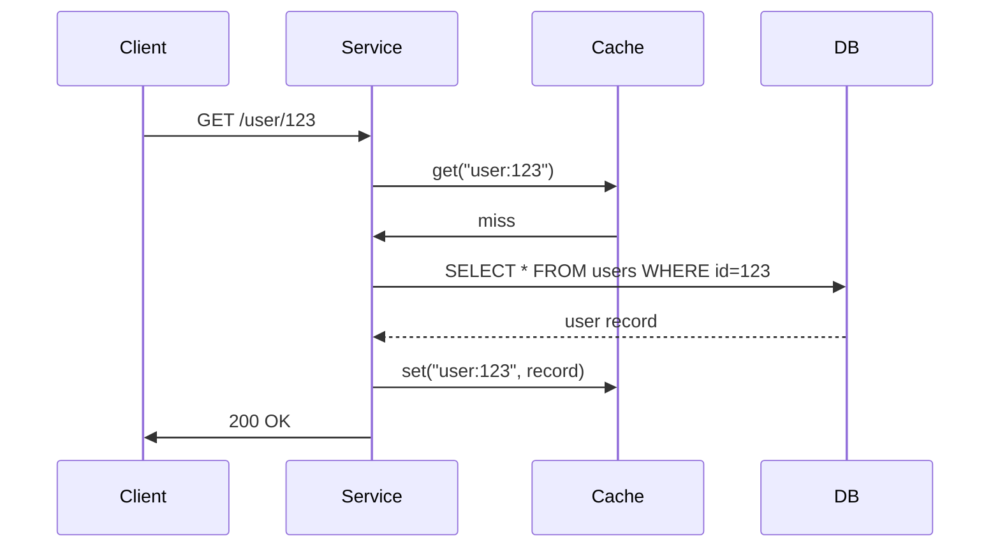
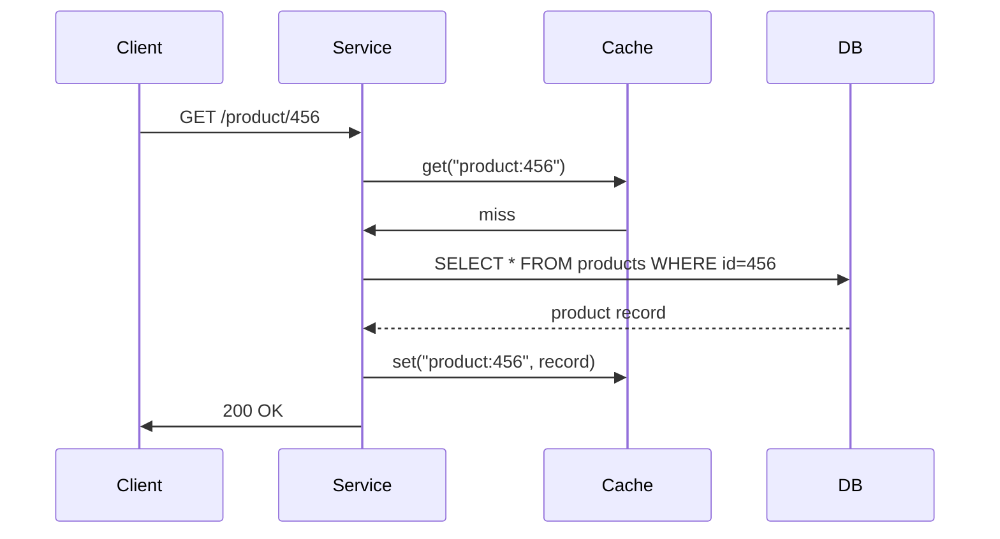

<!-- Generated by Groq via GitHub Actions -->
<!-- Topic ID: T059 -->
<!-- Category: Caching -->
<!-- Generated at UTC: 2026-10-06T18:59:11.869050+00:00 -->

# LRU/LFU

## 1. What problem does this solve?

**Motivation**  
Backends often need to serve the same data repeatedly (e.g., user profiles, product catalogs, AI model embeddings). Fetching that data from a database or recomputing it on every request is expensive in time and resources. Caching keeps a subset of data in fast memory (RAM, Redis, in‑process) so that the most frequently or recently used items can be returned instantly.

**What problem exists?**  
- **Latency spikes** when a cold cache causes a slow DB hit.  
- **Resource contention** when many requests hit the same hot data path.  
- **Cost** of scaling databases or compute to handle peak traffic.

**Why the problem matters**  
- User experience degrades with higher latency.  
- Cloud bill rises with more DB replicas or compute instances.  
- Poor scalability can lead to outages under load.

**What happens if this concept is not used?**  
- Every request may hit the primary store, causing bottlenecks.  
- The system may need to over‑provision resources to stay responsive.  
- Data consistency problems if multiple services recompute or fetch stale data.

**Where this concept appears in real backend systems**  
- **Web frameworks**: Express/Next.js middlewares that cache rendered pages or API responses.  
- **Microservices**: Service‑to‑service calls cached in Redis or in‑process.  
- **AI backends**: Caching embeddings or model inference results.  
- **Databases**: PostgreSQL’s `pg_cache` or MongoDB’s in‑memory storage engine.  
- **CDNs**: Edge caches that implement LRU/LFU to decide which objects to evict.

---

## 2. Mental model

**Analogy**  
Imagine a small coffee shop with a limited number of mugs (cache slots). Customers (requests) ask for coffee (data). The shop keeps the most recently used mugs (LRU) or the most frequently used mugs (LFU) on the counter. When a new mug is needed and the counter is full, the shop discards the mug that was used least recently or least often.

**Engineering model**  
- **Cache** = a key‑value store with a fixed capacity.  
- **Eviction policy** = algorithm that decides which key to remove when the cache is full.  
  - **LRU**: remove the key that was accessed the longest time ago.  
  - **LFU**: remove the key with the lowest access frequency.  
- **Metadata**: each entry stores its last‑access timestamp (LRU) or a counter (LFU).

---

## 3. Deep explanation

### Internals

| Component | Purpose |
|-----------|---------|
| **Hash map** | O(1) lookup of key → value. |
| **Doubly linked list** (LRU) | Maintains order of access; head = most recent, tail = least recent. |
| **Frequency buckets** (LFU) | Each bucket holds keys with the same access count; a min‑heap or linked list tracks the lowest frequency. |
| **Capacity** | Maximum number of entries; triggers eviction. |
| **TTL** | Optional time‑to‑live expiration. |

### Important terminology

- **Hit** – requested key is in cache.  
- **Miss** – requested key is not in cache.  
- **Eviction** – removal of an entry to free space.  
- **Promotion** – moving an entry to a higher frequency bucket (LFU).  
- **Stale** – data that is no longer valid but still in cache.

### Trade‑offs

| Aspect | LRU | LFU |
|--------|-----|-----|
| **Simplicity** | Very simple to implement. | Slightly more complex. |
| **Hot‑spot handling** | Good for bursty traffic. | Better for steady, skewed access patterns. |
| **Memory overhead** | Minimal (list + map). | Extra buckets + counters. |
| **Stale data** | Can evict recently used but stale items. | Can keep frequently accessed stale items. |
| **Implementation cost** | Low. | Higher, but still manageable. |

### Failure modes

- **Cache stampede**: many concurrent misses for the same key cause a DB overload.  
- **Over‑eviction**: aggressive eviction removes items that will be needed soon.  
- **Memory leaks**: forgetting to delete expired entries.  
- **Stale data**: not invalidating after underlying source changes.

### Limitations

- **Size constraints**: only a fraction of data can be cached.  
- **Consistency**: cache may serve stale data unless invalidated.  
- **Distributed coordination**: single‑node cache doesn’t share state across instances.

### Where this concept fits in a backend architecture

```
┌───────────────────────┐
│  Client (Browser/API) │
└─────────────┬─────────┘
              │
              ▼
┌───────────────────────┐
│  API Gateway / Load   │
│  Balancer              │
└─────────────┬─────────┘
              │
              ▼
┌───────────────────────┐
│  Service (Node.js)    │
│  ├─ In‑process Cache   │
│  ├─ Redis (Distributed)│
│  └─ DB (Postgres/Mongo)│
└─────────────────────┬─┘
                        │
                        ▼
┌───────────────────────┐
│  External Services    │
└───────────────────────┘
```

- **In‑process cache**: fastest, but not shared.  
- **Redis**: shared, persists across restarts, supports LRU/LFU.  
- **DB**: source of truth; cache sits in front.

### Interaction with related concepts

- **Cache invalidation**: TTL, write‑through, write‑back.  
- **Consistency models**: eventual vs. strong.  
- **Rate limiting**: can use cache to store request counts.  
- **Distributed tracing**: track cache hits/misses.  
- **Auto‑scaling**: cache size may need to grow with traffic.

---

## 4. How it works

### LRU Flow



### LFU Flow (simplified)



**Eviction step (LRU)**  
1. On miss, check capacity.  
2. If full, remove tail of linked list (least recent).  
3. Delete key from hash map.  
4. Insert new key at head.

**Eviction step (LFU)**  
1. On miss, check capacity.  
2. Find bucket with lowest frequency.  
3. Remove any key from that bucket (often the oldest).  
4. Delete key from map.  
5. Insert new key into frequency‑1 bucket.

---

## 5. Practical implementation

### TypeScript/Node.js – LRU Cache with `lru-cache`

```ts
// lruCache.ts
import LRU from 'lru-cache';

interface User {
  id: number;
  name: string;
  email: string;
}

// 1. Create cache with max 100 entries, 5‑minute TTL
const userCache = new LRU<string, User>({
  max: 100,
  ttl: 1000 * 60 * 5, // 5 minutes
  allowStale: false,
});

// 2. Helper to fetch from DB (mock)
async function fetchUserFromDB(id: number): Promise<User> {
  // Simulate DB latency
  await new Promise((r) => setTimeout(r, 50));
  return { id, name: `User ${id}`, email: `user${id}@example.com` };
}

// 3. Service handler
export async function getUser(id: number): Promise<User> {
  const key = `user:${id}`;

  // Try cache first
  const cached = userCache.get(key);
  if (cached) {
    console.log('Cache hit');
    return cached;
  }

  console.log('Cache miss – fetching from DB');
  const user = await fetchUserFromDB(id);

  // Store in cache
  userCache.set(key, user);
  return user;
}
```

### LFU Cache – custom implementation

```ts
// lfuCache.ts
class LFUCache<K, V> {
  private capacity: number;
  private minFreq: number;
  private keyToVal: Map<K, V>;
  private keyToFreq: Map<K, number>;
  private freqToKeys: Map<number, Set<K>>;

  constructor(capacity: number) {
    this.capacity = capacity;
    this.minFreq = 0;
    this.keyToVal = new Map();
    this.keyToFreq = new Map();
    this.freqToKeys = new Map();
  }

  get(key: K): V | undefined {
    if (!this.keyToVal.has(key)) return undefined;
    const freq = this.keyToFreq.get(key)!;
    this.keyToFreq.set(key, freq + 1);
    this.freqToKeys.get(freq)!.delete(key);

    if (this.freqToKeys.get(freq)!.size === 0) {
      this.freqToKeys.delete(freq);
      if (this.minFreq === freq) this.minFreq++;
    }

    if (!this.freqToKeys.has(freq + 1)) this.freqToKeys.set(freq + 1, new Set());
    this.freqToKeys.get(freq + 1)!.add(key);
    return this.keyToVal.get(key);
  }

  set(key: K, value: V): void {
    if (this.capacity === 0) return;

    if (this.keyToVal.has(key)) {
      this.keyToVal.set(key, value);
      this.get(key); // update freq
      return;
    }

    if (this.keyToVal.size >= this.capacity) {
      const keys = this.freqToKeys.get(this.minFreq)!;
      const evictKey = keys.values().next().value;
      keys.delete(evictKey);
      if (keys.size === 0) this.freqToKeys.delete(this.minFreq);
      this.keyToVal.delete(evictKey);
      this.keyToFreq.delete(evictKey);
    }

    this.keyToVal.set(key, value);
    this.keyToFreq.set(key, 1);
    this.minFreq = 1;
    if (!this.freqToKeys.has(1)) this.freqToKeys.set(1, new Set());
    this.freqToKeys.get(1)!.add(key);
  }
}
```

**Usage**

```ts
const productCache = new LFUCache<string, Product>(200);
```

### Redis – built‑in LRU/LFU

```bash
# redis.conf
maxmemory 256mb
maxmemory-policy allkeys-lru   # or allkeys-lfu
```

```ts
import { createClient } from 'redis';
const client = createClient();
await client.connect();

async function getProduct(id: string) {
  const key = `product:${id}`;
  const cached = await client.get(key);
  if (cached) return JSON.parse(cached);

  const product = await fetchFromDB(id);
  await client.set(key, JSON.stringify(product), {
    EX: 300, // 5 minutes
  });
  return product;
}
```

---

## 6. Production considerations

| Concern | LRU | LFU | Notes |
|---------|-----|-----|-------|
| **Scalability** | In‑process scales with process; Redis scales horizontally via clustering. | Same as LRU. | Use Redis for multi‑instance workloads. |
| **Reliability** | In‑process cache lost on crash. | Same. | Persist to disk or use Redis with persistence. |
| **Security** | Cache may hold sensitive data; enforce encryption at rest if using Redis. | Same. | Use `redis-ssl` or in‑process encryption. |
| **Observability** | Track hit/miss ratios, eviction counts. | Same. | Expose metrics via Prometheus (`node-cache` metrics). |
| **Performance** | O(1) ops; minimal GC overhead. | Slightly higher due to bucket management. | Benchmark under load. |
| **Error handling** | On cache error, fallback to DB. | Same. | Wrap cache calls in try/catch. |
| **Resource usage** | Memory footprint = `capacity * (size of key + value + metadata)`. | Higher due to freq buckets. | Monitor memory, set `maxmemory` in Redis. |
| **Operational concerns** | Eviction policy tuning (`maxmemory-policy`). | Same. | Use `INFO memory` to monitor. |
| **Failure recovery** | On restart, cache warm‑up via background prefetch. | Same. | Use background job to pre‑populate. |
| **Deployment** | Simple to ship with service. | Same. | For Redis, deploy as sidecar or managed service. |

---

## 7. Common mistakes

| Mistake | Why it’s problematic |
|---------|----------------------|
| **Using a very large capacity** | Increases memory usage, GC pressure, and can lead to swapping. |
| **Ignoring TTL** | Cache may serve stale data indefinitely. |
| **Not handling cache errors** | A cache outage can crash the service if not caught. |
| **Using in‑process cache for shared data** | Different instances will have inconsistent views. |
| **Choosing LRU for highly skewed access** | LRU evicts based on recency, not frequency; may evict hot items. |
| **Over‑optimizing with LFU** | Extra complexity may not yield measurable benefits. |
| **Not monitoring hit/miss ratios** | Hard to know if cache is effective. |
| **Storing large objects** | Wastes memory; consider compression or partial caching. |

---

## 8. Senior engineer perspective

### Architecture decisions

- **Cache placement**: in‑process vs. distributed Redis vs. CDN.  
- **Eviction policy**: LRU for bursty traffic, LFU for steady skewed workloads.  
- **Consistency model**: write‑through for strong consistency, write‑back for performance.  
- **Cache invalidation strategy**: TTL, pub/sub, versioning.  

### Trade‑offs

- **Latency vs. memory**: larger cache reduces DB hits but consumes more RAM.  
- **Complexity vs. benefit**: LFU adds overhead; evaluate if benefit outweighs cost.  
- **Cost**: Redis cluster vs. managed service; compute vs. memory pricing.  

### Bottlenecks

- **Hot key**: single key accessed by many requests; can cause DB contention.  
- **Eviction churn**: frequent evictions can degrade performance.  

### Failure scenarios

- **Cache partition**: network split causing stale data.  
- **Cache thrashing**: rapid eviction due to mis‑tuned capacity.  

### Monitoring

- **Metrics**: hit/miss ratio, eviction count, memory usage, latency.  
- **Alerts**: high miss rate, memory pressure, eviction spikes.  

### Cost/performance considerations

- **Memory vs. compute**: sometimes cheaper to add RAM than to scale DB replicas.  
- **Redis persistence**: `RDB` vs. `AOF` trade‑offs.  

### When NOT to use

- **Small, infrequently accessed data**: overhead outweighs benefit.  
- **Highly dynamic data**: frequent updates make cache invalidation hard.  
- **Security‑critical data**: avoid caching unless encrypted and access‑controlled.

---

## 9. Interview questions

1. **Beginner**: *What is the difference between LRU and LFU caching?*  
   - LRU evicts the least recently used item.  
   - LFU evicts the least frequently used item.  

2. **Beginner**: *Why do we need a TTL in a cache?*  
   - To prevent stale data from persisting indefinitely.  

3. **Senior**: *Explain how you would design a distributed cache that supports LRU eviction across multiple nodes.*  
   - Use Redis Cluster with `allkeys-lru` policy, or implement a consistent hashing ring with local LRU per node and a global coordinator.  

4. **Senior**: *What metrics would you monitor for a cache layer, and why?*  
   - Hit/miss ratio, eviction count, memory usage, latency, error rate.  

5. **Scenario/Debugging**: *A service reports a 30 % cache miss rate after a traffic spike, and the DB latency has doubled. What steps would you take to diagnose and fix the issue?*  
   - Check cache capacity and eviction policy.  
   - Inspect hit/miss logs.  
   - Verify TTL and invalidation logic.  
   - Scale cache memory or add nodes.  
   - Consider read‑through or write‑through strategies.  

---

## 10. Hands‑on task

**Task**: Implement an LRU cache for user sessions in a Next.js API route.

1. Create a new Next.js API route `/api/session/[id]`.  
2. Use `lru-cache` to store session objects (id, userId, expiresAt).  
3. On a GET request, return the session if present; otherwise, simulate fetching from a DB and store it in the cache.  
4. Add a `/api/session/clear` endpoint to manually clear the cache.  
5. Expose Prometheus metrics for hit/miss ratio.  

**Goal**: Observe cache behavior under simulated load (e.g., using `wrk` or `ab`).  

---

## 11. Quick revision

- Cache reduces latency by keeping hot data in memory.  
- **LRU** evicts least recently used; **LFU** evicts least frequently used.  
- In‑process cache is fast but not shared; Redis provides distributed caching.  
- Eviction policy must match access patterns.  
- TTL prevents stale data; invalidation strategies vary.  
- Monitor hit/miss ratio, eviction count, memory usage.  
- Handle cache errors gracefully; fallback to DB.  
- LFU adds complexity; evaluate benefit before use.  
- Distributed cache requires careful consistency and partition handling.  
- Use Prometheus metrics for observability.  

---

## 12. References

- [LRU Cache – Wikipedia](https://en.wikipedia.org/wiki/Cache_replacement_policies#Least_recently_used_(LRU))  
- [LFU Cache – Wikipedia](https://en.wikipedia.org/wiki/Cache_replacement_policies#Least_frequently_used_(LFU))  
- [Node.js `lru-cache` package](https://github.com/isaacs/node-lru-cache)  
- [Redis Eviction Policies](https://redis.io/docs/manual/eviction/)  
- [Redis Configuration](https://redis.io/docs/manual/configuration/)  
- [Prometheus Node Exporter](https://prometheus.io/docs/instrumenting/clientlibs/)  
- [Next.js API Routes](https://nextjs.org/docs/api-routes/introduction)  

---
