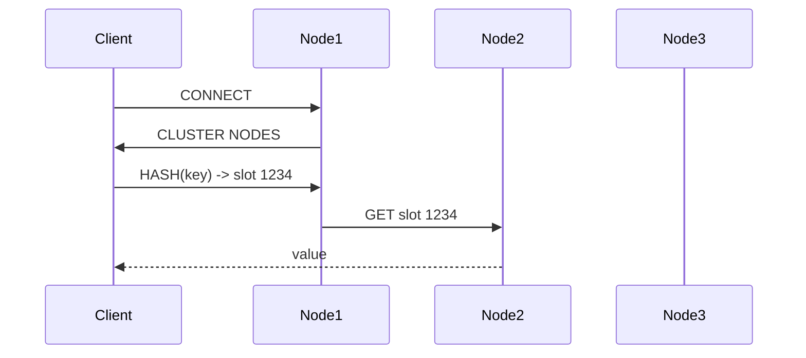

<!-- Generated by Groq via GitHub Actions -->
<!-- Topic ID: T060 -->
<!-- Category: Caching -->
<!-- Generated at UTC: 2026-10-06T18:59:11.869050+00:00 -->

# Redis Cluster

## 1. What problem does this solve?

**Motivation**

When a web service grows, a single Redis instance quickly becomes a bottleneck:

- **Memory limits** – A single node can only hold as much data as its RAM allows.
- **Throughput limits** – All requests hit the same TCP socket, saturating CPU and network.
- **High‑availability** – A crash or network partition brings the entire cache down.

Redis Cluster solves these problems by **sharding** data across multiple nodes and providing **automatic failover**.

**What problem exists**

- A single Redis node cannot scale beyond its memory and I/O capacity.
- A single point of failure means 100 % downtime if the node dies.
- Manual sharding (e.g., consistent hashing in application code) is error‑prone and hard to maintain.

**Why the problem matters**

- Users experience slow responses or timeouts.
- Service availability drops, affecting SLAs.
- Operational overhead rises as you manually manage shards.

**What happens if this concept is not used**

- The cache becomes a bottleneck, forcing you to move to a more expensive database or add custom sharding logic.
- Downtime is higher; recovery is manual.
- Scaling becomes a manual, error‑prone process.

**Where this concept appears in real backend systems**

- Session stores for millions of concurrent users.
- Rate‑limiting counters in API gateways.
- Distributed job queues (e.g., BullMQ).
- Feature flag storage in microservice architectures.
- Caching layers for read‑heavy services (e.g., product catalogs).

---

## 2. Mental model

**Simple analogy**

> Think of a large library that has many shelves. Each shelf holds a subset of books. When a patron asks for a book, the librarian looks up which shelf contains it and fetches it from there. If a shelf is full, the librarian moves some books to a new shelf. If a shelf breaks, the librarian immediately redirects patrons to a backup shelf.

**Engineering model**

- **Cluster nodes** = shelves.
- **Hash slots** = book identifiers (0–16383). Each key is mapped to a slot via CRC16.
- **Key → slot → node** mapping is deterministic.
- **Replication** = backup shelves.
- **Rebalancing** = moving books between shelves when shelves are added/removed.

---

## 3. Deep explanation

### Internals

| Term | Meaning |
|------|---------|
| **Master** | Node that owns a set of hash slots. |
| **Replica** | Read‑only copy of a master. |
| **Hash slot** | Integer 0–16383. All keys map to one slot. |
| **Cluster bus** | Pub/Sub channel for cluster state changes. |
| **Cluster nodes command** | Returns node list, roles, slots. |
| **Cluster slots command** | Returns slot ranges per node. |
| **Slot migration** | Moving a slot’s data from one node to another. |
| **Cluster state** | `ok`, `fail`, or `fail?` (pending). |

### Important terminology

- **Cluster state** – Overall health (`ok` means all masters are reachable).
- **Cluster bus** – Internal messaging for node discovery and slot migrations.
- **Cluster config epoch** – Monotonically increasing number used to resolve conflicts.
- **Cluster rebalance** – Redis‑CLI or `redis-trib` tool moves slots automatically.

### Trade‑offs

| Benefit | Trade‑off |
|---------|-----------|
| Horizontal scaling | More network hops per command (master → replica). |
| High availability | Requires more memory (replicas) and more complex client logic. |
| Automatic rebalancing | Can temporarily increase latency during migration. |
| No cross‑slot transactions | Some use‑cases (e.g., `MGET` across slots) are disallowed. |

### Failure modes

| Failure | Impact | Mitigation |
|---------|--------|------------|
| Node crash | Master lost, clients redirected | Replicas promote automatically |
| Network partition | Split‑brain if two masters think they’re master | Client retries, cluster bus resolves |
| Slot migration failure | Data loss if not persisted | Use `--cluster-require-full-coverage` |
| Client not cluster‑aware | Commands sent to wrong node | Use cluster‑aware driver (ioredis, node‑redis v4) |

### Limitations

- **No cross‑slot transactions** – `MULTI/EXEC` only works within a single slot.
- **Limited Lua scripting** – Scripts must stay within one slot.
- **No sorted set range queries across slots** – Must fetch per slot and merge.
- **Memory overhead** – Replicas double memory usage.

### Where this concept fits in a backend architecture

```
┌─────────────────────┐
│  Web / API Layer    │
└───────┬───────┬───────┘
        │       │
  ┌─────▼─────┐ ┌─────▼─────┐
  │  Node.js  │ │  FastAPI  │
  └─────┬─────┘ └─────┬─────┘
        │           │
  ┌─────▼─────┐ ┌─────▼─────┐
  │  Redis    │ │  Redis    │
  │  Cluster  │ │  Cluster  │
  └─────┬─────┘ └─────┬─────┘
        │           │
  ┌─────▼─────┐ ┌─────▼─────┐
  │ PostgreSQL│ │ MongoDB   │
  └───────────┘ └───────────┘
```

- **Cache layer**: Fast read/write, session store.
- **Rate limiter**: Distributed counter per API key.
- **Feature flags**: Fast lookup across services.

### Interaction with related backend concepts

- **Persistence**: `RDB`/`AOF` on each node; replicas can be read‑only.
- **Eviction policy**: `volatile-lru`, `allkeys-lru`, etc. per node.
- **Monitoring**: `INFO`, `CLUSTER INFO`, `MONITOR`, `SLOWLOG`.
- **Security**: TLS, ACLs, `requirepass`, `user` commands.

---

## 4. How it works

### Step‑by‑step flow

1. **Client connects** to any node in the cluster.
2. Node replies with **cluster configuration** (slot ranges, master/replica roles).
3. Client **hashes the key** to a slot (CRC16 % 16384).
4. Client **routes the command** to the master owning that slot.
5. Master processes the command, updates its memory, and optionally writes to AOF/RDB.
6. If the master fails, a replica promotes itself; clients are redirected via the cluster bus.
7. During **rebalance**, a master migrates a slot to another node:
   - It locks the slot, streams data, updates cluster config, and releases the lock.

### Mermaid diagram



---

## 5. Practical implementation

### Docker Compose – 3‑node cluster

```yaml
# docker-compose.yml
version: '3.8'
services:
  redis-node-1:
    image: redis:7
    command: ["redis-server", "--cluster-enabled", "yes", "--cluster-config-file", "nodes.conf", "--cluster-node-timeout", "5000", "--appendonly", "yes"]
    ports:
      - "7001:6379"
  redis-node-2:
    image: redis:7
    command: ["redis-server", "--cluster-enabled", "yes", "--cluster-config-file", "nodes.conf", "--cluster-node-timeout", "5000", "--appendonly", "yes"]
    ports:
      - "7002:6379"
  redis-node-3:
    image: redis:7
    command: ["redis-server", "--cluster-enabled", "yes", "--cluster-config-file", "nodes.conf", "--cluster-node-timeout", "5000", "--appendonly", "yes"]
    ports:
      - "7003:6379"
```

Run `docker compose up -d` then create the cluster:

```bash
docker exec -it $(docker ps -qf "name=redis-node-1") \
  redis-cli --cluster create 127.0.0.1:7001 127.0.0.1:7002 127.0.0.1:7003 --cluster-replicas 0
```

### Node.js example (TypeScript)

```ts
// src/cluster.ts
import { Cluster } from 'ioredis';

const cluster = new Cluster([
  { host: '127.0.0.1', port: 7001 },
  { host: '127.0.0.1', port: 7002 },
  { host: '127.0.0.1', port: 7003 },
], {
  // Enable automatic reconnection and node discovery
  redisOptions: { enableReadyCheck: true },
  // Optional: specify max retries per command
  maxRetriesPerRequest: 3,
});

cluster.on('connect', () => console.log('Cluster connected'));
cluster.on('error', err => console.error('Cluster error', err));

export default cluster;
```

```ts
// src/cache.ts
import cluster from './cluster';

export async function setUserSession(userId: string, data: object) {
  // Keys are hashed to slots automatically
  await cluster.set(`session:${userId}`, JSON.stringify(data), 'EX', 3600);
}

export async function getUserSession(userId: string) {
  const json = await cluster.get(`session:${userId}`);
  return json ? JSON.parse(json) : null;
}
```

**Key points**

- `ioredis` automatically discovers the cluster topology.
- All commands are routed to the correct master.
- If a node fails, the client automatically reconnects to a replica.

---

## 6. Production considerations

| Concern | What to watch | Tips |
|---------|---------------|------|
| **Scalability** | Slot distribution, memory per node | Use `redis-trib rebalance` or `redis-cli --cluster rebalance`. |
| **Reliability** | Node failures, network partitions | Enable replicas (`--cluster-replicas 1`), monitor `cluster-state`. |
| **Security** | TLS, ACLs, authentication | Use `tls` options in ioredis, set `requirepass`, create users. |
| **Observability** | Latency, memory, CPU, keyspace | `INFO`, `MONITOR`, `SLOWLOG`, Prometheus exporter. |
| **Performance** | Network hops, CPU load | Keep hot keys in same slot, avoid cross‑slot ops. |
| **Error handling** | `CLUSTER FAILOVER`, `MIGRATE` errors | Catch `ClusterError`, retry with backoff. |
| **Resource usage** | Replicas double memory | Use `--maxmemory-policy` per node. |
| **Operational concerns** | Backup, restore, upgrades | Use `redis-cli --cluster call` to run `BGSAVE`. |
| **Failure recovery** | Slot migration, node replacement | Use `redis-cli --cluster replace`. |
| **Deployment** | Docker, Kubernetes, managed services | Prefer managed Redis (AWS ElastiCache, Azure Cache for Redis) for HA. |

---

## 7. Common mistakes

| Mistake | Why it’s problematic |
|---------|----------------------|
| Using `MGET` across keys that may map to different slots | Redis rejects it; client errors. |
| Storing large values in a single key | Slows down slot migration and increases memory pressure. |
| Not setting `cluster-replicas` | No failover; single point of failure. |
| Ignoring `cluster bus` messages | Client may keep sending to a dead node. |
| Using `EVAL` that touches multiple keys | Script fails if keys are in different slots. |
| Over‑sharding (too many nodes) | Increases network overhead and management complexity. |
| Forgetting to enable TLS in production | Data in transit is unencrypted. |
| Relying on `MONITOR` for production metrics | Generates huge logs; use Prometheus exporter instead. |

---

## 8. Senior engineer perspective

### Architecture decisions

- **Node count** – Minimum 3 masters + 3 replicas for HA. Add more for throughput.
- **Replica count** – 1 replica per master is common; 2 for higher read traffic.
- **Memory allocation** – `maxmemory` per node, eviction policy (`allkeys-lru`).
- **Persistence** – `AOF` for durability, `RDB` for snapshots.
- **Network topology** – Prefer same AZ or region; avoid cross‑region latency.
- **Monitoring** – Prometheus + Grafana dashboards for `cluster-state`, `used_memory`, `keyspace_hits`.

### Trade‑offs

- **Read latency** – Replica reads reduce load but add network hop.
- **Write latency** – All writes go to master; high write traffic may saturate CPU.
- **Operational overhead** – Managing slot migrations, node replacements.

### Bottlenecks

- **CPU** – Sorting, Lua scripts, eviction.
- **Memory** – Hot keys, replication lag.
- **Network** – Cross‑AZ traffic, slot migration data transfer.

### Failure scenarios

- **Node crash** – Replica promotion, client reconnection.
- **Network partition** – Split‑brain; cluster bus resolves.
- **Slot migration failure** – Manual intervention, data loss risk.

### Monitoring

- `redis-cli cluster info` → `cluster_state`, `cluster_slots_assigned`.
- `redis-cli info memory` → `used_memory`, `maxmemory`.
- `redis-cli slowlog get` → slow commands.
- Export metrics via `redis_exporter`.

### Cost/performance

- **Managed vs self‑hosted** – Managed services reduce ops but add vendor lock‑in.
- **Memory vs CPU** – For write‑heavy workloads, CPU may be the bottleneck.
- **Scaling** – Add nodes horizontally; avoid vertical scaling beyond 32 GB per node.

### When NOT to use

- **Small workloads** (< 1 GB data) – A single node is simpler.
- **Strict cross‑slot transactions** – Use a relational DB instead.
- **Low latency critical** – Single node with local memory may be faster.

---

## 9. Interview questions

1. **Beginner** – *What is a hash slot in Redis Cluster?*  
   **Answer**: A number between 0 and 16383 that determines which node owns a key. Keys are hashed to a slot using CRC16.

2. **Beginner** – *Why do we need replicas in a Redis Cluster?*  
   **Answer**: Replicas provide high availability. If a master fails, a replica can promote itself to master, ensuring no downtime.

3. **Senior** – *Explain how Redis Cluster handles a node failure and the steps involved in promoting a replica.*  
   **Answer**: When a master fails, the cluster bus notifies other nodes. A replica with the highest config epoch becomes the new master. Clients are redirected via `CLUSTER FAILOVER` or automatic discovery. The old master’s data is re‑replicated to the new master.

4. **Senior** – *What are the limitations of transactions (`MULTI/EXEC`) in Redis Cluster and how can you work around them?*  
   **Answer**: Transactions only work within a single slot. Cross‑slot `MULTI/EXEC` is rejected. Workarounds: use Lua scripts that stay within one slot, or redesign data model to keep related keys in the same slot.

5. **Scenario/Debugging** – *You notice that `MGET` is failing with “Cross-slot keys are not allowed” in a production cluster. What steps would you take to diagnose and fix the issue?*  
   **Answer**:  
   - Verify key hash slots using `CLUSTER KEYSLOT key`.  
   - Identify keys that map to different slots.  
   - Refactor data model or use `MGET` only on same‑slot keys.  
   - Add a helper function that groups keys by slot before calling `MGET`.  
   - Check client library configuration to ensure it’s cluster‑aware.

---

## 10. Hands‑on task

**Implement a distributed rate limiter using Redis Cluster.**

1. Create a Docker Compose cluster (3 masters + 3 replicas).  
2. Write a Node.js module that:
   - Increments a counter per API key (`INCR`) with an expiry of 1 minute.  
   - Returns the current count and whether the limit (e.g., 100 requests/min) is exceeded.  
3. Simulate concurrent requests from multiple processes to test slot distribution and failover.  
4. Add logging for slot migrations and node failures.  
5. Optional: expose an HTTP endpoint to query the rate limit status.

---

## 11. Quick revision

- Redis Cluster shards data into 16384 hash slots.
- Keys are mapped to slots via CRC16; slot → master node.
- Cluster nodes communicate over the cluster bus; `CLUSTER NODES` shows topology.
- Replicas provide HA; `CLUSTER FAILOVER` promotes them.
- Cross‑slot commands (`MGET`, `MULTI`, Lua scripts) are disallowed.
- Rebalancing moves slots; use `redis-cli --cluster rebalance`.
- Monitor with `INFO`, `MONITOR`, Prometheus exporter.
- Use `ioredis` or `node‑redis v4` for cluster‑aware clients.
- TLS, ACLs, and `requirepass` secure the cluster.
- Avoid storing large values; keep hot keys in same slot.
- For production, consider managed services or Kubernetes operators.

---

## 12. References

- [Redis Cluster Specification](https://redis.io/docs/manual/scaling/)
- [ioredis Cluster Documentation](https://github.com/luin/ioredis#cluster)
- [Redis Cluster Commands](https://redis.io/commands#cluster)
- [Redis Enterprise Cluster Guide](https://redis.com/redis-enterprise/redis-enterprise/)
- [Redis Monitoring with Prometheus](https://github.com/oliver006/redis_exporter)
- [Redis Cluster Rebalancing](https://redis.io/docs/manual/scaling/#rebalancing-cluster)
