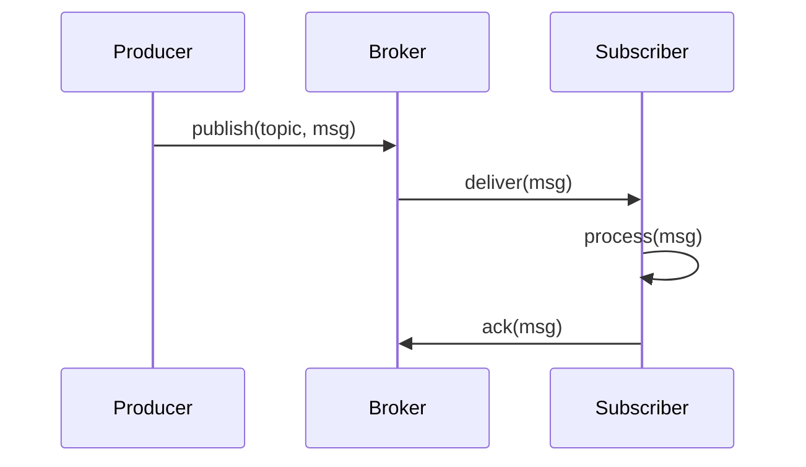

<!-- Generated by Groq via GitHub Actions -->
<!-- Topic ID: T061 -->
<!-- Category: Messaging & Event-Driven Architecture -->
<!-- Generated at UTC: 2026-10-07T07:24:25.327126+00:00 -->

# Pub/Sub

## 1. What problem does this solve?

- **Decoupling producers and consumers**  
  In a monolithic app a function that writes to a database often calls another function that sends an email. If the email service crashes, the whole transaction fails. Pub/Sub lets the producer publish an event and continue; the consumer can process it later or retry independently.

- **Scalability & elasticity**  
  When traffic spikes, you can spin up more consumers to handle the backlog without touching the producer. The producer never has to wait for the consumer to finish.

- **Event‑driven architecture**  
  Many modern systems (e.g., microservices, serverless functions, data pipelines) rely on events to trigger downstream work. Pub/Sub is the plumbing that carries those events.

- **Failure isolation**  
  If a consumer crashes, the producer keeps working. The event can be retried or routed to a dead‑letter queue.

- **Real‑world usage**  
  - E‑commerce order service publishes `OrderCreated` → inventory, shipping, analytics.  
  - IoT sensors publish telemetry → time‑series DB, alerting.  
  - CI/CD pipelines publish `BuildFinished` → deployment, notification.

## 2. Mental model

**Analogy:**  
Think of a **town bulletin board**. Anyone can post a notice (publish), and anyone can read it (subscribe). The board doesn’t care who posted or who reads; it just holds the messages. If a notice is important, you can put it on a sticky note so it stays visible until someone reads it.

**Engineering model:**  
- **Publisher** writes a message to a **topic** (or channel).  
- **Broker** stores the message and delivers it to all **subscribers** that are interested.  
- **Subscriber** receives the message asynchronously, processes it, and acknowledges (if the system supports ack).  
- The broker may persist messages, support retries, and provide ordering guarantees depending on the implementation.

## 3. Deep explanation

| Concept | What it is | Why it matters |
|---------|------------|----------------|
| **Topic / Channel** | Logical grouping of messages. | Enables filtering and logical separation. |
| **Message** | Payload + metadata (headers, timestamp). | Allows consumers to act on context. |
| **Broker** | The system that routes messages (Redis, Kafka, NATS, RabbitMQ). | Determines durability, ordering, scaling. |
| **Producer** | Component that publishes messages. | Should be fast, non‑blocking. |
| **Consumer** | Component that processes messages. | May run in parallel, can be scaled. |
| **Acknowledgement** | Confirmation that a message was processed. | Enables at‑least‑once or exactly‑once semantics. |
| **Dead‑Letter Queue (DLQ)** | Store of messages that failed repeatedly. | Prevents endless retries, aids debugging. |

### Internals

- **In‑memory vs. persistent**  
  - Redis Pub/Sub is volatile (messages lost on broker restart).  
  - Kafka persists to disk, provides replayability.  
  - NATS can be either in‑memory or durable.

- **Ordering**  
  - Kafka guarantees ordering per partition.  
  - Redis Pub/Sub has no ordering guarantees.  
  - NATS streams can provide ordering if configured.

- **Delivery semantics**  
  - **At‑most‑once**: broker deletes message after publishing.  
  - **At‑least‑once**: broker keeps message until consumer ack.  
  - **Exactly‑once**: requires idempotent consumers or transactional support (Kafka).

### Trade‑offs

| Broker | Pros | Cons |
|--------|------|------|
| Redis Pub/Sub | Simple, low latency, great for short‑lived messages | No persistence, no DLQ, no ordering |
| Kafka | Durable, high throughput, replay, DLQ | Higher operational complexity, more resources |
| NATS | Lightweight, low latency, easy to deploy | Limited durability unless using JetStream |
| RabbitMQ | Mature, flexible routing (queues, exchanges) | Slightly higher latency, more moving parts |

### Failure modes

- **Broker crash** → messages lost (volatile) or persisted (Kafka).  
- **Consumer crash** → unacked messages re‑queued (Kafka) or lost (Redis).  
- **Network partition** → split‑brain, duplicate messages.  
- **Backpressure** → consumer slower than producer → message backlog, memory pressure.

### Limitations

- **No built‑in schema enforcement** (unless using Kafka Avro, Protobuf).  
- **No transactional guarantees across services** (unless using distributed transactions or Kafka transactions).  
- **Complexity of scaling**: need to manage partitions, consumer groups, etc.

### Where it fits

- **Microservice communication**: events instead of direct RPC.  
- **Data pipelines**: ingest → transform → store.  
- **Real‑time analytics**: stream events to dashboards.  
- **Serverless**: trigger functions on events.

### Interaction with related concepts

- **CQRS**: Commands are published, queries read from read‑model.  
- **Event Sourcing**: All state changes are events in a log (Kafka).  
- **Message Queues**: Similar but usually point‑to‑point; Pub/Sub is fan‑out.  
- **Retry & DLQ**: Often implemented at broker level or in consumer logic.

## 4. How it works

1. **Producer** creates a message object.  
2. **Producer** serializes the message (JSON, Avro).  
3. **Producer** sends the message to the broker on a topic.  
4. **Broker** stores the message (in memory or disk).  
5. **Broker** pushes the message to all active subscribers.  
6. **Subscriber** receives the message, processes it.  
7. **Subscriber** acknowledges (if required).  
8. **Broker** removes the message from the queue or marks it as processed.



## 5. Practical implementation

### Example: TypeScript + Node.js + Redis Pub/Sub

```ts
// src/pubsub/redis.ts
import { createClient } from 'redis';

const publisher = createClient();
const subscriber = createClient();

publisher.on('error', err => console.error('Publisher error', err));
subscriber.on('error', err => console.error('Subscriber error', err));

await publisher.connect();
await subscriber.connect();

/**
 * Publish an event
 */
export async function publishEvent<T>(topic: string, payload: T) {
  const msg = JSON.stringify(payload);
  await publisher.publish(topic, msg);
}

/**
 * Subscribe to a topic
 */
export function subscribe<T>(topic: string, handler: (msg: T) => void) {
  subscriber.subscribe(topic, message => {
    const payload = JSON.parse(message) as T;
    handler(payload);
  });
}
```

#### Usage

```ts
// src/services/orderService.ts
import { publishEvent } from '../pubsub/redis';

export async function createOrder(order: Order) {
  // Persist to DB (PostgreSQL)
  await db.insert(order);

  // Publish event
  await publishEvent('orders.created', { id: order.id, userId: order.userId });
}
```

```ts
// src/services/inventoryService.ts
import { subscribe } from '../pubsub/redis';

subscribe<{ id: string; userId: string }>('orders.created', async ({ id }) => {
  // Reduce stock, etc.
  await inventory.reduceStockForOrder(id);
});
```

> **Note:** Redis Pub/Sub is *volatile*. For production you’d use Redis Streams or a dedicated broker like Kafka.

### Kafka example (brief)

```ts
import { Kafka } from 'kafkajs';

const kafka = new Kafka({ clientId: 'my-app', brokers: ['kafka:9092'] });

const producer = kafka.producer();
await producer.connect();

await producer.send({
  topic: 'orders',
  messages: [{ value: JSON.stringify(order) }],
});
```

## 6. Production considerations

| Concern | Tips |
|---------|------|
| **Scalability** | Use partitions (Kafka) or multiple channels (Redis Streams). Scale consumers horizontally. |
| **Reliability** | Persist messages (Kafka, Redis Streams). Use DLQs. |
| **Security** | TLS, authentication (SASL), ACLs. |
| **Observability** | Metrics: publish rate, consumer lag, error rates. Tracing: propagate correlation IDs. |
| **Performance** | Batch publishes, compress payloads, tune broker configs. |
| **Error handling** | Retry with backoff, idempotent consumers, DLQ. |
| **Resource usage** | Monitor memory, disk, network. |
| **Operational** | High‑availability broker clusters, automated backups. |
| **Failure recovery** | Consumer group rebalancing, broker failover, graceful shutdown. |
| **Deployment** | Containerize broker, use Helm charts, separate dev/prod clusters. |

## 7. Common mistakes

| Mistake | Why it’s bad |
|---------|--------------|
| **Using Pub/Sub for request/response** | Pub/Sub is fire‑and‑forget; you lose request correlation. |
| **Ignoring message ordering** | Some services assume order; Kafka partitions can break this if not designed. |
| **Not handling idempotency** | Duplicate messages lead to duplicate side effects. |
| **Publishing large payloads** | Increases network traffic, broker memory. |
| **Tight coupling of message schema** | Hard to evolve; use schema registry or versioned payloads. |
| **Over‑subscribing** | Each consumer adds overhead; use consumer groups. |
| **Not monitoring consumer lag** | Backlog grows unnoticed, leading to delays. |

## 8. Senior engineer perspective

- **Architecture decisions**  
  - Choose broker based on durability vs latency needs.  
  - Decide on partitioning strategy for Kafka.  
  - Decide on message format (JSON vs Avro).  
  - Integrate with existing monitoring stack.

- **Trade‑offs**  
  - Kafka gives durability but higher operational cost.  
  - Redis Pub/Sub is simple but volatile.  
  - NATS is lightweight but limited durability.

- **Bottlenecks**  
  - Single broker node → single point of failure.  
  - Network latency between services.  
  - Consumer processing speed vs publish rate.

- **Failure scenarios**  
  - Broker crash → message loss or backlog.  
  - Consumer crash → unacked messages re‑queued.  
  - Schema mismatch → deserialization errors.

- **Monitoring**  
  - Consumer lag, message throughput, error rates, broker health.  
  - Use Prometheus exporters, Grafana dashboards.

- **Cost/performance**  
  - Kafka clusters require more storage and CPU.  
  - Redis Streams can be cheaper but less durable.  
  - Serverless event buses (e.g., AWS EventBridge) reduce ops but add vendor lock‑in.

- **When NOT to use**  
  - Simple point‑to‑point communication → use queues.  
  - Low‑volume, low‑latency needs → simple HTTP callbacks.  
  - Tight coupling required → RPC may be simpler.

## 9. Interview questions

1. **Beginner**: *What is the difference between a message queue and a publish/subscribe system?*  
   *Answer:* Queue is point‑to‑point; one consumer gets the message. Pub/Sub is fan‑out; all subscribers receive the message.

2. **Beginner**: *Why do we need acknowledgements in a Pub/Sub system?*  
   *Answer:* To ensure messages are processed at least once and to allow the broker to remove or retry messages.

3. **Senior**: *Explain how Kafka achieves ordering guarantees and what limitations exist.*  
   *Answer:* Kafka guarantees ordering within a partition. Across partitions, ordering is not guaranteed. Consumers must process messages in order per partition.

4. **Senior**: *Describe a strategy to handle message schema evolution in a Pub/Sub system.*  
   *Answer:* Use a schema registry (Avro, Protobuf), versioned schemas, backward/forward compatibility, and enforce schema validation on both producer and consumer.

5. **Scenario/Debugging**: *You notice that consumer lag is steadily increasing over time. What could be causing this and how would you investigate?*  
   *Answer:* Possible causes: slow consumer processing, increased message volume, broker bottleneck, or consumer group rebalancing. Investigate by checking consumer metrics (lag, processing time), broker metrics (throughput, disk I/O), and logs for errors.

## 10. Hands‑on task

**Task:**  
Add a new event `UserRegistered` to the existing Node.js project that uses Redis Pub/Sub.  
- When a user signs up, publish `UserRegistered` with `{ userId, email }`.  
- Create a separate service that subscribes to this event and writes a welcome email record to a PostgreSQL table `welcome_emails` (columns: `id`, `user_id`, `sent_at`).  
- Ensure the subscriber acknowledges the message and handles failures by retrying up to 3 times before sending the message to a dead‑letter channel `user.registered.dlq`.

**Hints:**  
- Use `node-postgres` for DB access.  
- Use `async-retry` or a simple loop for retries.  
- Store the DLQ messages in Redis as a list.

## 11. Quick revision

- Pub/Sub decouples producers and consumers, enabling async, scalable architectures.  
- **Topic/Channel**: logical grouping of messages.  
- **Broker**: routes, stores, and optionally persists messages.  
- **Producer**: publishes; **Consumer**: subscribes and processes.  
- **Ack**: guarantees at‑least‑once delivery.  
- **DLQ**: stores messages that repeatedly fail.  
- **Ordering**: guaranteed per partition (Kafka) or not guaranteed (Redis Pub/Sub).  
- **Durability**: Redis Pub/Sub is volatile; Kafka/Redis Streams are durable.  
- **Common pitfalls**: ignoring idempotency, over‑subscribing, large payloads.  
- **Monitoring**: consumer lag, message throughput, error rates.  
- **When to use**: event‑driven microservices, real‑time analytics, data pipelines.  
- **When not to use**: simple point‑to‑point tasks, low‑volume, low‑latency needs.

## 12. References

- [Redis Pub/Sub](https://redis.io/docs/manual/pubsub/)  
- [Kafka Documentation](https://kafka.apache.org/documentation/)  
- [NATS Documentation](https://docs.nats.io/)  
- [RabbitMQ Pub/Sub](https://www.rabbitmq.com/tutorials/tutorial-five.html)  
- [Kafka Streams vs. Redis Streams](https://redis.com/redis-enterprise/redis-streams/)  
- [Node.js Redis Client](https://github.com/redis/node-redis)  
- [KafkaJS](https://kafka.js.org/docs/getting-started)  
- [Prometheus Kafka Exporter](https://github.com/danielqsj/kafka_exporter)
