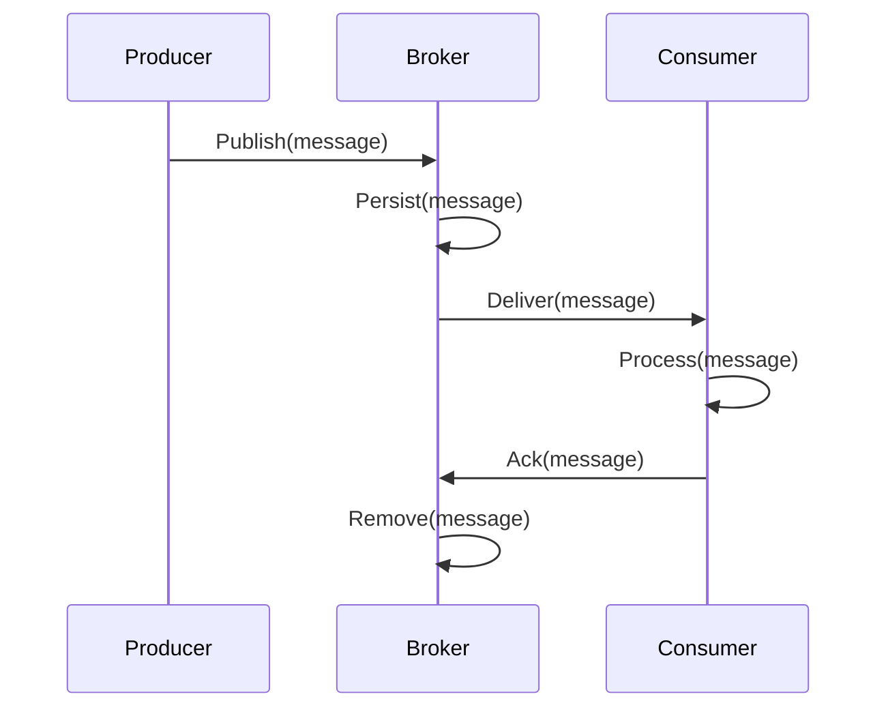

<!-- Generated by Groq via GitHub Actions -->
<!-- Topic ID: T062 -->
<!-- Category: Messaging & Event-Driven Architecture -->
<!-- Generated at UTC: 2026-10-07T07:24:25.327126+00:00 -->

# Message queues

## 1. What problem does this solve?

| Problem | Why it matters | Consequence if ignored | Real‑world example |
|---------|----------------|------------------------|--------------------|
| **Decoupling** | Producers and consumers can evolve independently. | Tight coupling forces synchronous calls, leading to cascading failures. | A user sign‑up service that triggers email verification via a separate mailer service. |
| **Load leveling** | Handles traffic bursts by buffering work. | Immediate spikes can overwhelm downstream services, causing timeouts or crashes. | A flash sale that pushes millions of order events into a payment service. |
| **Reliability** | Guarantees message delivery even if consumers fail. | Lost messages mean lost data, inconsistent state, or missed business events. | A financial transaction that must be persisted even if the processing node dies. |
| **Scalability** | Enables horizontal scaling of consumers without changing producers. | All services must scale together, increasing cost and complexity. | A recommendation engine that can spin up more workers during peak hours. |
| **Asynchronous processing** | Offloads long‑running work from request/response cycles. | Users experience slow responses or timeouts. | Image resizing after upload. |

Message queues are the backbone of many modern backend systems: order processing pipelines, event sourcing, log aggregation, background job queues, and microservice communication.

---

## 2. Mental model

### Analogy: The Postal Service

- **Producers** are people who write letters (messages).
- **Queues** are post offices that hold letters until a courier (consumer) picks them up.
- **Consumers** are couriers that deliver letters to recipients.
- **Broker** is the national postal network that routes letters between post offices.

Just as the postal system decouples the sender from the receiver, a message queue decouples the producer from the consumer. The sender can finish its work immediately after dropping the letter, while the receiver processes it at its own pace.

### Engineering model

```
Producer  →  Broker (queue)  →  Consumer
```

- **Producer** publishes a message to a *topic* or *queue*.
- **Broker** stores the message durably and makes it available to consumers.
- **Consumer** pulls (or is pushed) the message, processes it, and acknowledges receipt.

---

## 3. Deep explanation

### Internals

| Component | Responsibility |
|-----------|----------------|
| **Broker** | Persists messages, manages queues/topics, handles replication and failover. |
| **Producer** | Serializes data, sends to broker, optionally sets message attributes (TTL, priority). |
| **Consumer** | Pulls messages, processes, acknowledges or rejects. |
| **Queue/Topic** | Logical buffer; may be a simple FIFO queue or a partitioned log. |
| **Offset / Sequence** | Tracks consumption progress; crucial for at‑least‑once semantics. |
| **Dead‑Letter Queue (DLQ)** | Stores messages that failed repeatedly. |

### Important terminology

- **Producer** – entity that sends messages.
- **Consumer** – entity that receives messages.
- **Broker** – the message‑queue server (e.g., RabbitMQ, Kafka, Redis Streams).
- **Queue** – a FIFO buffer (RabbitMQ, SQS).
- **Topic** – a publish/subscribe log (Kafka, Redis Streams).
- **Partition** – a slice of a topic that allows parallel consumption.
- **Consumer Group** – a set of consumers that share a topic’s partitions.
- **Acknowledgement (Ack)** – consumer confirms successful processing.
- **At‑least‑once** – message may be delivered multiple times but never lost.
- **At‑most‑once** – message delivered once or not at all (risk of loss).
- **Exactly‑once** – hard to guarantee; often achieved via idempotent consumers.

### Trade‑offs

| Feature | Pros | Cons |
|---------|------|------|
| **Durability** | Messages survive broker restarts. | Disk I/O overhead, slower throughput. |
| **Ordering** | Guarantees order within a partition. | Requires single consumer per partition; limits parallelism. |
| **Throughput** | High with batching and prefetch. | Requires careful tuning; risk of over‑loading consumers. |
| **Latency** | Low when broker is local. | Network hops add latency; persistence adds delay. |
| **Exactly‑once** | No duplicates. | Complex; often requires idempotent consumers or transactional support. |

### Failure modes

- **Broker crash** – messages may be lost if not persisted or replicated.
- **Consumer crash** – unacked messages re‑queued; can lead to duplicates.
- **Network partition** – split‑brain; some consumers may see stale data.
- **Message corruption** – malformed payloads can crash consumers.

### Limitations

- **Eventual consistency** – consumers may lag behind producers.
- **No built‑in transaction across services** – requires application‑level choreography.
- **Limited queryability** – cannot easily search past messages without external indexing.

### Where it fits

- **Microservice communication** – async request/response or event bus.
- **Background jobs** – offload CPU‑heavy work.
- **Event sourcing** – store domain events in a log.
- **Data pipelines** – stream data between ingestion, processing, and storage layers.

### Interaction with related concepts

| Concept | Interaction |
|---------|-------------|
| **Database** | Use DB writes as part of message payload or as a source of truth. |
| **Cache** | Cache results of expensive computations triggered by messages. |
| **HTTP** | Producers may expose REST endpoints that enqueue work. |
| **AI backends** | Queue inference requests to scale GPU workers. |
| **Redis** | Redis Streams can act as lightweight queues. |
| **Kafka** | Provides high‑throughput, partitioned logs for analytics. |

---

## 4. How it works

1. **Producer** serializes a payload and sends it to the broker’s queue/topic.
2. **Broker** writes the message to disk (or memory) and assigns a unique ID/offset.
3. **Consumer** pulls the message (pull) or receives it via push.
4. **Consumer** processes the payload.
5. **Consumer** sends an **ack** back to the broker.
6. **Broker** removes the message from the queue (or marks it as consumed).
7. If **ack** is not received within a timeout, the broker re‑queues the message.



---

## 5. Practical implementation

### 5.1 RabbitMQ with `amqplib` (Node.js)

```ts
// rabbitmq.ts
import amqp from 'amqplib';

const RABBIT_URL = 'amqp://localhost';
const QUEUE = 'orders';

export async function publishOrder(order: any) {
  const conn = await amqp.connect(RABBIT_URL);
  const ch = await conn.createChannel();

  // Ensure the queue exists
  await ch.assertQueue(QUEUE, { durable: true });

  // Serialize and send
  const msg = Buffer.from(JSON.stringify(order));
  ch.sendToQueue(QUEUE, msg, { persistent: true });

  console.log('Order queued:', order.id);
  await ch.close();
  await conn.close();
}
```

```ts
// consumer.ts
import amqp from 'amqplib';

const RABBIT_URL = 'amqp://localhost';
const QUEUE = 'orders';

async function consume() {
  const conn = await amqp.connect(RABBIT_URL);
  const ch = await conn.createChannel();

  await ch.assertQueue(QUEUE, { durable: true });

  // Prefetch 1 to avoid overloading the consumer
  ch.prefetch(1);

  console.log('Waiting for orders...');
  ch.consume(
    QUEUE,
    async (msg) => {
      if (!msg) return;
      const order = JSON.parse(msg.content.toString());
      try {
        // Process order (e.g., charge payment, update inventory)
        await processOrder(order);
        ch.ack(msg); // Success
      } catch (err) {
        console.error('Processing failed', err);
        ch.nack(msg, false, false); // Drop or requeue based on policy
      }
    },
    { noAck: false }
  );
}

async function processOrder(order: any) {
  // Simulate async work
  await new Promise((r) => setTimeout(r, 200));
  console.log('Processed order', order.id);
}

consume().catch(console.error);
```

**Key points**

- `persistent: true` ensures the message survives broker restarts.
- `prefetch(1)` limits unacked messages to one, preventing a slow consumer from blocking others.
- `ack`/`nack` control message removal or requeue.

### 5.2 Redis Streams (ioredis)

```ts
// redis-stream.ts
import Redis from 'ioredis';

const redis = new Redis(); // defaults to localhost:6379
const STREAM = 'orders';
const GROUP = 'order-processor';
const CONSUMER = 'worker-1';

async function produce(order: any) {
  await redis.xadd(
    STREAM,
    '*',
    'id',
    order.id,
    'amount',
    order.amount.toString()
  );
  console.log('Order added to stream', order.id);
}

async function consume() {
  // Create consumer group if not exists
  try {
    await redis.xgroup('CREATE', STREAM, GROUP, '$', 'MKSTREAM');
  } catch (e) {
    if (!e.message.includes('BUSYGROUP')) throw e;
  }

  while (true) {
    const msgs = await redis.xreadgroup(
      'GROUP',
      GROUP,
      CONSUMER,
      'COUNT',
      1,
      'BLOCK',
      5000,
      'STREAMS',
      STREAM,
      '>'
    );

    if (!msgs) continue;

    const [stream, entries] = msgs[0];
    for (const [id, fields] of entries) {
      const order = parseFields(fields);
      try {
        await processOrder(order);
        await redis.xack(STREAM, GROUP, id);
      } catch (err) {
        console.error('Failed', err);
        // Optionally move to a DLQ stream
      }
    }
  }
}

function parseFields(fields: string[]) {
  const obj: any = {};
  for (let i = 0; i < fields.length; i += 2) {
    obj[fields[i]] = fields[i + 1];
  }
  return obj;
}
```

---

## 6. Production considerations

| Concern | What to watch for | Mitigation |
|---------|-------------------|------------|
| **Scalability** | Single broker bottleneck, disk I/O, network latency | Horizontal scaling, sharding/partitioning, load‑balancing |
| **Reliability** | Message loss on crash, duplicate delivery | Persistence, replication, idempotent consumers, DLQs |
| **Security** | Unauthorized access, data leakage | TLS, ACLs, authentication (OAuth, SASL), secrets management |
| **Observability** | Unknown lag, hidden failures | Metrics (prometheus), logs, tracing (OpenTelemetry), alerts |
| **Performance** | High latency, low throughput | Batch sends, prefetch limits, compression, efficient serialization |
| **Error handling** | Unhandled exceptions, retries | Structured retry policies, circuit breakers, dead‑letter queues |
| **Resource usage** | Memory, disk, CPU | Tune queue size, retention policies, clean up old messages |
| **Operational** | Upgrades, backups, monitoring | CI/CD pipelines, rolling restarts, automated backups |
| **Failure recovery** | Broker crash, network partition | Multi‑node clusters, quorum, automatic failover |
| **Deployment** | Container orchestration, configuration | Helm charts, environment variables, secrets injection |

---

## 7. Common mistakes

| Mistake | Why it hurts |
|---------|--------------|
| **Not persisting messages** | Messages vanish on broker restart. |
| **Using a single queue for many types** | Hard to filter, leads to wasted consumer cycles. |
| **Ignoring ack semantics** | Unacked messages may be lost or duplicated. |
| **Setting prefetch too high** | One slow consumer can block the entire queue. |
| **Assuming idempotency** | Duplicate deliveries can corrupt state. |
| **No DLQ** | Hard to debug failed messages. |
| **Hardcoding broker URLs** | Breaks in CI/CD or multi‑env deployments. |
| **Over‑optimizing latency** | Ignoring durability can lead to data loss. |

---

## 8. Senior engineer perspective

### Architectural decisions

- **Broker choice**: RabbitMQ for complex routing, Kafka for high‑throughput logs, Redis Streams for lightweight queues.
- **Partitioning strategy**: Key‑based partitioning to preserve ordering per entity.
- **Consumer group design**: Balance parallelism vs ordering guarantees.
- **Retention policy**: Long‑term logs vs short‑lived jobs.
- **Multi‑region deployment**: Latency vs consistency trade‑off.

### Bottlenecks & mitigations

- **Broker I/O**: Use SSDs, tune page cache, enable compression.
- **Network**: Deploy brokers close to consumers, use VPC peering.
- **Consumer lag**: Monitor lag, add workers, optimize processing.

### Failure scenarios

- **Broker split‑brain**: Use quorum or consensus protocols (Raft, Zookeeper).
- **Consumer crash**: Implement graceful shutdown, graceful rebalancing.
- **Duplicate messages**: Enforce idempotency, use unique message IDs.

### Monitoring

- **Throughput**: Messages per second, per consumer.
- **Latency**: Producer‑to‑consumer time, consumer processing time.
- **Lag**: Offset difference between producer and consumer.
- **Error rates**: DLQ count, retry failures.

### Cost/performance

- **Managed services** (e.g., AWS SQS, Azure Service Bus, GCP Pub/Sub) reduce ops but may limit tuning.
- **Self‑hosted** gives full control but requires cluster management.

### When NOT to use

- Simple background jobs that fit in a database queue.
- Low‑volume, low‑latency use cases where a lightweight in‑memory queue suffices.
- When you need strong transactional guarantees across services (use a saga or two‑phase commit instead).

---

## 9. Interview questions

1. **Beginner** – *What is a message queue and why would you use one?*  
   *Answer:* A message queue decouples producers from consumers, buffers work, ensures reliability, and allows scaling. It’s used for async processing, load leveling, and fault tolerance.

2. **Beginner** – *Explain the difference between a queue and a topic.*  
   *Answer:* A queue is point‑to‑point: one consumer receives each message. A topic is publish/subscribe: multiple consumers can receive the same message (consumer groups share a topic).

3. **Senior** – *How would you guarantee exactly‑once processing in a distributed system that uses a message queue?*  
   *Answer:* Use idempotent consumers, store a unique message ID in a database, or leverage transactional outbox patterns. Some brokers (Kafka with idempotent producers) provide at‑least‑once guarantees; exactly‑once requires application logic.

4. **Senior** – *Describe how you would design a system that processes millions of events per second with strict ordering per user.*  
   *Answer:* Partition the topic by user ID, ensure each partition is consumed by a single consumer, use consumer groups to scale across partitions, and monitor consumer lag. Use a broker that supports high throughput (Kafka) and tune batch sizes.

5. **Scenario/Debugging** – *A consumer is stuck processing a message for minutes, causing a backlog. What steps would you take to diagnose and fix the issue?*  
   *Answer:*  
   - Check consumer logs for errors or deadlocks.  
   - Verify message size and payload complexity.  
   - Inspect broker metrics: queue depth, consumer lag.  
   - Look for resource contention (CPU, memory).  
   - Consider adding more workers or scaling the consumer.  
   - If the message is malformed, route it to a DLQ.  
   - Implement circuit breakers or timeouts to prevent blocking.

---

## 10. Hands‑on task

**Build a simple order‑processing pipeline**

1. **Producer** – A Next.js API route (`/api/orders`) that accepts an order payload and publishes it to a RabbitMQ queue.
2. **Consumer** – A Node.js worker that consumes the queue, simulates inventory check and payment, then writes the result to a PostgreSQL table.
3. **Observability** – Expose Prometheus metrics (`queue_depth`, `processing_latency`) and log each step.
4. **Testing** – Write a Jest test that enqueues an order and verifies the database record after a short delay.

*Goal:* Understand the full flow from HTTP request → queue → background worker → persistence, and observe how the queue decouples the API from the heavy processing.

---

## 11. Quick revision

- **Decoupling** – Producers and consumers operate independently.
- **Load leveling** – Queues buffer bursts and smooth traffic.
- **Durability** – Persistent storage protects against broker crashes.
- **Ack/Nack** – Controls message removal and retry.
- **Consumer groups** – Parallel consumption with partitioning.
- **Dead‑letter queue** – Handles failed messages.
- **Ordering** – Guaranteed within a partition; global ordering is hard.
- **Exactly‑once** – Requires idempotent consumers or transactional patterns.
- **Scaling** – Horizontal scaling of brokers and consumers.
- **Observability** – Metrics: throughput, latency, lag; logs; tracing.
- **Security** – TLS, ACLs, authentication.
- **Common pitfalls** – No persistence, high prefetch, no DLQ, duplicate handling.

---

## 12. References

- RabbitMQ: https://www.rabbitmq.com/documentation.html
- Kafka: https://kafka.apache.org/documentation/
- Redis Streams: https://redis.io/docs/manual/data-types/streams/
- AMQP 0-9-1 spec: https://www.rabbitmq.com/amqp-0-9-1-reference.html
- Prometheus metrics for RabbitMQ: https://github.com/kbudde/rabbitmq_exporter
- OpenTelemetry for Node.js: https://opentelemetry.io/docs/instrumentation/node/
- AWS SQS documentation: https://docs.aws.amazon.com/AWSSimpleQueueService/latest/SQSDeveloperGuide/welcome.html
- Azure Service Bus docs: https://learn.microsoft.com/en-us/azure/service-bus-messaging/
- GCP Pub/Sub docs: https://cloud.google.com/pubsub/docs/overview

---
