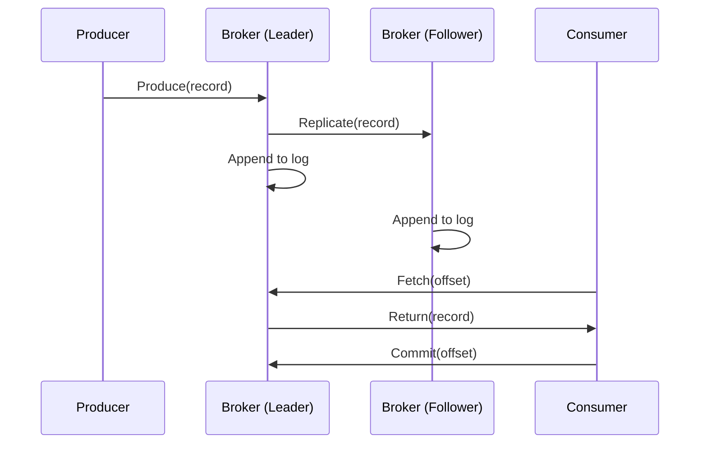

<!-- Generated by Groq via GitHub Actions -->
<!-- Topic ID: T064 -->
<!-- Category: Messaging & Event-Driven Architecture -->
<!-- Generated at UTC: 2026-10-07T19:26:42.960761+00:00 -->

# Kafka

## 1. What problem does this solve?

| Problem | Why it matters | Consequence of not using it | Real‑world use |
|---------|----------------|-----------------------------|----------------|
| **Decoupling services** | Services often need to talk to each other, but tight coupling hurts scalability and resilience. | Tight coupling forces services to be online together, making deployments brittle. | Microservice e‑commerce: order service writes to a queue, inventory service reads. |
| **Asynchronous processing** | Some tasks (image resizing, email sending) are slow and should not block the main request. | Users wait for slow tasks → poor UX, higher latency. | Notification service that sends emails after order placement. |
| **Event sourcing / audit trail** | Capturing every state change allows replay, debugging, and analytics. | Hard to reconstruct state, limited debugging. | Banking systems log every transaction event. |
| **Scalable data pipelines** | Need to ingest millions of events per second and process them in parallel. | Bottlenecks, data loss, or delayed processing. | Log aggregation, real‑time analytics. |

Kafka is a **distributed commit log** that lets you publish, store, and consume streams of records reliably and at scale. It solves the above by providing:

- Durable, ordered storage per topic/partition.
- Horizontal scalability via partitioning.
- Fault tolerance with replication.
- Back‑pressure handling (slow consumers don’t block producers).

## 2. Mental model

### Analogy: The “Message Board”

Imagine a large bulletin board in an office. Employees (producers) post notes (messages) on the board. Anyone (consumers) can read the notes later. The board is divided into sections (partitions) so many people can write at once without stepping on each other’s notes. If a section gets too crowded, the board can be split into more sections (horizontal scaling). If a section’s paper gets torn (node failure), the board has backup copies (replication).

### Engineering model

- **Topic** = logical channel (e.g., `orders`).
- **Partition** = ordered log segment; each partition is a file on disk.
- **Broker** = server that hosts partitions.
- **Producer** = writes records to a topic (chooses partition via key or round‑robin).
- **Consumer** = reads records from partitions; can be part of a **consumer group** to share load.
- **Offset** = position of a record in a partition; consumers commit offsets to track progress.

## 3. Deep explanation

### Internals

1. **Log structure**  
   - Each partition is an append‑only log stored as a sequence of segments.  
   - Segments are immutable; new records are appended to the current segment.  
   - Segments are rolled over based on size or time.

2. **Replication**  
   - Each partition has a **leader** broker and zero or more **followers**.  
   - Producers write only to the leader; followers replicate asynchronously.  
   - Replication factor ≥ 1; typical values: 3 for production.

3. **Retention & compaction**  
   - **Retention**: delete old segments after a time or size threshold.  
   - **Compaction**: keep only the latest record per key (useful for state).

4. **Network protocol**  
   - Binary protocol over TCP; uses **RecordBatch** for efficient batching.  
   - Supports compression (gzip, snappy, lz4, zstd).

### Important terminology

| Term | Meaning |
|------|---------|
| **Topic** | Named stream of records. |
| **Partition** | Ordered, immutable sequence of records. |
| **Offset** | 64‑bit integer identifying a record’s position. |
| **Consumer group** | Set of consumers that share a topic’s partitions. |
| **Commit** | Persisting the consumer’s offset. |
| **ISR (In‑Sync Replicas)** | Followers that are caught up with the leader. |
| **Leader election** | Process to pick a new leader when the current one fails. |

### Trade‑offs

| Aspect | Trade‑off |
|--------|-----------|
| **Latency vs Throughput** | Batching improves throughput but adds latency. |
| **Replication factor** | Higher factor → more durability but higher storage and network cost. |
| **Compaction vs Retention** | Compaction keeps state but may keep old keys longer; retention frees space but loses history. |
| **Consumer group size** | More consumers → parallelism but risk of uneven partition distribution. |

### Failure modes

- **Broker crash** → leader election; followers may lag.  
- **Network partition** → split‑brain; ISR shrinks.  
- **Disk full** → broker stops accepting writes; producers get errors.  
- **Consumer lag** → if consumer is slow, it may fall behind ISR and lose messages if retention is short.

### Limitations

- **Ordering only within a partition**; cross‑partition ordering is not guaranteed.  
- **No built‑in transaction support** (Kafka 0.11+ added ACID transactions, but they’re complex).  
- **Requires operational expertise**: tuning log retention, segment size, replication, and monitoring.  
- **Not a general key‑value store**; use Kafka Streams or KSQL for stateful processing.

### Where it fits

- **Event bus** between microservices.  
- **Data ingestion pipeline** (source → Kafka → stream processors → sinks).  
- **Audit trail** for compliance.  
- **Cache invalidation** (e.g., Redis cache updates triggered by Kafka events).  

### Interaction with related concepts

- **PostgreSQL**: Use logical replication or Debezium to stream DB changes into Kafka.  
- **Redis**: Publish/subscribe can be replaced by Kafka for durability.  
- **FastAPI**: Expose REST endpoints that produce events to Kafka.  
- **Next.js**: Server‑side rendering can consume events for real‑time updates via WebSockets.  
- **AI backends**: Queue inference requests or model updates via Kafka.

## 4. How it works

1. **Producer** creates a record and sends it to a broker.  
2. Broker **appends** the record to the appropriate partition log.  
3. Broker **replicates** the record to follower replicas.  
4. **Consumer** fetches records from the partition it owns.  
5. Consumer **commits** the offset after processing.  
6. If a consumer fails, another member of the group takes over the partition.



## 5. Practical implementation

### Setup

```bash
# Install Kafka locally (Docker)
docker run -d --name zookeeper -p 2181:2181 zookeeper:3.7
docker run -d --name kafka -p 9092:9092 \
  -e KAFKA_ZOOKEEPER_CONNECT=zookeeper:2181 \
  -e KAFKA_ADVERTISED_LISTENERS=PLAINTEXT://localhost:9092 \
  -e KAFKA_OFFSETS_TOPIC_REPLICATION_FACTOR=1 \
  confluentinc/cp-kafka:7.5
```

### Producer (TypeScript)

```ts
// src/kafka/producer.ts
import { Kafka, logLevel } from 'kafkajs';

const kafka = new Kafka({
  clientId: 'order-service',
  brokers: ['localhost:9092'],
  logLevel: logLevel.INFO,
});

const producer = kafka.producer();

export async function initProducer() {
  await producer.connect();
}

export async function sendOrder(order: { id: string; total: number }) {
  await producer.send({
    topic: 'orders',
    messages: [
      {
        key: order.id, // ensures same order goes to same partition
        value: JSON.stringify(order),
      },
    ],
  });
}
```

### Consumer (TypeScript)

```ts
// src/kafka/consumer.ts
import { Kafka, logLevel } from 'kafkajs';

const kafka = new Kafka({
  clientId: 'inventory-service',
  brokers: ['localhost:9092'],
  logLevel: logLevel.INFO,
});

const consumer = kafka.consumer({ groupId: 'inventory-group' });

export async function initConsumer() {
  await consumer.connect();
  await consumer.subscribe({ topic: 'orders', fromBeginning: true });

  await consumer.run({
    eachMessage: async ({ topic, partition, message }) => {
      const order = JSON.parse(message.value!.toString());
      console.log(`Processing order ${order.id} (partition ${partition})`);
      // TODO: update inventory in PostgreSQL
    },
  });
}
```

### Running

```bash
# In one terminal
node src/kafka/producer.ts  # after calling initProducer()
# In another terminal
node src/kafka/consumer.ts  # after calling initConsumer()
```

### Realistic backend example

- **FastAPI** endpoint that receives an order and pushes it to Kafka.
- **PostgreSQL** consumer that writes the order to the `orders` table.
- **Redis** consumer that updates a cache key for the order status.

## 6. Production considerations

| Concern | What to do |
|---------|------------|
| **Scalability** | Increase partitions per topic; add brokers; use rack‑aware replication. |
| **Reliability** | Set replication factor ≥ 3; enable `min.insync.replicas`; monitor ISR. |
| **Security** | Enable TLS for broker communication; SASL/PLAIN or SCRAM for authentication; ACLs for authorization. |
| **Observability** | Export JMX metrics; use Prometheus + Grafana; enable Kafka Connect metrics. |
| **Performance** | Tune `log.segment.bytes`, `log.retention.hours`, `compression.type`; batch size > 1 kB. |
| **Error handling** | Retry with exponential backoff; dead‑letter topic for failed messages. |
| **Resource usage** | Monitor disk I/O, CPU, network; use SSDs for log storage. |
| **Operational concerns** | Automate broker upgrades; use Kafka Manager or Confluent Control Center. |
| **Failure recovery** | Plan for broker replacement; use `kafka-reassign-partitions.sh`. |
| **Deployment** | Prefer managed services (Confluent Cloud, AWS MSK) for easier ops; otherwise use Docker‑Compose or Kubernetes with StatefulSets. |

## 7. Common mistakes

| Mistake | Why it’s bad |
|---------|--------------|
| **Using a single partition** | No parallelism; becomes a bottleneck. |
| **Ignoring `min.insync.replicas`** | Producers may succeed even when only one replica is up, risking data loss. |
| **Not committing offsets** | Consumers may reprocess messages on restart, causing duplicates. |
| **Using `fromBeginning: true` in production** | Re‑processes all history on every restart; expensive. |
| **Hard‑coding broker addresses** | Fails when scaling or moving to cloud. |
| **Treating Kafka as a queue only** | Overlooking ordering guarantees and consumer group semantics. |
| **Not monitoring disk usage** | Log segments can fill disks, causing broker crashes. |
| **Using default compression** | May lead to high CPU usage; choose appropriate codec. |

## 8. Senior engineer perspective

### Design decisions

- **Topic partitioning strategy**: key‑based vs round‑robin; consider hot‑keys.  
- **Replication factor & ISR**: balance durability vs latency.  
- **Consumer group design**: one consumer per microservice vs multiple for scaling.  
- **Retention policy**: time‑based for logs, compaction for state.  
- **Schema registry**: enforce Avro/Protobuf schemas to avoid breaking changes.  
- **Transactional writes**: use Kafka transactions for atomic multi‑topic writes.  

### Bottlenecks

- **Disk I/O**: Kafka is disk‑bound; use SSDs and tune `io.max.bytes.per.read`.  
- **Network**: large batches can saturate network; monitor throughput.  
- **CPU**: compression/decompression; enable hardware acceleration if possible.  

### Failure scenarios

- **Broker loss**: leader election delay → consumer lag.  
- **ISR shrink**: if replication lags, producers may block.  
- **Topic overload**: too many producers → high write latency.  

### Monitoring

- **JMX metrics**: `kafka.server:type=BrokerTopicMetrics` for request rates.  
- **Consumer lag**: `kafka.consumer:type=consumer-fetch-manager-metrics` or `kafka-consumer-groups.sh`.  
- **Disk usage**: `log.dir` metrics.  

### Cost/performance

- **Managed services**: higher cost but lower ops.  
- **Self‑hosted**: cheaper but requires expertise.  
- **Storage**: retention size directly impacts storage cost.  

### When NOT to use Kafka

- Simple request/response patterns where a lightweight message queue (e.g., RabbitMQ) suffices.  
- Low‑volume, low‑latency workloads where the overhead of Kafka is unnecessary.  
- Situations requiring strict ordering across many keys (Kafka only guarantees per‑partition ordering).

## 9. Interview questions

| Level | Question | Answer points |
|-------|----------|---------------|
| Beginner | What is a Kafka partition and why is it important? | Ordered log; enables parallelism; each consumer reads from one partition. |
| Beginner | How does Kafka ensure durability of messages? | Replication to followers; `min.insync.replicas`; log is append‑only on disk. |
| Senior | Explain how Kafka handles consumer group rebalancing and the impact on message ordering. | Rebalance assigns partitions to consumers; ordering preserved within partition; cross‑partition ordering not guaranteed. |
| Senior | Discuss the trade‑offs between using `acks=all` vs `acks=1` for producers. | `acks=all` ensures all ISR replicas have the record; higher latency; `acks=1` faster but risk of data loss if leader fails. |
| Scenario | A consumer group is experiencing high lag after a broker failure. What steps would you take to diagnose and resolve the issue? | Check ISR size; verify replication lag; look at broker logs; consider increasing `replica.fetch.max.bytes`; ensure retention is long enough; rebalance group; monitor disk usage. |

## 10. Hands‑on task

**Build a simple order processing pipeline**

1. Create a FastAPI endpoint `/orders` that accepts JSON `{id, total}`.  
2. On POST, publish the order to Kafka topic `orders`.  
3. Spin up a Node.js consumer that reads from `orders` and writes to a PostgreSQL `orders` table.  
4. Add a Redis cache that stores the latest order status; update it in the consumer.  
5. Verify that after a consumer restart, it resumes from the last committed offset and does not re‑process old orders.

Use Docker Compose to orchestrate FastAPI, Node.js consumer, Kafka, Zookeeper, PostgreSQL, and Redis.

## 11. Quick revision

- Kafka is a distributed **commit log** for high‑throughput, durable messaging.  
- **Topic → partitions → logs**; each partition is ordered and replicated.  
- **Producers** write to a leader; **followers** replicate asynchronously.  
- **Consumer groups** share partitions; each consumer reads a subset.  
- **Offsets** track progress; committing offsets is essential.  
- **Replication factor** ≥ 3 for production; `min.insync.replicas` prevents data loss.  
- **Retention** can be time‑based or size‑based; compaction keeps latest key.  
- **TLS/SASL** for security; ACLs for authorization.  
- **Monitoring**: JMX metrics, consumer lag, disk usage.  
- **Common pitfalls**: single partition, no offset commits, ignoring ISR.  
- **When to use**: event sourcing, microservice communication, data pipelines.  
- **When not to use**: simple queues, low‑volume workloads, strict cross‑partition ordering.

## 12. References

- [Apache Kafka Documentation](https://kafka.apache.org/documentation/)  
- [KafkaJS – Node.js client](https://kafka.js.org/docs/)  
- [Confluent Kafka Tutorials](https://developer.confluent.io/)  
- [Kafka Streams Documentation](https://kafka.apache.org/documentation/streams/)  
- [Kafka Security Guide](https://kafka.apache.org/documentation/#security)  
- [Kafka Metrics (JMX)](https://kafka.apache.org/documentation/#metrics)
