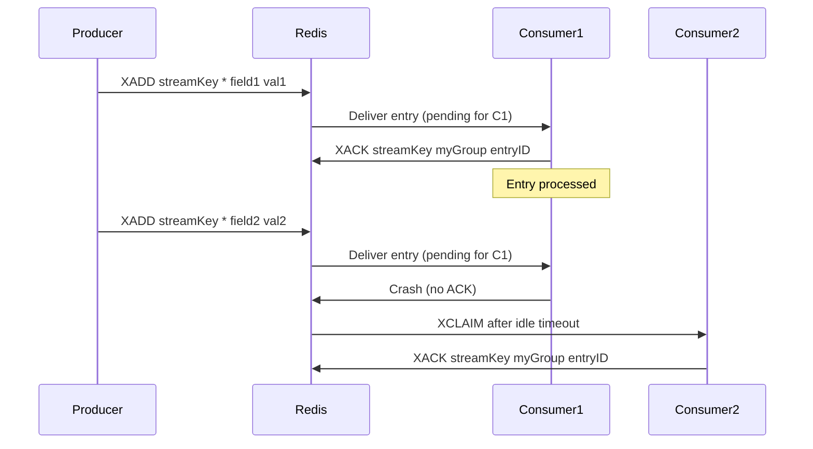

<!-- Generated by Groq via GitHub Actions -->
<!-- Topic ID: T065 -->
<!-- Category: Messaging & Event-Driven Architecture -->
<!-- Generated at UTC: 2026-10-08T07:39:57.673759+00:00 -->

# Redis Streams

## 1. What problem does this solve?

**Motivation**  
Modern back‑ends often need to decouple producers (e.g., a web API that receives user actions) from consumers (e.g., background workers that send emails, update analytics, or trigger downstream services). The key requirements are:

- **Reliability** – a message should survive crashes and be processed at least once.
- **Ordering** – many workflows depend on the order of events (e.g., order status updates).
- **Scalability** – many producers and consumers should run concurrently without bottlenecks.
- **Back‑pressure handling** – producers should not be blocked by slow consumers.

**Problem**  
Traditional in‑memory queues or simple Redis lists (`LPUSH/RPOP`) lack built‑in consumer groups, pending‑message tracking, or automatic rebalancing. They also provide only at‑most‑once semantics and no visibility into which consumer processed what.

**Why it matters**  
If you cannot guarantee that every event is processed, you risk data loss, inconsistent state, or duplicate work. Without ordering guarantees, downstream services may see events out of sequence, breaking invariants.

**Consequences of not using a proper stream**  
- **Duplicate work** – a consumer may re‑process a message if it crashes before acknowledging.
- **Lost messages** – if a consumer never acknowledges and the stream grows indefinitely, you may run out of memory.
- **Hard to scale** – adding more workers requires manual coordination or custom logic.

**Real‑world usage**  
- Order processing pipelines (e.g., e‑commerce order status updates).
- Event sourcing for domain models.
- Background job queues (image processing, email sending).
- Log aggregation and analytics pipelines.

---

## 2. Mental model

### Analogy  
Imagine a **public mailbox** that accepts envelopes (messages). Each envelope has a unique serial number (ID). Multiple **mail carriers** (consumers) can pick up envelopes from the mailbox. When a carrier takes an envelope, they write a note in a shared ledger (consumer group state) that they are handling it. If a carrier drops the envelope (fails before finishing), the ledger still shows it as pending, and another carrier can claim it later.

### Engineering model  
- **Stream** = ordered log of entries (envelopes).
- **Consumer group** = shared ledger of which consumer is processing which entry.
- **Consumer** = a worker that reads from the stream and acknowledges.
- **Pending entries** = entries that have been delivered to a consumer but not yet acknowledged.

---

## 3. Deep explanation

### Internals
- Redis stores a stream as a **linked list of entries** in memory, each entry having a unique ID (`<timestamp>-<sequence>`).
- Each entry is a **hash** of field/value pairs.
- Consumer groups maintain a **cursor** (offset) per consumer, stored in a separate hash.
- Pending entries are tracked in a **ZSET** keyed by consumer group, mapping entry IDs to the consumer that owns them.

### Important terminology
| Term | Meaning |
|------|---------|
| `XADD` | Append an entry to a stream. |
| `XREADGROUP` | Read entries from a stream as part of a consumer group. |
| `XACK` | Acknowledge that a consumer has processed an entry. |
| `XCLAIM` | Claim pending entries that have been idle for too long. |
| `consumer group` | Logical grouping of consumers that share a cursor. |
| `consumer` | Individual worker instance. |
| `pending entries` | Entries delivered but not yet acknowledged. |
| `idle time` | Time since an entry was delivered to a consumer. |

### Trade‑offs
| Aspect | Benefit | Drawback |
|--------|---------|----------|
| **In‑memory** | Low latency, high throughput. | Limited by RAM; no disk persistence unless using RDB/AOF. |
| **At‑least‑once** | Simple to implement; no message loss. | Requires idempotent consumers or de‑duplication logic. |
| **No built‑in exactly‑once** | Avoids complex transaction logic. | Duplicate processing risk. |
| **Single key per stream** | Easy to manage. | No horizontal partitioning unless you shard by key. |

### Failure modes
- **Consumer crash** – pending entries remain unacknowledged; must be claimed later.
- **Redis crash** – data may be lost if AOF/RDB not configured; replication mitigates.
- **Network partition** – consumers may read stale data; Redis Cluster can help.
- **Stream growth** – if not trimmed, memory usage can explode.

### Limitations
- No built‑in TTL for entries (must trim manually).
- No exactly‑once semantics.
- Limited to a single Redis instance per stream unless using Redis Cluster.
- Consumer group rebalancing is manual; no automatic partition assignment.

### Where it fits
- **Message broker** – acts as a lightweight broker for event streams.
- **Task queue** – workers consume tasks from a stream.
- **Event sourcing** – domain events are appended to a stream.
- **Change data capture** – database changes can be streamed into Redis.

### Interaction with related concepts
- **Pub/Sub** – Redis Streams provide persistence and consumer groups; Pub/Sub is fire‑and‑forget.
- **Redis Lists** – simpler but lack consumer groups and pending entry tracking.
- **Kafka** – similar semantics but more feature‑rich (exactly‑once, compaction, multi‑topic partitions).
- **Database triggers** – can push events into a stream for downstream processing.

---

## 4. How it works

1. **Producer** calls `XADD streamKey * field1 value1 field2 value2 …` to append an entry.  
2. **Consumer group** `myGroup` is created with `XGROUP CREATE streamKey myGroup $`.  
3. **Consumer** `worker-1` reads new entries:  
   `XREADGROUP GROUP myGroup worker-1 COUNT 10 BLOCK 0 STREAMS streamKey >`.  
   The `>` means “new entries only”.
4. Redis delivers the entries to `worker-1` and records them as **pending** for that consumer.  
5. `worker-1` processes each entry and acknowledges with `XACK streamKey myGroup entryID`.  
6. If `worker-1` crashes before acknowledging, the entry remains pending.  
7. Another consumer can claim it after a timeout using `XCLAIM streamKey myGroup newConsumer idleTime entryID`.  
8. Periodically, the stream can be trimmed with `XTRIM streamKey MAXLEN 100000` to free memory.



---

## 5. Practical implementation

### Setup

```bash
# Install dependencies
npm install redis
```

### Producer (orders.ts)

```ts
import { createClient } from 'redis';

const client = createClient();
await client.connect();

export async function produceOrder(order: { id: string; status: string }) {
  // Use auto‑generated ID (*)
  await client.xAdd('orders', '*', {
    id: order.id,
    status: order.status,
  });
}
```

### Consumer group creation (init.ts)

```ts
import { createClient } from 'redis';

const client = createClient();
await client.connect();

// Create consumer group if it doesn't exist
try {
  await client.xGroupCreate('orders', 'order_workers', '$', { mkstream: true });
} catch (e) {
  if (!e.message.includes('BUSYGROUP')) throw e;
}
```

### Worker (worker.ts)

```ts
import { createClient } from 'redis';

const client = createClient();
await client.connect();

const CONSUMER_ID = `worker-${process.pid}`;

async function processEntry(entry: { id: string; fields: Record<string, string> }) {
  const { id, fields } = entry;
  console.log(`Processing order ${fields.id} with status ${fields.status}`);
  // Simulate work
  await new Promise((r) => setTimeout(r, 500));

  // Acknowledge
  await client.xAck('orders', 'order_workers', id);
}

async function run() {
  while (true) {
    // Read up to 10 new entries, block if none
    const streams = await client.xReadGroup(
      'order_workers',
      CONSUMER_ID,
      { key: 'orders', id: '>' },
      { count: 10, block: 0 }
    );

    if (!streams) continue;

    for (const stream of streams) {
      for (const [id, fields] of stream.messages) {
        try {
          await processEntry({ id, fields: fields as Record<string, string> });
        } catch (e) {
          console.error('Processing failed', e);
          // Optionally leave the entry pending for retry
        }
      }
    }
  }
}

run().catch(console.error);
```

### Handling pending entries (recovery.ts)

```ts
import { createClient } from 'redis';

const client = createClient();
await client.connect();

async function claimStaleEntries() {
  // Claim entries idle > 60s
  const entries = await client.xClaim(
    'orders',
    'order_workers',
    'recovery-worker',
    60000,
    ['*'] // all pending entries
  );

  for (const [id, fields] of entries) {
    console.log(`Claimed stale entry ${id}`);
    // Process and ack
    await client.xAck('orders', 'order_workers', id);
  }
}

claimStaleEntries().catch(console.error);
```

---

## 6. Production considerations

| Concern | How to address |
|---------|----------------|
| **Scalability** | • Partition by stream key (e.g., `orders:shard-1`). <br>• Scale workers horizontally; each consumer group can have many consumers. <br>• Use Redis Cluster for sharding. |
| **Reliability** | • Enable AOF or RDB snapshots. <br>• Use Redis Sentinel or Cluster for high‑availability. <br>• Persist consumer group state; claim pending entries on restart. |
| **Security** | • Use ACLs to restrict `XADD`, `XREADGROUP`, `XACK`. <br>• Enable TLS for client connections. |
| **Observability** | • Export metrics: `redis_stream_entries`, `redis_stream_pending`, `redis_stream_consumers`. <br>• Log consumer lag and pending counts. <br>• Trace message flow with OpenTelemetry. |
| **Performance** | • Keep entry payload small; avoid large blobs. <br>• Use `XADD` with `*` for auto‑IDs to reduce CPU. <br>• Trim streams (`XTRIM`) to control memory. |
| **Error handling** | • Implement idempotent consumers. <br>• Use dead‑letter streams for permanently failing entries. <br>• Retry logic with exponential backoff. |
| **Resource usage** | • Monitor memory per entry (~50–100 bytes + payload). <br>• Set `maxmemory-policy` to `volatile-lru` if you trim streams. |
| **Operational concerns** | • Automate stream trimming via cron or Redis keyspace notifications. <br>• Monitor consumer group health; alert on high pending counts. |
| **Failure recovery** | • On Redis node failure, failover to replica. <br>• On consumer crash, claim pending entries after idle timeout. |
| **Deployment** | • Containerize Redis with proper resource limits. <br>• Use Helm charts for Kubernetes. <br>• Keep Redis and workers in the same network for low latency. |

---

## 7. Common mistakes

| Mistake | Why it’s problematic |
|---------|----------------------|
| **Not acknowledging (`XACK`)** | Entries stay pending → memory leak, duplicate processing. |
| **Using `XREAD` instead of `XREADGROUP`** | No consumer group state → no pending entry tracking, no rebalancing. |
| **Ignoring idle timeout** | Stale entries never get re‑claimed → worker starvation. |
| **Using `XADD` with duplicate IDs** | Redis rejects duplicate IDs → lost messages. |
| **Not trimming the stream** | Unbounded memory growth. |
| **Creating a consumer group per worker** | No load balancing; each worker processes the entire stream. |
| **Blocking on `XREADGROUP` with `BLOCK=0`** | Workers spin‑wait, wasting CPU. |
| **Assuming exactly‑once** | Duplicate processing can happen; consumers must be idempotent. |

---

## 8. Senior engineer perspective

### Design decisions at scale
- **Stream partitioning**: Use multiple streams (`orders:shard-1`, `orders:shard-2`) to avoid a single hot key.
- **Consumer group strategy**: One group per logical service; avoid cross‑service groups unless needed.
- **Retention policy**: Set `MAXLEN` or use `XTRIM` with `~` for approximate trimming to keep memory bounded.
- **Cluster vs Sentinel**: Prefer Redis Cluster for horizontal scaling; Sentinel for simpler HA.
- **Monitoring**: Expose `redis_stream_pending` and `redis_stream_consumers` to Prometheus; alert on high pending counts.
- **Cost**: Each entry consumes ~100 bytes; 1 M entries ≈ 100 MB. Scale memory accordingly.

### Bottlenecks
- **Memory**: Streams are in‑memory; large streams can saturate RAM.
- **CPU**: `XCLAIM` and `XACK` are O(1), but large pending sets can slow down.
- **Network**: High throughput streams can saturate network if workers are remote.

### Failure scenarios
- **Consumer crash** → pending entries remain; must be claimed.
- **Redis node failure** → data loss if not replicated; use AOF or RDB.
- **Network partition** → consumers may read stale data; use Redis Cluster with quorum.

### When NOT to use
- **Exactly‑once semantics** required → consider Kafka or a transactional database.
- **Cross‑region replication** needed → Redis Cluster may not span regions easily.
- **Complex routing** (e.g., topic‑based) → use a full‑blown broker.

---

## 9. Interview questions

1. **Beginner** – *What is a Redis Stream and how does it differ from a Redis List?*  
   *Answer:* A stream is an append‑only log with unique IDs, supports consumer groups, pending entries, and message acknowledgment. Lists are simple FIFO queues without consumer groups or persistence guarantees.

2. **Beginner** – *Explain the purpose of `XACK` in Redis Streams.*  
   *Answer:* `XACK` tells Redis that a consumer has finished processing an entry, removing it from the pending set and allowing the consumer group cursor to advance.

3. **Senior** – *How would you design a stream‑based order processing system that can handle millions of orders per day while ensuring no order is lost or processed twice?*  
   *Answer:* Partition orders into multiple streams (shards) by hash of order ID; use a single consumer group per shard; ensure idempotent processing; use `XACK` and `XCLAIM` for failure recovery; trim streams; enable AOF/RDB; monitor pending counts; use Redis Cluster for scaling.

4. **Senior** – *What are the trade‑offs between using Redis Streams and Kafka for event processing?*  
   *Answer:* Redis Streams are lightweight, low‑latency, and easier to set up but lack exactly‑once semantics, long‑term storage, and multi‑region replication. Kafka offers stronger guarantees, compaction, and built‑in partitioning but has higher operational overhead and latency.

5. **Scenario/Debugging** – *A consumer group has a growing number of pending entries over time. What could be causing this and how would you investigate?*  
   *Answer:* Possible causes: consumers not acknowledging (`XACK`), consumers crashing, or slow processing. Investigate by checking consumer group pending count (`XPENDING`), consumer idle times, logs for errors, and ensuring workers are healthy. Use `XCLAIM` to recover stale entries.

---

## 10. Hands‑on task

**Build an order‑processing pipeline**

1. Create a Node.js project with `redis` client.  
2. Implement a producer that reads orders from a JSON file and pushes them to a stream `orders`.  
3. Create a consumer group `order_workers`.  
4. Spin up 3 worker processes that read from the stream, simulate processing (e.g., sleep 200 ms), and acknowledge.  
5. Add logic to claim pending entries idle > 30 s.  
6. Periodically trim the stream to keep at most 500 k entries.  
7. Expose a simple HTTP endpoint `/stats` that returns the number of pending entries and last processed order ID.  
8. Run the system, observe that workers process orders, pending entries stay low, and the `/stats` endpoint reports correct values.

---

## 11. Quick revision

- Redis Streams are append‑only logs with unique IDs (`<timestamp>-<sequence>`).  
- `XADD` appends; `XREADGROUP` reads; `XACK` acknowledges.  
- Consumer groups share a cursor; pending entries track unacknowledged messages.  
- `XCLAIM` reclaims stale pending entries.  
- Streams are in‑memory; trim with `XTRIM` or `MAXLEN`.  
- Use `XGROUP CREATE` with `mkstream` to create a stream if it doesn’t exist.  
- For idempotent processing, design consumers to handle duplicates.  
- Monitor pending counts (`XPENDING`) and stream length (`XLEN`).  
- Use Redis Cluster or Sentinel for HA.  
- Avoid `XREAD` without consumer groups; it lacks pending tracking.  
- Exactly‑once semantics are not guaranteed; use idempotency or external deduplication.  
- Trimming is essential to control memory usage.

---

## 12. References

- [Redis Streams – Official Documentation](https://redis.io/docs/manual/data-types/streams/)  
- [Redis Streams – Commands](https://redis.io/commands/?search=stream)  
- [node-redis v4 API](https://github.com/redis/node-redis)  
- [ioredis – Streams Example](https://github.com/luin/ioredis/blob/master/examples/streams.js)  
- [Redis Cluster – Streams](https://redis.io/docs/manual/scaling/cluster/)  
- [Redis Sentinel – High Availability](https://redis.io/docs/manual/sentinel/)  
- [Redis Streams – Best Practices](https://redis.io/docs/latest/develop/messaging/streams/)  

---
