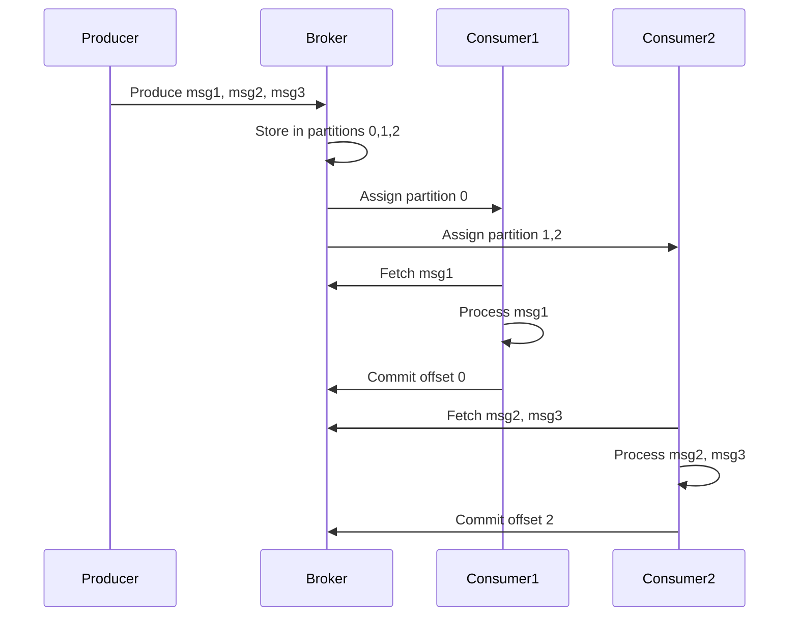

<!-- Generated by Groq via GitHub Actions -->
<!-- Topic ID: T066 -->
<!-- Category: Messaging & Event-Driven Architecture -->
<!-- Generated at UTC: 2026-10-08T07:39:57.673759+00:00 -->

# Consumer groups

## 1. What problem does this solve?

**Motivation**

When a backend system publishes many events (e.g., user sign‑ups, order placements), multiple services often need to react to those events. A naive approach is to have each service subscribe to the same topic and process every message independently. This leads to:

- **Duplicate work** – every consumer does the same heavy processing.
- **Unnecessary load** – the producer pushes the same payload to many consumers.
- **Difficulty scaling** – adding more instances of a consumer doubles the work.

**Problem**

- *Redundant processing*: Each consumer receives every message.
- *Throughput bottleneck*: A single consumer instance can become a choke point.
- *Stateful coordination*: When multiple instances must share work, coordination is hard.

**Why it matters**

- **Cost**: More compute and storage for duplicate work.
- **Latency**: Slow consumers delay downstream services.
- **Reliability**: If one consumer fails, others may still process the same message, causing idempotency issues.

**Consequences of not using consumer groups**

- Services may process the same event multiple times, leading to inconsistent state.
- Scaling becomes expensive because you need to run many identical consumers.
- Harder to guarantee at‑least‑once or exactly‑once semantics.

**Real‑world appearance**

- Kafka consumer groups in microservice architectures.
- RabbitMQ consumer queues with competing consumers.
- NATS streaming with queue groups.
- Redis Streams consumer groups.

---

## 2. Mental model

**Analogy**

> *Imagine a group of workers (consumers) sharing a pile of tasks (messages). Each task is a job card. The workers form a “task squad” (consumer group). When a new job card appears, only one worker picks it up; the others ignore it. If a worker leaves, the remaining workers automatically take over the remaining cards.*

**Engineering model**

- **Topic** → *Task pile* (a stream of messages).
- **Consumer group** → *Task squad* (set of consumer instances).
- **Partition** → *Sub‑pile* (logical division of the task pile).
- **Offset** → *Last processed card* (position marker).
- **Load balancing** → *Workers pick different sub‑piles* (each partition assigned to one consumer in the group).

---

## 3. Deep explanation

### Internals

| Term | Meaning |
|------|---------|
| **Topic** | Logical channel for messages. |
| **Partition** | Ordered, immutable sequence of messages. Each partition is a unit of parallelism. |
| **Consumer group** | A set of consumers that share the load of a topic. |
| **Offset** | Position of the last consumed message per partition. |
| **Rebalance** | Process of redistributing partitions among consumers when group membership changes. |
| **Commit** | Persisting the offset so the group knows where to resume. |

**How it works**

1. Each consumer subscribes to a topic and joins a group.
2. The broker assigns each partition to exactly one consumer in the group.
3. Consumers read messages sequentially from their assigned partitions.
4. After processing, consumers commit offsets.
5. If a consumer dies, the group rebalances: remaining consumers take over its partitions.

### Trade‑offs

| Aspect | Benefit | Drawback |
|--------|---------|----------|
| **Parallelism** | Increases throughput linearly with partitions. | Requires enough partitions; too many partitions can increase metadata overhead. |
| **Ordering** | Guarantees order per partition. | Global ordering across partitions is not preserved. |
| **Fault tolerance** | Automatic failover via rebalancing. | Rebalance can pause consumption temporarily. |
| **Exactly‑once** | Possible with idempotent processing and proper offset commits. | Requires careful design; not guaranteed by the broker alone. |

### Failure modes

- **Rebalance storms**: Frequent joins/leaves cause repeated rebalancing, stalling consumption.
- **Offset mis‑commit**: If a consumer commits before processing, a crash leads to data loss.
- **Out‑of‑order commits**: Parallel consumers may commit offsets out of sequence, causing reprocessing.
- **Under‑partitioning**: Too few partitions limit parallelism; too many partitions waste resources.

### Limitations

- **No cross‑partition ordering**: If ordering matters across partitions, you must enforce it in the application.
- **Single consumer per partition**: A consumer cannot read the same partition concurrently with another consumer in the same group.
- **Rebalance latency**: During rebalancing, consumers pause; high churn can degrade throughput.

### Where it fits

- **Event sourcing**: Consumers replay events to rebuild state.
- **CQRS**: Read models subscribe to command events via consumer groups.
- **Microservices**: Each service runs a consumer group to process its domain events.

### Interaction with related concepts

- **Idempotency**: Needed when a consumer may reprocess messages after a crash.
- **Dead‑letter queues**: For messages that repeatedly fail.
- **Exactly‑once semantics**: Combine with transactional writes to databases.
- **Back‑pressure**: Use consumer lag metrics to throttle producers.

---

## 4. How it works



**Step‑by‑step flow**

1. **Producer** sends messages to a topic.
2. **Broker** splits the topic into partitions and stores messages.
3. **Consumers** join a group; the broker assigns partitions.
4. Each consumer **fetches** messages from its partitions.
5. After **processing**, the consumer **commits** the offset.
6. If a consumer **fails**, the broker **rebalances** partitions to remaining consumers.
7. Consumers **resume** from the last committed offset.

---

## 5. Practical implementation

Below is a minimal Node.js example using **KafkaJS** (a popular pure‑TS Kafka client).  
The consumer group is named `order-processor`.

```ts
// src/consumer.ts
import { Kafka, logLevel } from 'kafkajs';

const kafka = new Kafka({
  clientId: 'order-service',
  brokers: ['kafka:9092'],
  logLevel: logLevel.INFO,
});

const consumer = kafka.consumer({ groupId: 'order-processor' });

async function run() {
  await consumer.connect();
  // Subscribe to the topic; autoOffsetReset = 'earliest' ensures we read from the start
  await consumer.subscribe({ topic: 'orders', fromBeginning: true });

  // Run the consumer loop
  await consumer.run({
    eachMessage: async ({ topic, partition, message }) => {
      const order = JSON.parse(message.value?.toString() || '{}');
      console.log(`Processing order ${order.id} from partition ${partition}`);

      // Simulate idempotent DB write
      await processOrder(order);

      // KafkaJS automatically commits offsets after eachMessage resolves
    },
  });
}

async function processOrder(order: any) {
  // Example: upsert into PostgreSQL
  // await db.query('INSERT INTO orders ... ON CONFLICT (id) DO UPDATE ...');
  // For demo, just delay
  await new Promise((r) => setTimeout(r, 200));
}

run().catch(console.error);
```

**Key points**

- `groupId` defines the consumer group.
- `eachMessage` is called for every message; KafkaJS commits the offset automatically after the promise resolves.
- If the consumer crashes before `eachMessage` resolves, the message will be re‑processed after rebalance.

### Running the example

```bash
# Docker compose (simplified)
docker run -d --name kafka -p 9092:9092 \
  wurstmeister/kafka:2.13-2.8.1 \
  /etc/kafka/docker/run.sh

# Start consumer
node src/consumer.ts
```

---

## 6. Production considerations

| Concern | Recommendation |
|---------|----------------|
| **Scalability** | *Partition count* should be ≥ number of consumer instances. Use 3× the number of cores for parallelism. |
| **Reliability** | Enable *auto-commit* only after idempotent processing. Use *manual commits* for critical flows. |
| **Security** | Use SASL/SSL for broker authentication. Restrict ACLs to the consumer group. |
| **Observability** | Export consumer lag, rebalance events, and error metrics to Prometheus. |
| **Performance** | Tune `fetch.min.bytes`, `fetch.max.wait.ms`, and `max.poll.records` for throughput. |
| **Error handling** | Catch exceptions in `eachMessage`; send to a dead‑letter topic if needed. |
| **Resource usage** | Monitor JVM/Node heap; avoid memory leaks in message handlers. |
| **Operational concerns** | Automate rebalancing with `rebalanceListener`. Use graceful shutdown (`consumer.disconnect()`). |
| **Failure recovery** | Keep offsets in a durable store (Kafka’s internal topic). Verify offset commit strategy. |
| **Deployment** | Run consumers in containers; use Kubernetes StatefulSets or Deployments with proper liveness/readiness probes. |

---

## 7. Common mistakes

| Mistake | Why it’s problematic |
|---------|----------------------|
| **Using a single partition** | Limits parallelism; all consumers share the same partition → no load balancing. |
| **Auto‑commit before processing** | Data loss if consumer crashes after commit but before business logic completes. |
| **Ignoring consumer lag** | Overlooking that consumers are falling behind can hide performance bottlenecks. |
| **Not handling rebalances** | Consumers may pause during rebalance; if not handled, throughput drops. |
| **Assuming global ordering** | Kafka guarantees order only per partition; cross‑partition ordering is not preserved. |
| **Hard‑coding offsets** | Bypassing the broker’s offset store leads to duplicate or missing messages. |
| **Running too many consumer instances** | Exceeds partition count → some consumers idle; increases overhead. |

---

## 8. Senior engineer perspective

### At scale

- **Partition strategy**: Use a hash of a key (e.g., user ID) to ensure related events stay in the same partition for ordering.
- **Offset storage**: Prefer the broker’s internal topic (`__consumer_offsets`) over external stores for consistency.
- **Exactly‑once**: Combine Kafka’s transactional API with idempotent database writes; this requires a transactional producer and consumer.
- **Rebalance tuning**: Set `session.timeout.ms` and `heartbeat.interval.ms` to balance responsiveness vs. false positives.
- **Monitoring**: Track *consumer lag*, *rebalance frequency*, and *error rates*; set alerts for lag > threshold.
- **Cost/performance**: More partitions increase metadata traffic; evaluate the trade‑off between parallelism and overhead.
- **When NOT to use**: If you need strict global ordering or very low latency per message, consider a different pattern (e.g., direct RPC or a single consumer).

---

## 9. Interview questions

1. **Beginner**: *What is a consumer group in Kafka?*  
   *Answer:* A set of consumers that share the work of consuming messages from a topic; each partition is assigned to only one consumer in the group.

2. **Beginner**: *Why do we commit offsets?*  
   *Answer:* To record how far a consumer has processed, so that on restart or rebalance it can resume from the last committed position.

3. **Senior**: *Explain how Kafka guarantees at-least-once delivery in a consumer group.*  
   *Answer:* Kafka commits offsets after a consumer processes a message. If a consumer crashes before committing, the message will be re‑delivered. This yields at-least-once semantics; idempotent processing is required for correctness.

4. **Senior**: *Describe a scenario where rebalancing can cause a performance hit and how you mitigate it.*  
   *Answer:* Frequent joins/leaves trigger rebalancing, pausing consumption. Mitigation: use sticky assignment, reduce group churn, tune `session.timeout.ms`, and handle rebalance events gracefully.

5. **Scenario/Debugging**: *You notice consumer lag increasing steadily over time. What steps would you take to diagnose and fix the issue?*  
   *Answer:*  
   - Check broker metrics for partition throughput.  
   - Inspect consumer logs for errors or slow processing.  
   - Verify offset commit strategy (auto vs manual).  
   - Profile message handler for CPU/memory bottlenecks.  
   - Scale consumer instances or increase partition count.  
   - Add back‑pressure or throttling if producer is too fast.

---

## 10. Hands‑on task

**Task**: Build a simple order‑processing pipeline.

1. **Producer**: Create a Node.js script that publishes 1,000 order events to a Kafka topic `orders`. Each event contains `{ id, userId, amount }`.
2. **Consumer group**: Implement a consumer group `order-processor` that:
   - Reads messages.
   - Stores them in an in‑memory map keyed by `id` (simulate DB).
   - Logs when a duplicate order is detected (simulate idempotency).
3. **Experiment**: Run 3 consumer instances in parallel. Observe consumer lag and duplicate detection. Then stop one consumer and observe rebalancing.

**Deliverables**:  
- `producer.ts`, `consumer.ts`, and a `docker-compose.yml` to run Kafka locally.  
- A README explaining how to run the experiment and what to observe.

---

## 11. Quick revision

- Consumer group = set of consumers sharing a topic’s partitions.
- Each partition is assigned to only one consumer in the group.
- Offsets track progress; committing after processing ensures at‑least‑once.
- Rebalance redistributes partitions when group membership changes.
- Partition count determines parallelism; too few → bottleneck, too many → overhead.
- Exactly‑once requires idempotent processing + transactional commits.
- Monitor consumer lag, rebalance events, and error rates.
- Avoid auto‑commit before business logic completes.
- Rebalancing pauses consumption; handle gracefully.
- Use ACLs and TLS for security.
- Scale by adding partitions and consumer instances.

---

## 12. References

- [Kafka Documentation – Consumer Groups](https://kafka.apache.org/documentation/#consumerconfigs)
- [KafkaJS – Official Docs](https://kafka.js.org/docs/)
- [Kafka Streams – Partitioning & Ordering](https://kafka.apache.org/documentation/streams/)
- [Confluent – Exactly‑Once Semantics](https://docs.confluent.io/platform/current/streams/developer-guide/streams-exactly-once.html)
- [Prometheus – Kafka Exporter](https://github.com/danielqsj/kafka_exporter)
- [AWS MSK – Consumer Group Best Practices](https://docs.aws.amazon.com/msk/latest/developerguide/consumer-group-best-practices.html)
