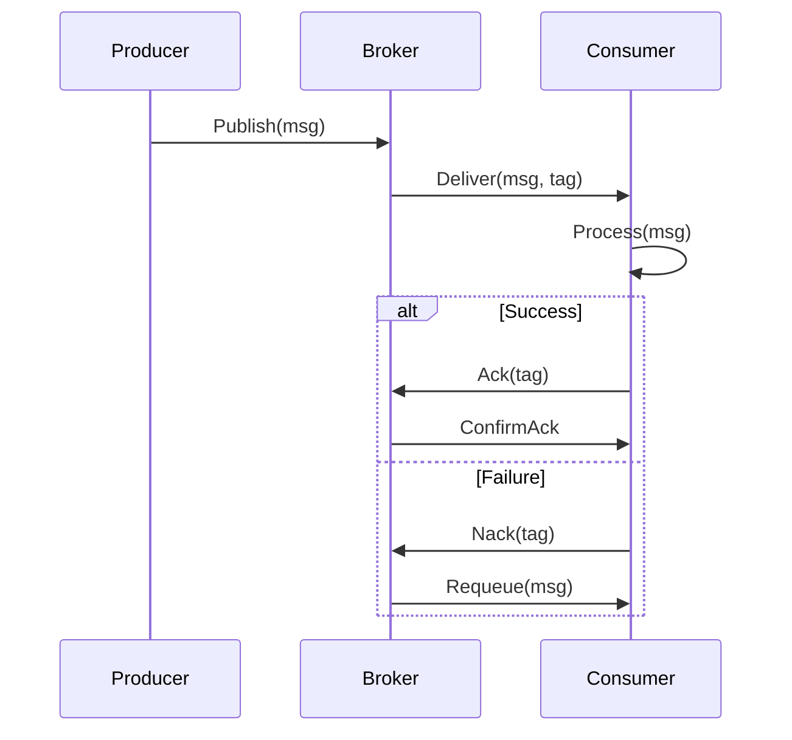

<!-- Generated by Groq via GitHub Actions -->
<!-- Topic ID: T067 -->
<!-- Category: Messaging & Event-Driven Architecture -->
<!-- Generated at UTC: 2026-10-08T19:21:41.501623+00:00 -->

# Message acknowledgment

## 1. What problem does this solve?

When a backend service consumes a message from a queue or stream, it must **confirm** that it has processed the message successfully.  
Without this confirmation the system cannot guarantee **exact‑once** delivery, may lose work, or may process the same message multiple times.

- **Problem**: A consumer might crash, time out, or fail after pulling a message but before persisting its result. If the message is never acknowledged, the broker will re‑deliver it, leading to duplicate work or data corruption.
- **Why it matters**: In financial, order‑processing, or data‑pipeline systems, duplicate or missing records can cause serious downstream errors, regulatory violations, or lost revenue.
- **What happens if not used**:  
  - **Duplicate processing** → double charges, duplicated emails, inconsistent state.  
  - **Message loss** → missed orders, incomplete analytics, stale caches.  
  - **Unbounded queue growth** → resource exhaustion and degraded performance.
- **Real‑world appearance**:  
  - **RabbitMQ**: `basic.ack`, `basic.nack`.  
  - **Kafka**: consumer offsets commit.  
  - **AWS SQS**: visibility timeout + delete.  
  - **Redis Streams**: `XACK`.  
  - **NATS Streaming**: manual ack.

## 2. Mental model

### Analogy: Post‑alot delivery

Imagine a postal worker (consumer) picks up a letter (message) from a mailbox (queue). The worker must **sign** a receipt (acknowledge) after delivering it.  
- If the worker signs, the sender knows the letter was delivered and can stop sending more copies.  
- If the worker fails to sign (e.g., crashes), the system will assume the letter was lost and will resend it later.

### Engineering model

- **Message** → **Consumer** → **Processing** → **Ack/Nack** → **Broker**  
  - **Ack**: “I finished successfully.”  
  - **Nack / Requeue**: “I failed; please retry.”  
  - **No ack**: Broker will retry after a timeout.

## 3. Deep explanation

| Topic | Details |
|-------|---------|
| **Internals** | Brokers keep a per‑consumer or per‑partition state of unacknowledged messages. They may store a *delivery tag* or *offset* and a visibility timeout. |
| **Terminology** | *Acknowledgment*, *Nack*, *Requeue*, *Visibility timeout*, *Offset commit*, *Dead‑letter queue (DLQ)*. |
| **Trade‑offs** | <ul><li>**Latency**: Waiting for ack can increase end‑to‑end latency.</li><li>**Throughput**: Too many unacked messages can block consumers.</li><li>**Complexity**: Manual ack logic adds code complexity.</li></ul> |
| **Failure modes** | <ul><li>Consumer crashes after processing but before ack → duplicate work.</li><li>Broker fails to persist ack state → message may be lost.</li><li>Ack sent too early (before idempotent write) → data corruption.</li></ul> |
| **Limitations** | <ul><li>Not all brokers support manual ack (e.g., some pub/sub models).</li><li>Ack granularity may be coarse (e.g., batch ack).</li></ul> |
| **Fit in architecture** | Acknowledgment sits between *consumer* and *broker*. It is orthogonal to *idempotency*, *transactional outbox*, and *retry policies*. |
| **Interaction with related concepts** | • **Idempotency**: Even with ack, duplicate messages may arrive; idempotent handlers prevent double work.<br>• **Transactional outbox**: Acks are often coupled with database commits to avoid lost updates.<br>• **Dead‑letter queues**: Messages that exceed retry limits are routed to DLQ after repeated nacks. |

## 4. How it works

1. **Producer** publishes a message to a broker.  
2. **Broker** stores the message and assigns a delivery tag/offset.  
3. **Consumer** pulls the message.  
4. **Consumer** processes the message.  
5. **Consumer** sends an **ack** if successful, or a **nack/requeue** if it fails.  
6. **Broker** updates its state:  
   - Ack → message is removed or marked consumed.  
   - Nack/Requeue → message becomes visible again after visibility timeout.  
7. **Optional**: If the consumer crashes before ack, the broker will re‑deliver after the timeout.



## 5. Practical implementation

### Node.js with RabbitMQ (amqplib)

```ts
import amqp from 'amqplib';

async function run() {
  const conn = await amqp.connect('amqp://localhost');
  const ch = await conn.createChannel();

  const queue = 'orders';
  await ch.assertQueue(queue, { durable: true });

  // Consume with manual ack
  ch.consume(
    queue,
    async (msg) => {
      if (!msg) return;

      try {
        const order = JSON.parse(msg.content.toString());
        // idempotent DB write
        await db.saveOrder(order);

        // ACK after successful DB write
        ch.ack(msg);
      } catch (err) {
        console.error('Processing failed', err);
        // NACK and requeue for retry
        ch.nack(msg, false, true);
      }
    },
    { noAck: false } // manual ack mode
  );
}

run().catch(console.error);
```

**Key lines**

- `noAck: false` → consumer must ack manually.  
- `ch.ack(msg)` → confirms success.  
- `ch.nack(msg, false, true)` → requeues the message for retry.

### Kafka with Node.js (kafkajs)

```ts
import { Kafka } from 'kafkajs';

const kafka = new Kafka({ clientId: 'orders', brokers: ['localhost:9092'] });
const consumer = kafka.consumer({ groupId: 'order-processors' });

async function run() {
  await consumer.connect();
  await consumer.subscribe({ topic: 'orders', fromBeginning: false });

  await consumer.run({
    eachMessage: async ({ topic, partition, message }) => {
      try {
        const order = JSON.parse(message.value?.toString() || '');
        await db.saveOrder(order);
        // Auto-commit offset after eachMessage resolves
      } catch (err) {
        console.error('Failed', err);
        // Throw to trigger retry or manual offset commit
        throw err;
      }
    },
  });
}

run().catch(console.error);
```

Kafka auto‑commits offsets after `eachMessage` resolves. If you throw, the consumer will retry based on `retry` config.

## 6. Production considerations

| Concern | Tips |
|---------|------|
| **Scalability** | Use *batch ack* (e.g., `basic.ack` with `multiple=true`) to reduce round‑trips. |
| **Reliability** | Combine ack with *transactional outbox* or *two‑phase commit* to avoid lost updates. |
| **Security** | Ensure only authorized consumers can send acks; use TLS and ACLs. |
| **Observability** | Emit metrics: `messages_acked`, `messages_nacked`, `retries`. Log ack timestamps. |
| **Performance** | Tune visibility timeout to match processing time; avoid too short timeouts that cause premature retries. |
| **Error handling** | Implement exponential backoff for nacks; route to DLQ after N attempts. |
| **Resource usage** | Monitor unacked message count; high counts may indicate consumer lag. |
| **Operational concerns** | Backups of broker state; monitor broker health; plan for broker restarts. |
| **Failure recovery** | On consumer crash, broker will re‑deliver after timeout. Ensure idempotent processing. |
| **Deployment** | Use container orchestration (K8s) with liveness/readiness probes; keep broker replicas for HA. |

## 7. Common mistakes

| Mistake | Why it’s bad |
|---------|--------------|
| **Ack before DB commit** | If the DB write fails after ack, the message is lost. |
| **No ack on failure** | Broker will retry, but if the consumer crashes, the message may be lost or duplicated. |
| **Using auto‑ack (`noAck:true`)** | No guarantee of processing; duplicates or losses are common. |
| **Ignoring DLQ** | Messages that repeatedly fail will clog the queue, causing backpressure. |
| **Hard‑coding visibility timeout** | If processing time varies, some messages may be retried too early or too late. |
| **Not handling idempotency** | Duplicate acks can still lead to duplicate processing if the consumer is restarted. |

## 8. Senior engineer perspective

At scale, message acknowledgment becomes a **system‑level contract** between producers, brokers, and consumers.

- **Architecture decisions**  
  - Choose a broker that supports *exact‑once* semantics (e.g., Kafka with idempotent producers).  
  - Decide between *at‑least‑once* (simpler) vs *exact‑once* (complex).  
  - Use *dead‑letter queues* and *retry policies* to isolate problematic messages.

- **Trade‑offs**  
  - **Throughput vs. safety**: Manual ack + idempotency reduces throughput but increases reliability.  
  - **Latency vs. consistency**: Waiting for ack before responding to a client can increase latency.

- **Bottlenecks**  
  - Unacked message backlog can exhaust broker memory.  
  - Slow consumers can cause *consumer lag* and stale data.

- **Failure scenarios**  
  - Broker partition loss → unacked messages may be lost.  
  - Consumer crash during processing → duplicate work.

- **Monitoring**  
  - Track *unacked message count*, *retry rates*, *DLQ size*.  
  - Alert on *consumer lag* > threshold.

- **Cost/performance**  
  - Batch ack reduces network overhead but may increase memory usage.  
  - Larger visibility timeouts reduce retries but increase resource consumption.

- **When NOT to use**  
  - Simple fire‑and‑forget workloads where duplicates are acceptable.  
  - Low‑volume, low‑risk systems where manual ack adds unnecessary complexity.

## 9. Interview questions

1. **Beginner**: *What is the purpose of message acknowledgment in a message queue?*  
   *Answer*: It lets the broker know a consumer has processed a message so it can remove it from the queue and avoid re‑delivery.

2. **Beginner**: *What happens if a consumer fails after processing a message but before sending an ack?*  
   *Answer*: The broker will re‑deliver the message after the visibility timeout, leading to duplicate processing.

3. **Senior**: *Explain how you would design a system that guarantees exactly‑once processing using Kafka.*  
   *Answer points*: Use idempotent producers, transactional outbox, commit offsets only after DB commit, enable `enable.idempotence=true`, use `acks=all`, handle retries, use DLQ.

4. **Senior**: *How do you balance throughput and reliability when choosing between manual ack and auto‑ack?*  
   *Answer points*: Manual ack gives control and reliability but adds latency; auto‑ack is faster but risks data loss. Consider workload, idempotency, and SLA.

5. **Scenario/Debugging**: *A consumer is stuck processing messages and the queue grows. What steps would you take to diagnose and fix the issue?*  
   *Answer points*:  
   - Check consumer logs for errors.  
   - Verify ack is sent after processing.  
   - Inspect visibility timeout vs. processing time.  
   - Look at consumer lag metrics.  
   - Ensure idempotent DB writes.  
   - Consider scaling consumer instances or increasing batch size.

## 10. Hands‑on task

**Task**: Implement a retry‑aware consumer for a RabbitMQ queue that processes JSON orders.  
- On success, ack the message.  
- On failure, nack and requeue up to 5 times.  
- After 5 failures, move the message to a `orders.dlq` queue.  
- Log each step and expose Prometheus metrics (`orders_processed_total`, `orders_failed_total`, `orders_dlq_total`).

**Hints**:  
- Use `x-death` header to count retries.  
- Use `channel.nack(msg, false, false)` to drop the message.  
- Create a DLQ exchange/queue and bind it with a routing key.

## 11. Quick revision

- Ack = “I finished successfully”; Nack = “I failed”.  
- Manual ack gives reliability; auto‑ack sacrifices safety.  
- Unacked messages = broker’s visibility timeout → retry.  
- Combine ack with idempotent writes to avoid duplicates.  
- DLQ stores messages that exceed retry limits.  
- Batch ack reduces round‑trips but increases memory usage.  
- Monitor unacked count, consumer lag, DLQ size.  
- Use `x-death` header (RabbitMQ) or offset commits (Kafka).  
- Ensure ack is sent **after** all side‑effects (DB, external calls).  
- For Kafka, use transactional outbox + idempotent producer for exact‑once.  
- Security: TLS, ACLs, signed acks.  
- Performance: tune visibility timeout, batch size, prefetch count.

## 12. References

- RabbitMQ: [Basic.Ack](https://www.rabbitmq.com/confirms.html)  
- RabbitMQ: [Dead Letter Exchanges](https://www.rabbitmq.com/dlx.html)  
- Kafka: [Consumer Offsets](https://kafka.apache.org/documentation/#consumerconfigs_auto.commit.interval.ms)  
- Kafka: [Exactly‑once Semantics](https://kafka.apache.org/documentation/#exactly_once)  
- AWS SQS: [Visibility Timeout](https://docs.aws.amazon.com/AWSSimpleQueueService/latest/SQSDeveloperGuide/sqs-visibility-timeout.html)  
- Redis Streams: [XACK](https://redis.io/commands/xack/)  
- amqplib: [Channel.ack](https://github.com/squaremo/amqp.node#channelackmessage-multiple)  
- kafkajs: [Consumer.run](https://kafka.js.org/docs/consumer)  

---
