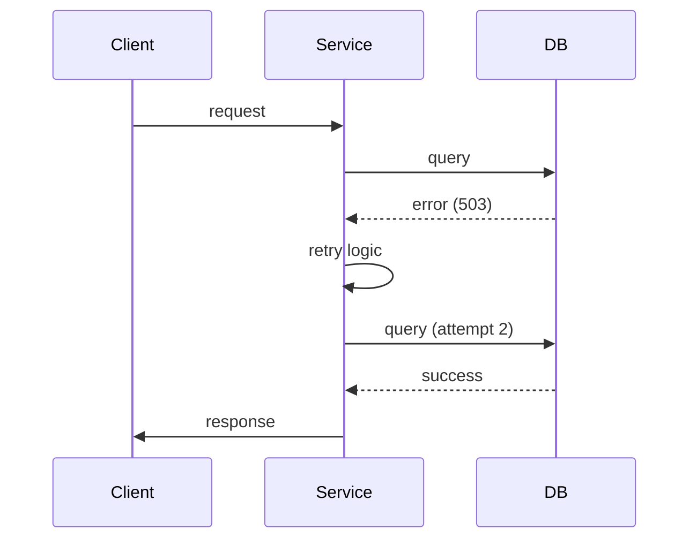

<!-- Generated by Groq via GitHub Actions -->
<!-- Topic ID: T068 -->
<!-- Category: Messaging & Event-Driven Architecture -->
<!-- Generated at UTC: 2026-10-08T19:21:41.501623+00:00 -->

# Retry mechanisms

## 1. What problem does this solve?

When a backend service calls another service, database, or external API, the call can fail for many reasons: transient network glitches, temporary unavailability of the target, rate limits, or even a brief overload of the downstream system.  
If we simply propagate the error to the caller, the entire user request may fail, leading to a poor user experience, lost business, or cascading failures in a distributed system.

**Why it matters**

* **User experience** – A single hiccup shouldn’t turn a successful request into a 500 error.
* **System resilience** – Transient failures are common; handling them gracefully keeps the system healthy.
* **Cost & SLA** – Retries can reduce the number of failed requests that trigger expensive compensating actions or SLA penalties.

**What happens if we don’t use retries**

* Higher error rates and more visible failures.
* Increased load on downstream services because the caller may retry manually or re‑invoke the operation.
* Complicated error handling logic spread across the codebase.

**Where it appears in real backend systems**

* HTTP clients (e.g., Axios, node-fetch) retrying REST calls.
* Message brokers (Kafka, RabbitMQ) retrying message consumption.
* Database drivers retrying transient connection errors.
* AI inference services retrying GPU queue slots.

---

## 2. Mental model

**Analogy – The “Retrying a Phone Call”**

Imagine you’re calling a support line. The line is busy, so you hang up and call back after a short pause. You keep trying a few times, each time waiting a bit longer, until the call goes through or you give up.  

**Engineering model**

* **Transient failure** = “busy line” – temporary, likely to succeed if retried.
* **Retry policy** = “how many times, how long to wait, when to stop”.
* **Back‑off** = “wait longer each time” – prevents hammering the downstream system.
* **Circuit breaker** = “give up after many failures” – protects the system from endless retries.

---

## 3. Deep explanation

### Internals

A retry mechanism typically consists of:

1. **Decision logic** – Determines if an error is retryable.
2. **Policy** – Number of attempts, base delay, max delay, jitter.
3. **Execution wrapper** – Executes the operation, catches errors, applies policy.

### Important terminology

| Term | Meaning |
|------|---------|
| **Transient error** | An error that may succeed if retried (e.g., 503 Service Unavailable). |
| **Permanent error** | An error that will not succeed on retry (e.g., 404 Not Found). |
| **Exponential back‑off** | Delay grows exponentially (e.g., 100ms, 200ms, 400ms). |
| **Jitter** | Random variation added to delay to avoid thundering herd. |
| **Circuit breaker** | Opens after a threshold of failures, preventing further attempts for a cooldown period. |
| **Idempotency** | Operation can be safely retried without side effects. |

### Trade‑offs

| Aspect | Benefit | Drawback |
|--------|---------|----------|
| **Retries** | Higher success rate, better user experience. | Extra latency, increased load on downstream services. |
| **Back‑off** | Reduces contention, gives downstream time to recover. | Longer overall latency. |
| **Jitter** | Avoids synchronized retries. | Slightly unpredictable latency. |
| **Circuit breaker** | Protects system from cascading failures. | Requires tuning to avoid false positives. |

### Failure modes

* **Infinite retry loop** – No max attempts or timeout → resource exhaustion.
* **Retrying non‑idempotent ops** – Duplicate side effects (e.g., double charge).
* **Retrying permanent errors** – Wastes time and resources.
* **Thundering herd** – Many services retry simultaneously, causing spikes.

### Limitations

* **Not a silver bullet** – Only handles transient failures; cannot fix underlying bugs.
* **Requires idempotency** – Many operations (writes) are not safe to retry.
* **Complexity** – Adding retries increases code complexity and testing surface.

### Where it fits in a backend architecture

```
┌─────────────┐
│  Client     │
└─────┬───────┘
      │
      ▼
┌─────────────┐
│  API Gateway│
└─────┬───────┘
      │
      ▼
┌─────────────┐
│  Service A  │  <-- Retry wrapper around outbound calls
└─────┬───────┘
      │
      ▼
┌─────────────┐
│  Service B  │  <-- May also retry inbound requests
└─────┬───────┘
      │
      ▼
┌─────────────┐
│  Database   │
└─────────────┘
```

*Retries are usually applied at the **client** side of a call (outbound).  
*They can also be applied at the **consumer** side (inbound) for message queues.*

### Interaction with related concepts

* **Idempotency keys** – Ensure safe retries for writes.
* **Circuit breakers** – Often paired with retries to avoid endless attempts.
* **Observability** – Metrics (retry count, latency) help tune policies.
* **Rate limiting** – Retries must respect downstream limits.

---

## 4. How it works

1. **Call the operation** inside a retry wrapper.
2. **Catch errors** and classify them as retryable or not.
3. If retryable:
   1. **Increment attempt counter**.
   2. **Calculate delay** using back‑off + jitter.
   3. **Wait** for the delay.
   4. **Repeat** until success or max attempts reached.
4. If not retryable or max attempts exceeded, **propagate error**.



---

## 5. Practical implementation

Below is a TypeScript helper that retries an async function with exponential back‑off and jitter. It also accepts a predicate to decide if an error is retryable.

```ts
// retry.ts
export type Retryable = (error: unknown) => boolean;

export async function retry<T>(
  fn: () => Promise<T>,
  options: {
    retries?: number;          // default 5
    baseDelayMs?: number;      // default 100
    maxDelayMs?: number;       // default 2000
    jitter?: boolean;          // default true
    isRetryable?: Retryable;   // default always retry
  } = {}
): Promise<T> {
  const {
    retries = 5,
    baseDelayMs = 100,
    maxDelayMs = 2000,
    jitter = true,
    isRetryable = () => true,
  } = options;

  let attempt = 0;
  while (true) {
    try {
      return await fn();
    } catch (err) {
      attempt++;
      if (attempt > retries || !isRetryable(err)) {
        throw err; // give up
      }

      // exponential back‑off
      let delay = Math.min(baseDelayMs * 2 ** (attempt - 1), maxDelayMs);
      if (jitter) {
        // add +/- 20% jitter
        const jitterFactor = 0.2;
        const random = Math.random() * 2 - 1; // -1 .. +1
        delay = Math.max(0, delay + delay * jitterFactor * random);
      }

      await new Promise((r) => setTimeout(r, delay));
    }
  }
}
```

### Example: Retrying a PostgreSQL query

```ts
import { Client } from 'pg';
import { retry } from './retry';

const pgClient = new Client({ connectionString: process.env.DATABASE_URL });
await pgClient.connect();

async function getUser(id: string) {
  return retry(
    async () => {
      const res = await pgClient.query('SELECT * FROM users WHERE id = $1', [id]);
      if (res.rows.length === 0) throw new Error('NotFound');
      return res.rows[0];
    },
    {
      retries: 3,
      baseDelayMs: 200,
      maxDelayMs: 1000,
      isRetryable: (err) => {
        // Retry on transient DB errors
        return err.code === 'ECONNRESET' || err.code === 'ETIMEDOUT';
      },
    }
  );
}
```

### Example: Retrying an HTTP request with Axios

```ts
import axios, { AxiosError } from 'axios';
import { retry } from './retry';

async function fetchWithRetry(url: string) {
  return retry(
    async () => {
      const resp = await axios.get(url);
      return resp.data;
    },
    {
      retries: 4,
      baseDelayMs: 150,
      isRetryable: (err: unknown) => {
        if (!(err instanceof AxiosError)) return false;
        // Retry on 5xx or network errors
        return err.response?.status >= 500 || err.code === 'ECONNABORTED';
      },
    }
  );
}
```

---

## 6. Production considerations

| Concern | How to address it |
|---------|-------------------|
| **Scalability** | Keep retry counters in memory per request; avoid global state. |
| **Reliability** | Combine retries with circuit breakers; use idempotent operations. |
| **Security** | Do not retry on authentication failures; avoid retrying sensitive data. |
| **Observability** | Emit metrics: `retry.count`, `retry.delay`, `retry.success`. Log each retry attempt. |
| **Performance** | Tune max attempts and delays; monitor latency impact. |
| **Error handling** | Return clear error codes after exhausting retries. |
| **Resource usage** | Avoid blocking threads; use async/await or worker threads. |
| **Operational concerns** | Expose retry configuration via env vars; allow dynamic tuning. |
| **Failure recovery** | Ensure downstream services can handle bursts; use back‑pressure. |
| **Deployment** | Test retry logic in staging; monitor for increased error rates. |

---

## 7. Common mistakes

| Mistake | Why it’s problematic |
|---------|----------------------|
| Retrying **non‑idempotent** writes | Can cause duplicate side effects (double charge). |
| Using a **fixed delay** | Leads to thundering herd; downstream overload. |
| No **max attempts** | Infinite loops, resource exhaustion. |
| Retrying **permanent errors** (e.g., 404) | Wastes time and resources. |
| Ignoring **jitter** | Causes synchronized retries across many services. |
| Not logging retry attempts | Hard to debug and tune policies. |
| Hard‑coding retry logic in many places | Code duplication, hard to change policy. |
| Over‑retrying on **rate‑limited** endpoints | Exacerbates the problem. |

---

## 8. Senior engineer perspective

### What changes at scale?

* **Policy as code** – Store retry policies in a central config service or feature flag system.
* **Observability pipelines** – Send retry metrics to Prometheus/Grafana; alert on abnormal retry rates.
* **Distributed tracing** – Include retry spans to see end‑to‑end latency.
* **Circuit breaker integration** – Use libraries like `opossum` or `cockatiel` to combine retries with circuit breakers.
* **Idempotency enforcement** – Generate idempotency keys for writes; store them in Redis or Postgres.
* **Back‑pressure** – If downstream is overloaded, apply back‑pressure signals instead of blind retries.

### Design decisions

| Decision | Trade‑offs |
|----------|------------|
| **Retry on HTTP vs. message queue** | HTTP retries are simpler but risk duplicate side effects; message queues often provide at‑least‑once semantics. |
| **Retry count vs. time budget** | Count limits are deterministic; time budget adapts to latency spikes. |
| **Central vs. local policy** | Central allows global tuning but adds latency; local is fast but harder to change. |
| **Jitter strategy** | Full jitter (random between 0 and max) vs. equal jitter (add random to base). |
| **Where to place retries** | Outbound (client side) vs. inbound (consumer side). Outbound is safer for idempotent reads; inbound may be needed for message processing. |

### When NOT to use retries

* For **critical writes** that must not be duplicated (e.g., financial transactions) – use idempotency keys or compensating actions instead.
* When the downstream system is **unavailable for a long period** – better to fail fast and let the user retry manually.
* If the operation is **expensive** and retries would cause significant cost or resource usage.

---

## 9. Interview questions

| Level | Question | Answer points |
|-------|----------|---------------|
| Beginner | What is a retry mechanism? | A strategy to re‑attempt a failed operation, usually with back‑off. |
| Beginner | Why do we use exponential back‑off? | Prevents hammering the downstream system; gives time to recover. |
| Senior | How would you design a retry system that works with idempotent and non‑idempotent operations? | Separate retry policies; use idempotency keys; avoid retrying non‑idempotent writes. |
| Senior | Explain how you would integrate retries with a circuit breaker. | Circuit breaker opens after threshold; retries only when closed; use libraries; monitor metrics. |
| Scenario | A service retries an HTTP call 5 times with exponential back‑off, but the downstream service is down for 30 s. What will happen, and how would you mitigate the impact? | All retries will fail; total latency ~ sum of delays; user sees error. Mitigation: add a timeout, use a circuit breaker, or fallback to cache. |

---

## 10. Hands‑on task

**Task:** Add a retry wrapper to the existing `orders` microservice (in the repo) that calls an external payment gateway.  
* Implement exponential back‑off with jitter.  
* Retry only on network errors and 5xx responses.  
* Log each retry attempt.  
* Expose the retry configuration via environment variables (`RETRY_MAX`, `RETRY_BASE_MS`).  
* Write a unit test that simulates a transient failure and verifies that the wrapper retries the correct number of times.

---

## 11. Quick revision

- Retries solve transient failures by re‑attempting operations.  
- Use exponential back‑off + jitter to avoid spikes.  
- Only retry idempotent or safe operations.  
- Combine with circuit breakers for safety.  
- Log and metric each retry for observability.  
- Limit attempts and total timeout to prevent resource exhaustion.  
- Configure via env vars or a config service for flexibility.  
- Test retry logic with mocks that simulate transient failures.  
- Avoid retrying permanent errors (4xx, auth failures).  
- Use idempotency keys for writes that must not duplicate.  
- Monitor retry rates; high rates may indicate upstream issues.  
- In production, centralize policies and integrate with tracing.

---

## 12. References

- [Node.js `setTimeout` documentation](https://nodejs.org/api/timers.html#timers_settimeout_callback_delay_args)  
- [Axios error handling](https://axios-http.com/docs/handling_errors)  
- [PostgreSQL Node.js driver](https://node-postgres.com/)  
- [OpenTelemetry retry patterns](https://opentelemetry.io/docs/concepts/observability-patterns/#retry)  
- [Resilience4j retry](https://resilience4j.readme.io/docs/retry) (Java, but concepts apply)  
- [Microsoft docs on retry patterns](https://learn.microsoft.com/en-us/azure/architecture/patterns/retry)  
- [AWS SDK retry behavior](https://docs.aws.amazon.com/sdk-for-javascript/v2/developer-guide/retries.html)  
- [Cockatiel retry and circuit breaker](https://github.com/jeffijoe/cockatiel)  

---
