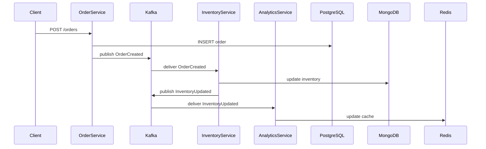

<!-- Generated by Groq via GitHub Actions -->
<!-- Topic ID: T070 -->
<!-- Category: Messaging & Event-Driven Architecture -->
<!-- Generated at UTC: 2026-10-09T07:36:28.016960+00:00 -->

# Event‑Driven Architecture

## 1. What problem does this solve?

| Problem | Why it matters | Consequence if ignored | Real‑world example |
|---------|----------------|------------------------|--------------------|
| **Tight coupling** – services call each other directly (e.g., REST) | Hard to evolve independently; a change in one service can break many others | Frequent regressions, slow feature rollout | A monolithic e‑commerce site where the payment service is hard‑wired to the inventory service |
| **Scalability bottlenecks** – a single request path becomes a choke point | Throughput limited by the slowest service | Users experience latency spikes | A social media feed that pulls data from many microservices in a single request |
| **Resilience** – a failure in one component cascades | System downtime, poor user experience | Loss of revenue, brand damage | A booking system where a database outage stops all operations |
| **Data consistency** – distributed transactions are hard | Inconsistent state across services | Wrong inventory counts, double charges | A ticketing platform where seat allocation must be atomic |

Event‑driven architecture (EDA) addresses these by decoupling producers and consumers through an asynchronous message bus. Producers publish events; consumers subscribe and react. This allows independent scaling, better fault isolation, and eventual consistency.

---

## 2. Mental model

### Analogy – The Postal System

| Postal system | Event‑driven system |
|---------------|---------------------|
| **Sender** writes a letter and drops it in a mailbox. | **Producer** creates an event and publishes it to a broker. |
| **Mail carrier** picks up letters, delivers them to the right post office. | **Broker** routes events to the right topic/queue. |
| **Recipient** receives the letter, reads it, and may reply later. | **Consumer** receives the event, processes it, and may emit new events. |
| **No direct contact** between sender and recipient. | **No direct API call** between producer and consumer. |

### Engineering model

1. **Event** – a JSON payload describing a state change (`OrderCreated`, `UserSignedUp`).
2. **Producer** – service that emits events (e.g., Order Service).
3. **Broker** – message store (Kafka, RabbitMQ, Redis Streams) that guarantees delivery semantics.
4. **Consumer** – service that subscribes to events and performs side effects (e.g., Inventory Service).
5. **Topic/Queue** – logical channel; partitions enable parallelism.
6. **Offset/Sequence** – consumer tracks progress to ensure at‑least‑once or exactly‑once processing.

---

## 3. Deep explanation

### Internals

- **Broker storage**: durable log (Kafka) or in‑memory queue (Redis Streams). Events are immutable and appended.
- **Partitions**: split a topic into shards; each partition is ordered. Consumers in a group read from distinct partitions.
- **Acknowledgement**: consumer commits offset after successful processing. Broker can replay on failure.
- **Back‑pressure**: consumer can slow down by not committing offsets or by using flow control.

### Important terminology

| Term | Meaning |
|------|---------|
| **Event** | Immutable record of something that happened. |
| **Producer** | Emits events. |
| **Consumer** | Reads events. |
| **Topic** | Logical channel. |
| **Partition** | Ordered slice of a topic. |
| **Offset** | Position of a message within a partition. |
| **Consumer Group** | Set of consumers that share work. |
| **Exactly‑once** | Guarantee that each event is processed once. |
| **At‑least‑once** | Event may be processed multiple times. |
| **At‑most‑once** | Event may be lost. |

### Trade‑offs

| Trade‑off | Description | When to choose |
|-----------|-------------|----------------|
| **Latency vs. Throughput** | Synchronous calls give low latency; async pipelines can batch and increase throughput. | Real‑time dashboards → synchronous; order processing → async. |
| **Consistency vs. Availability** | EDA favors eventual consistency; synchronous APIs favor strong consistency. | Payment settlement → synchronous; analytics → async. |
| **Complexity vs. Decoupling** | More components (broker, schema registry) increase operational burden. | Small teams → simple queues; large orgs → Kafka. |

### Failure modes

- **Message loss** – broker crash before persistence. Mitigated by replication.
- **Duplicate processing** – at‑least‑once semantics; consumer must be idempotent.
- **Back‑pressure** – consumer slower than producer → broker storage grows. Use consumer lag monitoring.
- **Schema drift** – event format changes break consumers. Use schema registry and versioning.

### Limitations

- **Eventual consistency** – not suitable for scenarios requiring immediate consistency.
- **Complex debugging** – tracing a flow across many services is harder.
- **Operational overhead** – running a broker cluster, monitoring, and maintaining schemas.

### Where it fits

- **Microservices** – each service owns its domain events.
- **Data pipelines** – stream processing (Kafka Streams, Flink).
- **CQRS** – separate read models built from events.
- **Integration** – external systems consume internal events (e.g., Slack bot).

### Interaction with related concepts

| Concept | Interaction |
|---------|-------------|
| **REST** | EDA can replace or complement REST; use REST for command APIs, events for state changes. |
| **CQRS** | Events drive read models; commands trigger events. |
| **Saga** | Long‑running transactions orchestrated via events. |
| **GraphQL** | Subscriptions can be backed by event streams. |
| **Docker/K8s** | Broker runs as a container; services scale independently. |

---

## 4. How it works

### Step‑by‑step flow

1. **Order Service** receives a REST POST `/orders`.
2. Validates input, writes order to PostgreSQL.
3. Publishes `OrderCreated` event to Kafka topic `orders`.
4. **Kafka Broker** stores the event in partition 0.
5. **Inventory Service** (consumer group `inventory`) reads from partition 0.
6. Consumes `OrderCreated`, updates inventory in MongoDB.
7. Emits `InventoryUpdated` event.
8. **Analytics Service** consumes `InventoryUpdated` and updates a Redis cache.



---

## 5. Practical implementation

### Prerequisites

```bash
npm init -y
npm install kafkajs express body-parser
```

### 1️⃣ Producer – Order Service

```ts
// src/order-service.ts
import express from 'express';
import bodyParser from 'body-parser';
import { Kafka } from 'kafkajs';

const app = express();
app.use(bodyParser.json());

const kafka = new Kafka({ brokers: ['localhost:9092'] });
const producer = kafka.producer();

async function start() {
  await producer.connect();
  app.post('/orders', async (req, res) => {
    const { userId, items } = req.body;

    // 1️⃣ Persist to DB (omitted for brevity)

    // 2️⃣ Publish event
    const event = { type: 'OrderCreated', payload: { userId, items, orderId: Date.now() } };
    await producer.send({
      topic: 'orders',
      messages: [{ value: JSON.stringify(event) }],
    });

    res.status(201).json({ status: 'created', orderId: event.payload.orderId });
  });

  app.listen(3000, () => console.log('Order Service listening on 3000'));
}

start().catch(console.error);
```

### 2️⃣ Consumer – Inventory Service

```ts
// src/inventory-service.ts
import { Kafka } from 'kafkajs';
import { MongoClient } from 'mongodb';

const kafka = new Kafka({ brokers: ['localhost:9092'] });
const consumer = kafka.consumer({ groupId: 'inventory' });

async function start() {
  await consumer.connect();
  await consumer.subscribe({ topic: 'orders', fromBeginning: true });

  const mongo = new MongoClient('mongodb://localhost:27017');
  await mongo.connect();
  const db = mongo.db('shop');
  const inventory = db.collection('inventory');

  await consumer.run({
    eachMessage: async ({ topic, partition, message }) => {
      const event = JSON.parse(message.value!.toString());
      if (event.type !== 'OrderCreated') return;

      // 1️⃣ Update inventory (simplified)
      for (const item of event.payload.items) {
        await inventory.updateOne(
          { sku: item.sku },
          { $inc: { stock: -item.qty } },
          { upsert: true }
        );
      }

      // 2️⃣ (Optional) Emit InventoryUpdated event
      // ...
    },
  });
}

start().catch(console.error);
```

> **Important lines explained**
> - `consumer.subscribe({ topic: 'orders', fromBeginning: true })` – ensures we process all past orders.
> - `eachMessage` – called for each event; idempotent logic is essential.

### 3️⃣ Running locally

```bash
# Start Kafka (e.g., via Docker Compose)
docker run -d --name zookeeper -p 2181:2181 zookeeper:3.7
docker run -d --name kafka -p 9092:9092 \
  -e KAFKA_ZOOKEEPER_CONNECT=host.docker.internal:2181 \
  -e KAFKA_ADVERTISED_LISTENERS=PLAINTEXT://localhost:9092 \
  -e KAFKA_OFFSETS_TOPIC_REPLICATION_FACTOR=1 \
  confluentinc/cp-kafka:7.0

# Start services
node src/order-service.ts
node src/inventory-service.ts
```

Now POST to `http://localhost:3000/orders` and watch the inventory update.

---

## 6. Production considerations

| Concern | Best practice |
|---------|---------------|
| **Scalability** | Partition topics; run multiple consumer instances per group. |
| **Reliability** | Enable broker replication; use idempotent producers; commit offsets only after successful processing. |
| **Security** | TLS for broker traffic; SASL authentication; ACLs per topic. |
| **Observability** | Instrument producers/consumers with metrics (latency, lag); use tracing (OpenTelemetry). |
| **Performance** | Batch sends; compress messages; tune batch size and linger.ms. |
| **Error handling** | Retry with exponential backoff; dead‑letter queues for irrecoverable messages. |
| **Resource usage** | Monitor broker disk usage; set retention policies. |
| **Operational concerns** | Automate broker upgrades; monitor consumer lag; set alerts for high lag. |
| **Failure recovery** | Use checkpointing; enable exactly‑once semantics if needed. |
| **Deployment** | Containerize broker and services; use Helm charts for Kafka; separate dev/test/production clusters. |

---

## 7. Common mistakes

| Mistake | Why it hurts |
|---------|--------------|
| **Not making events idempotent** | Duplicate events cause double inventory deduction. |
| **Using fire‑and‑forget without ack** | Consumer may crash before processing, leading to data loss. |
| **Tight coupling of event schema** | Changing event breaks all consumers; no backward compatibility. |
| **Ignoring consumer lag** | Slow consumers cause broker storage to fill up. |
| **Over‑partitioning** | Too many partitions increase coordination overhead and reduce parallelism per consumer. |
| **Using a single broker in production** | Single point of failure; no replication. |
| **Blocking consumer thread** | Long processing blocks message consumption; use async workers. |

---

## 8. Senior engineer perspective

### At scale

- **Architecture decisions**  
  - Choose a broker that supports high throughput (Kafka) vs. lightweight (Redis Streams).  
  - Decide on event versioning strategy (Avro + Confluent Schema Registry).  
  - Determine whether to use **exactly‑once** semantics (Kafka transactional producer) or **at‑least‑once** with idempotent consumers.

- **Trade‑offs**  
  - **Latency**: Kafka has higher latency than in‑memory queues; acceptable for order processing but not for real‑time gaming.  
  - **Operational cost**: Running a Kafka cluster (Zookeeper, brokers, connectors) is non‑trivial; consider managed services (Confluent Cloud, AWS MSK).

- **Bottlenecks**  
  - **Broker disk I/O** – tune retention and compaction.  
  - **Consumer lag** – monitor and auto‑scale consumer groups.  
  - **Schema validation** – heavy validation can slow producers.

- **Failure scenarios**  
  - **Broker outage** – use multi‑AZ replication.  
  - **Consumer crash** – ensure graceful shutdown to commit offsets.  
  - **Schema incompatibility** – enforce backward compatibility.

- **Monitoring**  
  - **Lag metrics** (`kafka-consumer-groups.sh --describe`).  
  - **Throughput** (`kafka-run-class kafka.tools.GetOffsetShell`).  
  - **Error rates** – consumer re‑processing counts.

- **Cost/performance**  
  - Partition count vs. consumer count: more partitions → more parallelism but higher coordination overhead.  
  - Storage retention: longer retention → higher disk cost.

- **When NOT to use EDA**  
  - Simple CRUD services with low latency requirements.  
  - Systems requiring strict ACID transactions across services.  
  - When the operational overhead outweighs the decoupling benefits.

---

## 9. Interview questions

1. **Beginner** – *What is an event in event‑driven architecture?*  
   *Answer:* An immutable record describing a state change, e.g., `OrderCreated`.

2. **Beginner** – *Why do we use a consumer group?*  
   *Answer:* To distribute work among multiple consumers while ensuring each message is processed by only one consumer in the group.

3. **Senior** – *Explain the difference between at‑least‑once and exactly‑once delivery semantics in Kafka.*  
   *Answer:*  
   - *At‑least‑once:* Messages may be processed multiple times; consumer must be idempotent.  
   - *Exactly‑once:* Producer and consumer use Kafka transactions; each message is processed once, but requires more coordination and higher latency.

4. **Senior** – *How would you handle schema evolution in a large event‑driven system?*  
   *Answer:* Use a schema registry (e.g., Confluent Schema Registry) with Avro/Protobuf, enforce backward compatibility, version events, and provide migration scripts for consumers.

5. **Scenario/Debugging** – *Your inventory service is lagging behind by 10,000 messages after a traffic spike. What steps would you take to diagnose and fix the issue?*  
   *Answer:*  
   - Check consumer lag metrics.  
   - Verify consumer CPU/memory usage; scale up consumer instances.  
   - Inspect message size and batch settings.  
   - Look for slow database writes; add indexes or batch updates.  
   - Ensure no blocking I/O in the consumer loop.  
   - Consider increasing partition count if bottleneck is partition‑level.  

---

## 10. Hands‑on task

**Build a simple order‑to‑inventory pipeline**

1. Create two Node.js services (`order-service`, `inventory-service`) as shown above.  
2. Deploy Kafka locally (Docker).  
3. Write a script to generate 1000 orders via the REST API.  
4. Verify that inventory counts are updated correctly and that consumer lag stays below 10 messages.  
5. Add a dead‑letter queue for failed inventory updates and test by injecting a failure (e.g., throw an error when `sku === 'BAD'`).  

---

## 11. Quick revision

- EDA decouples services via asynchronous events.
- **Producer** → **Broker** → **Consumer**.
- **Kafka**: partitions, offsets, consumer groups, exactly‑once.
- **Idempotency** is essential for at‑least‑once delivery.
- **Back‑pressure** handled by consumer lag monitoring.
- **Schema evolution** → schema registry, backward compatibility.
- **Observability**: metrics (lag, throughput), tracing, logs.
- **Failure recovery**: retries, dead‑letter queues, transactional producers.
- **When to avoid**: low latency, strict ACID, simple CRUD.

---

## 12. References

- [Kafka Documentation – Topics](https://kafka.apache.org/documentation/#topic)
- [Kafka Documentation – Producer API](https://kafka.apache.org/documentation/#producerapi)
- [Kafka Documentation – Consumer API](https://kafka.apache.org/documentation/#consumerapi)
- [Confluent Schema Registry](https://docs.confluent.io/platform/current/schema-registry/index.html)
- [Kafka Streams – Exactly Once Semantics](https://kafka.apache.org/documentation/streams/developer-guide.html#exactly_once)
- [OpenTelemetry for Node.js](https://opentelemetry.io/docs/instrumentation/node/)
- [Redis Streams](https://redis.io/docs/manual/data-types/streams/)
- [Docker Compose Kafka Example](https://github.com/bitnami/bitnami-docker-kafka)
