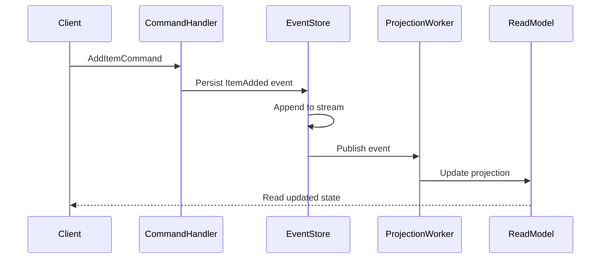

<!-- Generated by Groq via GitHub Actions -->
<!-- Topic ID: T071 -->
<!-- Category: Messaging & Event-Driven Architecture -->
<!-- Generated at UTC: 2026-10-09T18:55:01.851529+00:00 -->

# Event sourcing

## 1. What problem does this solve?

**Motivation**  
In a traditional CRUD system the current state of an entity (e.g., a bank account balance) is stored in a table and updated in place. If you need to audit, replay, or recover from a bug you have to rely on external logs or database snapshots, which are often incomplete or expensive to maintain.

**Problems that exist**

| Problem | Why it matters | Consequence if ignored |
|---------|----------------|------------------------|
| **Audit trail** | Regulatory compliance and debugging require a full history of changes. | Hard to prove what happened, leading to legal risk. |
| **Temporal queries** | Need to answer “what was the balance on 2023‑05‑01?” | Must rebuild state from scratch or maintain separate history tables. |
| **Event replay** | System upgrades, migrations, or new projections need to rebuild state. | Manual migration scripts, fragile rollbacks. |
| **Concurrency** | Multiple services may update the same entity concurrently. | Lost updates, data corruption. |
| **Scalability of writes** | Updating a single row can become a bottleneck. | Throughput limits, hot spots. |

**Where it appears in real systems**

- Financial services (transaction ledgers, fraud detection)
- E‑commerce order processing (order state machine)
- IoT telemetry (device state changes)
- Messaging platforms (chat history, read receipts)
- Microservice orchestration (Saga patterns)

---

## 2. Mental model

**Analogy – a diary**  
Imagine you keep a diary where every day you write a new entry describing what happened that day. You never delete or edit an entry; you just add more. If you want to know what happened on a particular day, you read the relevant entry. If you want to see how your life progressed, you read the whole diary.

**Engineering model**  
Event sourcing stores *every* change to an entity as an immutable event in an append‑only log. The current state is derived by replaying those events. The log is the source of truth; the state is a projection (derived view) that can be rebuilt at any time.

---

## 3. Deep explanation

### Internals

1. **Event store** – a durable, append‑only storage (e.g., PostgreSQL table, Kafka topic, or a dedicated event store like EventStoreDB). Each event has:
   - `id` (UUID)
   - `aggregate_id` (entity id)
   - `type` (e.g., `OrderCreated`, `ItemAdded`)
   - `payload` (JSON)
   - `timestamp`
   - `sequence_number` (per aggregate)

2. **Aggregate** – the domain object that owns a sequence of events. It contains business logic to apply events to its in‑memory state.

3. **Projection** – a read‑optimized view (SQL table, Redis cache, search index) built by subscribing to the event stream and applying events.

4. **Command** – intent to change state (e.g., `AddItemCommand`). Commands are validated, turned into events, and persisted.

### Important terminology

| Term | Meaning |
|------|---------|
| **Event** | Immutable record of something that happened. |
| **Aggregate** | Domain entity that owns events. |
| **Event stream** | Ordered list of events for an aggregate. |
| **Projection** | Derived read model. |
| **Snapshot** | Periodic capture of aggregate state to speed replay. |
| **Saga** | Long‑running transaction orchestrated via events. |

### Trade‑offs

| Benefit | Cost |
|---------|------|
| Full audit trail | Requires more storage |
| Easy replay | Rebuilding state can be expensive |
| Decoupled reads/writes | Complexity of event handling |
| Strong consistency for writes | Read models may lag (eventual consistency) |

### Failure modes

- **Event loss** – if the event store crashes before persisting, data is lost. Mitigate with durable writes and replication.
- **Out‑of‑order events** – sequence numbers enforce order; reject or reorder if needed.
- **Projection drift** – if a projection handler fails, the view can become stale. Use idempotent handlers and retry.

### Limitations

- Not ideal for simple CRUD workloads where audit isn’t needed.
- Requires careful versioning of event schemas.
- Requires eventual consistency for read models.

### Where it fits

```
┌───────────────────────┐
│  Client / API Gateway │
└─────────────┬─────────┘
              │
              ▼
┌───────────────────────┐
│   Command Handler      │
│  (validates, creates   │
│   events, writes to    │
│   event store)         │
└─────────────┬─────────┘
              │
              ▼
┌───────────────────────┐
│   Event Store (Kafka,  │
│   PostgreSQL, etc.)    │
└─────────────┬─────────┘
              │
              ▼
┌───────────────────────┐
│   Projection Workers   │
│  (update read models)  │
└─────────────┬─────────┘
              │
              ▼
┌───────────────────────┐
│   Read API / Cache     │
└───────────────────────┘
```

### Interaction with related concepts

- **CQRS** – Command Query Responsibility Segregation pairs well with event sourcing.
- **Event‑driven architecture** – Events are the lingua franca between services.
- **Saga** – Long‑running transactions orchestrated by events.
- **Idempotency** – Event handlers must be idempotent to handle retries.

---

## 4. How it works

1. **Client sends a command** (`AddItemCommand`).
2. **Command handler** validates business rules.
3. **Command handler** creates one or more events (`ItemAdded`).
4. **Events are written** to the event store atomically.
5. **Event store publishes** events to a stream (Kafka topic).
6. **Projection workers** consume the stream, apply events to read models.
7. **Client reads** from the read model (eventually consistent).



---

## 5. Practical implementation

Below is a minimal Node.js/TypeScript example using **PostgreSQL** as the event store and **Redis** as a projection cache.

```ts
// src/eventStore.ts
import { Pool } from 'pg';
import { v4 as uuidv4 } from 'uuid';

const pool = new Pool({ connectionString: process.env.DATABASE_URL });

export interface Event {
  id: string;
  aggregateId: string;
  type: string;
  payload: any;
  timestamp: Date;
  sequence: number;
}

// Append a single event atomically
export async function appendEvent(
  aggregateId: string,
  type: string,
  payload: any
): Promise<Event> {
  const client = await pool.connect();
  try {
    await client.query('BEGIN');

    // Get current sequence
    const seqRes = await client.query(
      'SELECT COALESCE(MAX(sequence), 0) AS seq FROM events WHERE aggregate_id = $1',
      [aggregateId]
    );
    const sequence = (seqRes.rows[0].seq as number) + 1;

    const event: Event = {
      id: uuidv4(),
      aggregateId,
      type,
      payload,
      timestamp: new Date(),
      sequence,
    };

    await client.query(
      `INSERT INTO events
       (id, aggregate_id, type, payload, timestamp, sequence)
       VALUES ($1, $2, $3, $4, $5, $6)`,
      [
        event.id,
        event.aggregateId,
        event.type,
        JSON.stringify(event.payload),
        event.timestamp,
        event.sequence,
      ]
    );

    await client.query('COMMIT');
    return event;
  } catch (err) {
    await client.query('ROLLBACK');
    throw err;
  } finally {
    client.release();
  }
}
```

```ts
// src/projection.ts
import { createClient } from 'redis';
import { Event } from './eventStore';

const redis = createClient({ url: process.env.REDIS_URL });
await redis.connect();

export async function handleEvent(event: Event) {
  switch (event.type) {
    case 'OrderCreated':
      await redis.hSet(`order:${event.aggregateId}`, {
        status: 'created',
        createdAt: event.timestamp.toISOString(),
      });
      break;
    case 'ItemAdded':
      const key = `order:${event.aggregateId}`;
      const items = JSON.parse(
        (await redis.hGet(key, 'items')) ?? '[]'
      );
      items.push(event.payload);
      await redis.hSet(key, { items: JSON.stringify(items) });
      break;
    // add more handlers
  }
}
```

```ts
// src/commandHandler.ts
import { appendEvent } from './eventStore';
import { handleEvent } from './projection';

export async function addItem(orderId: string, item: any) {
  // Business rule: order must exist
  const event = await appendEvent(orderId, 'ItemAdded', item);
  await handleEvent(event); // update projection immediately
}
```

**Running locally**

1. Start PostgreSQL and Redis.
2. Create the `events` table:

```sql
CREATE TABLE events (
  id UUID PRIMARY KEY,
  aggregate_id UUID NOT NULL,
  type TEXT NOT NULL,
  payload JSONB NOT NULL,
  timestamp TIMESTAMP WITH TIME ZONE NOT NULL,
  sequence BIGINT NOT NULL,
  CONSTRAINT uniq_agg_seq UNIQUE (aggregate_id, sequence)
);
```

3. Run the Node.js app and call `addItem`.

---

## 6. Production considerations

| Concern | How to address |
|---------|----------------|
| **Scalability** | Partition event streams by aggregate id or shard key; use Kafka partitions. |
| **Reliability** | Replicate event store (PostgreSQL streaming replication, Kafka replication). Use idempotent handlers. |
| **Security** | Encrypt payloads at rest; enforce ACLs on event store. |
| **Observability** | Log event metadata, expose metrics (event count, lag). Use tracing to follow event flow. |
| **Performance** | Batch writes; use write‑ahead logs. Cache projections in Redis or use materialized views. |
| **Error handling** | Retry on transient failures; dead‑letter queue for irrecoverable events. |
| **Resource usage** | Monitor disk usage of event store; purge old snapshots if needed. |
| **Operational concerns** | Schema migration strategy (add new event types). |
| **Failure recovery** | Replay from last snapshot; use event versioning. |
| **Deployment** | Containerize event store and projection workers; use CI/CD to deploy new handlers. |

---

## 7. Common mistakes

| Mistake | Why it’s problematic |
|---------|----------------------|
| **Treating events as “just logs”** | Events must be immutable and versioned; mutating them breaks replay. |
| **Skipping snapshots** | Replaying millions of events for a single aggregate can be slow. |
| **Non‑idempotent handlers** | Retries can corrupt state. |
| **Storing large payloads in the event store** | Increases storage cost and network latency. |
| **Using the same table for events and read models** | Violates separation of concerns; read queries become slow. |
| **Ignoring sequence numbers** | Out‑of‑order events can corrupt aggregate state. |
| **Hard‑coding event types** | Makes evolution difficult; use a registry or schema registry. |

---

## 8. Senior engineer perspective

### What changes at scale?

- **Architecture decisions**  
  - Use a dedicated event store (Kafka, EventStoreDB) instead of a relational table.  
  - Partition streams to avoid hot spots.  
  - Separate projection workers per read model.

- **Trade‑offs**  
  - Event store replication vs. latency.  
  - Snapshot frequency vs. replay time.  
  - Consistency guarantees (strict vs. eventual).

- **Bottlenecks**  
  - Write amplification if many projections.  
  - Network bandwidth for large events.

- **Failure scenarios**  
  - Event store crash → use replication and WAL.  
  - Projection failure → replay from snapshot.

- **Monitoring**  
  - Lag metrics per projection.  
  - Event throughput and error rates.  
  - Storage growth.

- **Cost/performance**  
  - Kafka clusters cost per broker; consider managed services.  
  - Redis for projections keeps reads fast but adds memory cost.

- **When NOT to use**  
  - Simple CRUD services with no audit needs.  
  - Systems where write latency must be <1 ms and event replay is unnecessary.

---

## 9. Interview questions

1. **Beginner** – *What is the difference between an event and a command?*  
   *Answer:* A command is an intent to change state; an event is a record of something that happened. Commands are validated and turned into events; events are immutable and stored.

2. **Beginner** – *Why do we need sequence numbers in an event stream?*  
   *Answer:* They enforce order per aggregate, allowing deterministic replay and detecting out‑of‑order events.

3. **Senior** – *How would you design an event sourcing system that supports high write throughput and low read latency?*  
   *Answer:* Use a partitioned event store (Kafka), write‑ahead logs, batch writes, snapshots, and dedicated projection workers. Cache projections in Redis or use materialized views.

4. **Senior** – *Explain how you would handle schema evolution for events in a production system.*  
   *Answer:* Version each event type, keep backward‑compatible handlers, use a schema registry, and provide migration scripts or projection upgrades.

5. **Scenario/Debugging** – *You notice that the read model for orders is lagging behind the event stream by several minutes. What steps would you take to diagnose and fix the issue?*  
   *Answer:*  
   - Check projection worker logs for errors or slow processing.  
   - Verify Kafka consumer lag metrics.  
   - Inspect event size and batch processing.  
   - Ensure idempotent handlers.  
   - Scale projection workers or increase consumer group size.  
   - Add monitoring alerts for lag thresholds.

---

## 10. Hands‑on task

**Task:**  
Implement a simple “Todo” aggregate using event sourcing in the repository.

1. Create an `events` table (or use Kafka if available).  
2. Define commands: `CreateTodo`, `ToggleTodo`.  
3. Implement command handlers that produce events (`TodoCreated`, `TodoToggled`).  
4. Write a projection that stores the current list of todos in Redis.  
5. Expose a REST endpoint to add a todo and to list all todos.  
6. Write a script that replays all events to rebuild the projection and verify consistency.

---

## 11. Quick revision

- Event sourcing stores every state change as an immutable event.
- Events are appended to an event store; aggregates replay events to derive state.
- Projections are read models built by consuming events.
- Sequence numbers enforce order; snapshots speed up replay.
- CQRS pairs naturally with event sourcing.
- Idempotent handlers and retries are essential.
- Kafka or dedicated event stores scale better than relational tables.
- Snapshots mitigate replay cost; version events for schema evolution.
- Monitoring lag and error rates is critical in production.
- Use Redis or materialized views for fast reads.

---

## 12. References

- https://www.eventstore.com/docs/
- https://www.confluent.io/blog/what-is-event-sourcing/
- https://www.postgresql.org/docs/current/sql-createtable.html
- https://redis.io/docs/manual/
- https://www.npmjs.com/package/uuid
- https://node-postgres.com/
- https://redis.io/docs/management/monitoring/
- https://www.oreilly.com/library/view/architecture-of-microservices/9781492041524/ (Event Sourcing chapter)
