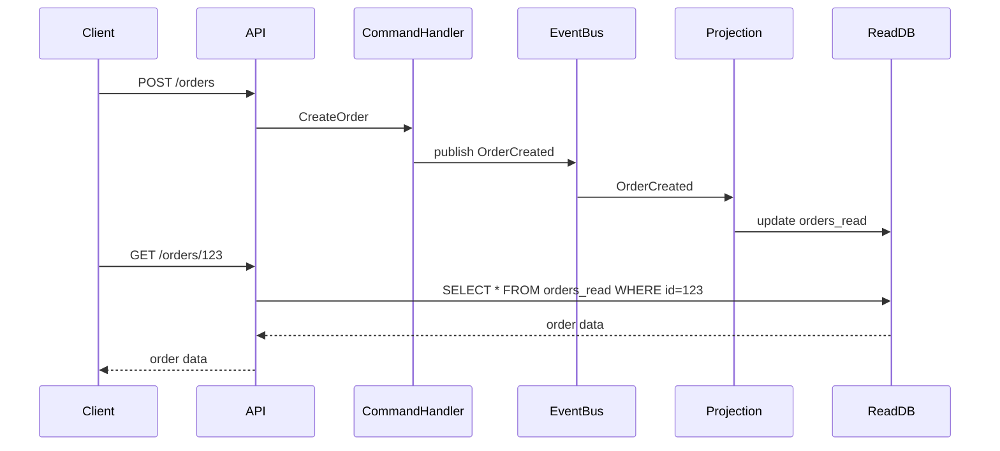

<!-- Generated by Groq via GitHub Actions -->
<!-- Topic ID: T072 -->
<!-- Category: Messaging & Event-Driven Architecture -->
<!-- Generated at UTC: 2026-10-09T18:55:01.851529+00:00 -->

# CQRS

## 1. What problem does this solve?

**Motivation**  
In many applications, the same data store is used for both *reading* (queries) and *writing* (commands). When the workload grows, the read side can become a bottleneck for writes, and vice‑versa. Additionally, the business logic that mutates state often differs from the logic that presents data to users. CQRS (Command Query Responsibility Segregation) separates these concerns so each can evolve independently.

**What problem exists**

- **Write‑heavy systems**: A single database that serves both reads and writes can suffer from contention, slow writes, and complex locking.
- **Complex queries**: The same schema that supports updates may not be optimal for reporting, analytics, or UI rendering.
- **Different consistency needs**: Writes often require strong consistency, while reads can tolerate eventual consistency for performance.
- **Scaling difficulties**: Scaling a monolithic read/write model requires scaling the entire database, even if only reads or writes need more capacity.

**Why the problem matters**

- **Performance degradation**: Users experience slow responses or timeouts.
- **Maintenance pain**: Adding a new query or command often requires touching the same code paths, increasing risk.
- **Limited scalability**: You cannot scale reads and writes independently, leading to over‑provisioning or under‑provisioning.

**What happens if CQRS is not used**

- The system may become a single point of contention.
- Read and write models become tightly coupled, making refactoring hard.
- Scaling becomes expensive and complex.

**Where this concept appears in real backend systems**

- E‑commerce platforms (orders, inventory, catalog).
- Banking systems (transactions vs. account statements).
- Social media (post creation vs. feed generation).
- IoT telemetry (device data ingestion vs. analytics dashboards).

---

## 2. Mental model

**Analogy**  
Think of a library that serves two purposes: *borrowing books* (commands) and *reading books* (queries). In a normal library, the same shelf holds books for both activities. If the library gets very busy, the shelves become crowded, and people have to wait to borrow or read. Instead, the library splits into two sections:

- **Borrowing desk**: Only handles lending/returning books. It’s fast and simple.
- **Reading room**: Only displays books for reading. It can be optimized for quick look‑ups and large displays.

The two sections share the same collection of books but are managed separately, allowing each to be tuned for its workload.

**Engineering model**  
In CQRS, the *write side* (commands) updates the source of truth, often using a relational DB or event store. The *read side* (queries) maintains a projection (denormalized view) that is optimized for read patterns, possibly in a different database or cache. Commands and queries never share the same data model.

---

## 3. Deep explanation

### Internals

1. **Command** – Intent to change state (e.g., `CreateOrder`).  
2. **Command Handler** – Business logic that validates and applies the change.  
3. **Event** – Immutable record of what happened (e.g., `OrderCreated`).  
4. **Event Store / Message Bus** – Persists events or forwards them to subscribers.  
5. **Projection / Read Model** – Materialized view built by applying events, stored in a read‑optimized store.  
6. **Query** – Request for data (e.g., `GetOrderSummary`).  
7. **Query Handler** – Reads from the projection.

### Important terminology

- **Command** vs. **Query**: Commands change state; queries read state.  
- **Event**: A record of a state change, used for eventual consistency.  
- **Projection**: A read‑optimized representation of the domain.  
- **Event Sourcing**: Storing the entire history of events instead of snapshots.  
- **Read Model**: The database or cache that serves queries.

### Trade‑offs

| Benefit | Drawback |
|---------|----------|
| Independent scaling | Extra infrastructure |
| Optimized read/write models | Eventual consistency complexity |
| Clear separation of concerns | More code paths to maintain |
| Easier to add new queries | Requires event handling logic |
| Supports audit trails | Potential data duplication |

### Failure modes

- **Event loss**: If the event bus fails, the read model may become stale.  
- **Projection drift**: Bugs in event handlers can cause the read model to diverge.  
- **Latency**: Eventual consistency introduces a delay between write and read.  
- **Complexity**: More moving parts increase operational risk.

### Limitations

- Not suitable for simple CRUD apps with low traffic.  
- Requires careful versioning of events and projections.  
- Adds latency for read operations that depend on the latest write.

### Where this concept fits

- **Microservices**: Each service can expose its own CQRS boundary.  
- **Event‑driven architectures**: CQRS naturally pairs with message queues (Kafka, RabbitMQ).  
- **Domain‑driven design**: Commands map to domain actions; queries map to read models.

### Interaction with related concepts

- **Event Sourcing**: CQRS + event sourcing stores events as the source of truth.  
- **Saga / Orchestration**: Commands can trigger long‑running workflows.  
- **Cache**: Read models often live in Redis or a NoSQL store for speed.  
- **API Gateway**: Routes commands to command handlers, queries to query handlers.

---

## 4. How it works

1. **Client sends a command** (`POST /orders` → `CreateOrder`).  
2. **Command handler** validates input, applies business rules, and emits an event (`OrderCreated`).  
3. **Event bus** stores the event and publishes it to subscribers.  
4. **Projection service** consumes the event, updates the read model (e.g., a PostgreSQL table).  
5. **Client queries** (`GET /orders/123`) are served from the read model.  
6. **Read model** may be refreshed asynchronously; eventual consistency is accepted.



---

## 5. Practical implementation

Below is a minimal Node.js/TypeScript example using **Express**, **PostgreSQL** for the read model, and **Redis Streams** as the event bus. The write side uses an in‑memory event store for simplicity.

```ts
// src/server.ts
import express from 'express';
import { v4 as uuidv4 } from 'uuid';
import { Pool } from 'pg';
import { createClient } from 'redis';

const app = express();
app.use(express.json());

// ---------- PostgreSQL read model ----------
const pool = new Pool({
  connectionString: process.env.DATABASE_URL,
});

// ---------- Redis event bus ----------
const redis = createClient({ url: process.env.REDIS_URL });
redis.on('error', console.error);
await redis.connect();

// ---------- Command handler ----------
app.post('/orders', async (req, res) => {
  const { userId, items } = req.body;
  const orderId = uuidv4();

  // Business rule: at least one item
  if (!items || items.length === 0) {
    return res.status(400).json({ error: 'Order must contain items' });
  }

  // Emit event
  const event = {
    type: 'OrderCreated',
    data: { orderId, userId, items, createdAt: new Date().toISOString() },
    timestamp: Date.now(),
  };
  await redis.xAdd('order-events', '*', { event: JSON.stringify(event) });

  res.status(201).json({ orderId });
});

// ---------- Query handler ----------
app.get('/orders/:id', async (req, res) => {
  const { id } = req.params;
  const { rows } = await pool.query(
    'SELECT * FROM orders_read WHERE id = $1',
    [id]
  );
  if (!rows.length) return res.status(404).json({ error: 'Not found' });
  res.json(rows[0]);
});

// ---------- Projection ----------
async function runProjection() {
  const consumerGroup = 'order-projections';
  const consumerName = 'projection-1';

  // Create consumer group if not exists
  try {
    await redis.xGroupCreate('order-events', consumerGroup, '0', { MKSTREAM: true });
  } catch (e) {
    // ignore if group already exists
  }

  while (true) {
    const streams = await redis.xReadGroup(
      consumerGroup,
      consumerName,
      { key: 'order-events', id: '>' },
      { COUNT: 10, BLOCK: 5000 }
    );

    if (!streams) continue;

    for (const stream of streams) {
      for (const [id, fields] of stream.messages) {
        const event = JSON.parse(fields.event);
        if (event.type === 'OrderCreated') {
          const { orderId, userId, items, createdAt } = event.data;
          await pool.query(
            'INSERT INTO orders_read (id, user_id, items, created_at) VALUES ($1, $2, $3, $4)',
            [orderId, userId, items, createdAt]
          );
        }
        // Acknowledge processed message
        await redis.xAck('order-events', consumerGroup, id);
      }
    }
  }
}

// Start projection in background
runProjection().catch(console.error);

// ---------- Start server ----------
const PORT = process.env.PORT || 3000;
app.listen(PORT, () => console.log(`🚀 Server listening on ${PORT}`));
```

**Key points**

- The command (`POST /orders`) never touches the read database; it only publishes an event.
- The projection (`runProjection`) consumes events and updates the read model asynchronously.
- The query (`GET /orders/:id`) reads from a denormalized table optimized for reads.
- Redis Streams provide durability and ordering guarantees.

> **Tip**: In production, replace the in‑memory event store with a durable broker (Kafka, NATS, or a dedicated event store).

---

## 6. Production considerations

| Concern | How CQRS addresses it | Practical steps |
|---------|-----------------------|-----------------|
| **Scalability** | Separate read/write scaling | Run multiple projection workers; scale read DB horizontally (read replicas). |
| **Reliability** | Decoupled components | Use durable message broker; implement retry/back‑off for projections. |
| **Security** | Fine‑grained access | Protect command endpoints with auth; expose read endpoints with read‑only tokens. |
| **Observability** | Event logs | Instrument event bus, command handlers, and projections; use distributed tracing. |
| **Performance** | Optimized read model | Use indexes, caching (Redis), and denormalization. |
| **Error handling** | Idempotent events | Ensure event handlers are idempotent; store processed event IDs. |
| **Resource usage** | Separate workloads | Allocate dedicated resources for write and read services. |
| **Operational concerns** | Deployment complexity | Use container orchestration (K8s) with separate deployments for command and query services. |
| **Failure recovery** | Replay events | Keep event store; on projection failure, replay from last checkpoint. |
| **Deployment** | Blue/green for projections | Deploy new projection version, then switch traffic. |

---

## 7. Common mistakes

1. **Mixing commands and queries in the same service** – leads to tight coupling and hard‑to‑scale code.  
2. **Assuming immediate consistency** – queries may return stale data if projections lag.  
3. **Not idempotent event handlers** – duplicate events cause data corruption.  
4. **Ignoring event versioning** – schema changes break projections if not handled.  
5. **Over‑denormalizing** – unnecessary columns increase storage and maintenance.  
6. **Using the same DB for both sides** – defeats the purpose of separation.  
7. **Skipping monitoring** – hard to detect projection drift or lag.  
8. **Hard‑coding event bus URLs** – leads to brittle deployments.

---

## 8. Senior engineer perspective

### What changes at scale?

- **Distributed projections**: Multiple workers consume the same stream; need partitioning or consumer groups.  
- **Event store durability**: Use Kafka or a dedicated event store instead of Redis Streams.  
- **Schema evolution**: Implement event versioning and migration pipelines.  
- **Monitoring**: Track lag between command processing and projection updates.  
- **Cost**: Separate databases and brokers increase operational cost; weigh against performance gains.  
- **Security**: Harden command endpoints; enforce least privilege on event bus.  
- **Testing**: Integration tests must cover command → event → projection → query path.

### Design decisions

| Decision | Options | Trade‑offs |
|----------|---------|------------|
| **Event bus** | Redis Streams, Kafka, NATS | Latency vs. durability vs. ecosystem |
| **Read store** | PostgreSQL, MongoDB, ElasticSearch | Query flexibility vs. write speed |
| **Projection strategy** | Single table vs. multiple tables | Simplicity vs. performance |
| **Event sourcing** | Yes vs. No | Full audit trail vs. complexity |
| **Deployment** | Monolith vs. microservices | Operational overhead vs. isolation |

### When NOT to use CQRS

- Simple CRUD apps with low traffic.  
- Systems where read and write patterns are identical.  
- Projects with tight deadlines and limited resources.  
- When eventual consistency is unacceptable for critical reads.

---

## 9. Interview questions

| Level | Question | Answer points |
|-------|----------|---------------|
| Beginner | What is the difference between a command and a query in CQRS? | Commands change state, queries read state; commands are write‑only, queries are read‑only. |
| Beginner | Why might you want to use a separate read model? | Optimizes for query patterns, reduces contention, allows independent scaling. |
| Senior | How would you handle schema evolution for events in a CQRS system? | Version events, maintain backward compatibility, use projection migration scripts, keep old handlers. |
| Senior | Describe how you would monitor projection lag in a distributed system. | Track offset differences, expose metrics, alert on thresholds, use consumer group lag APIs. |
| Scenario | A user reports that after placing an order, the order summary page shows stale data for a few seconds. How would you debug and fix this? | Check event bus delivery, verify projection processing, inspect consumer lag, add idempotency, consider read‑through cache, adjust eventual consistency window. |

---

## 10. Hands‑on task

**Task**: Extend the example to support an `UpdateOrderStatus` command that changes an order’s status (`Pending`, `Shipped`, `Delivered`).  

1. Add a new command endpoint (`PATCH /orders/:id/status`).  
2. Emit an `OrderStatusUpdated` event.  
3. Update the projection to handle this event and store the new status.  
4. Add a query endpoint (`GET /orders/:id/status`) that returns the current status.  
5. Write a test that sends a command, waits for the projection to update, and verifies the query result.

---

## 11. Quick revision

- CQRS separates **commands** (writes) from **queries** (reads).  
- Commands → Event → Projection → Query.  
- Read model is denormalized and read‑optimized.  
- Event bus guarantees ordering and durability.  
- Event handlers must be idempotent.  
- Projection lag introduces eventual consistency.  
- Use consumer groups for distributed projections.  
- Version events to handle schema changes.  
- Monitor consumer lag and projection health.  
- Avoid CQRS for simple CRUD workloads.  
- Security: protect command endpoints; read endpoints can be more permissive.  
- Deploy command and query services independently.  
- Use Docker/K8s for isolation and scaling.

---

## 12. References

- [CQRS – Microsoft Docs](https://learn.microsoft.com/en-us/azure/architecture/patterns/cqrs)  
- [Event Sourcing – Microsoft Docs](https://learn.microsoft.com/en-us/azure/architecture/patterns/event-sourcing)  
- [Redis Streams – Redis.io](https://redis.io/docs/manual/streams/)  
- [PostgreSQL – Official Docs](https://www.postgresql.org/docs/)  
- [Express – Official Docs](https://expressjs.com/)  
- [TypeScript – Official Docs](https://www.typescriptlang.org/docs/)  
- [Kafka – Confluent Docs](https://docs.confluent.io/platform/current/overview.html)  
- [NestJS – CQRS Module](https://docs.nestjs.com/recipes/cqrs)  

---
