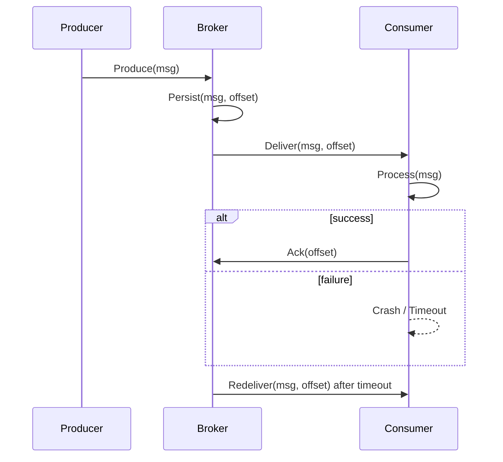

<!-- Generated by Groq via GitHub Actions -->
<!-- Topic ID: T073 -->
<!-- Category: Messaging & Event-Driven Architecture -->
<!-- Generated at UTC: 2026-10-10T07:23:09.364384+00:00 -->

# At‑least‑once delivery

## 1. What problem does this solve?

When a system sends a message (e.g., an event, a task, a notification) it wants the receiver to process it **at least once**.  
The motivation is that in real‑world distributed systems, network glitches, process crashes, or transient failures can cause a message to be lost or duplicated. If the system guarantees *exactly once*, it must detect and eliminate duplicates, which is hard and expensive. *At‑least once* is a pragmatic compromise: the receiver may see the same message multiple times, but it will never miss it.

**Why it matters**

- **Data consistency**: A payment system must not lose a transfer event.
- **Business guarantees**: Order fulfillment must eventually reach the warehouse.
- **Reliability**: Users expect their actions to be processed even if a server hiccups.

**What happens if it’s not used**

- Missing messages → lost orders, incomplete analytics, stale caches.
- Duplicate processing → double charges, duplicate emails, inconsistent state.

**Real‑world appearance**

- Kafka’s default delivery semantics (`acks=all`, `enable.idempotence=false`).
- SQS “at‑least once” semantics.
- Pub/Sub systems in cloud providers.
- Background job queues (BullMQ, Sidekiq).

---

## 2. Mental model

**Analogy**  
Imagine you’re mailing a postcard to a friend. You hand it to the post office, but you’re not sure if the clerk will actually put it in the mail slot. To be safe, you keep a copy of the postcard in your mailbox. If the clerk drops it, you’ll still have a copy. If the clerk forgets, you’ll eventually get a second copy when you check your mailbox. You never lose the postcard, but you might receive it twice.

**Engineering model**  
A producer writes a message to a durable store (queue, log). The consumer reads the message, processes it, and acknowledges. If the consumer crashes before acknowledging, the message stays in the store and will be redelivered. The consumer must be idempotent or deduplicate to avoid double work.

---

## 3. Deep explanation

### Internals

| Component | Role |
|-----------|------|
| **Producer** | Publishes messages to a broker or queue. |
| **Broker/Queue** | Stores messages durably, assigns offsets/IDs. |
| **Consumer** | Reads messages, processes, acknowledges. |
| **Acknowledgment** | Explicit signal that processing succeeded. |
| **Redelivery policy** | Determines how long a message stays unacknowledged before retrying. |

### Important terminology

- **Offset / Sequence number** – unique identifier for a message in a stream.
- **Ack / Commit** – consumer’s confirmation of successful processing.
- **Visibility timeout** – period during which a message is invisible to other consumers after being fetched.
- **Idempotence** – ability to apply the same operation multiple times without side effects.
- **Dead‑letter queue** – place for messages that repeatedly fail.

### Trade‑offs

| Aspect | At‑least‑once | Exactly‑once |
|--------|---------------|--------------|
| **Complexity** | Low | High (requires deduplication, transactional guarantees) |
| **Latency** | Lower (no extra round‑trips) | Higher (extra checks) |
| **Throughput** | Higher | Lower |
| **Reliability** | High (never lost) | High (never duplicated) |

### Failure modes

1. **Consumer crash before ack** → message redelivered → duplicate processing.
2. **Network partition** → consumer cannot ack → message stays unacknowledged → eventual redelivery.
3. **Duplicate producer send** → two identical messages → consumer must dedupe.

### Limitations

- Requires consumer idempotence or external deduplication.
- Redelivery can cause temporary spikes in load.
- Not suitable for stateful operations that cannot be retried safely.

### Where it fits

- **Event sourcing**: append-only logs; consumers replay events.
- **Microservices**: inter‑service communication via queues.
- **Background job processing**: tasks that can be retried.

### Interaction with related concepts

- **Idempotent APIs**: essential to safely handle duplicates.
- **Transactional outbox pattern**: ensures message is stored only if DB transaction succeeds.
- **Dead‑letter queues**: capture messages that exceed retry limits.
- **Compensating actions**: undo side effects of duplicate processing.

---

## 4. How it works

1. Producer writes message to broker (e.g., Kafka topic).
2. Broker assigns offset, persists to disk.
3. Consumer fetches message, starts processing.
4. If processing succeeds → consumer sends ack/commit.
5. If consumer crashes or fails → broker keeps message unacknowledged.
6. After visibility timeout, broker redelivers message to same or another consumer.
7. Consumer processes again; must handle duplicates.



---

## 5. Practical implementation

### Node.js + Kafka (kafkajs)

```ts
// producer.ts
import { Kafka } from 'kafkajs';

const kafka = new Kafka({ brokers: ['localhost:9092'] });
const producer = kafka.producer();

async function sendOrder(order: { id: string; amount: number }) {
  await producer.connect();
  await producer.send({
    topic: 'orders',
    messages: [{ key: order.id, value: JSON.stringify(order) }],
  });
  await producer.disconnect();
}
```

```ts
// consumer.ts
import { Kafka } from 'kafkajs';

const kafka = new Kafka({ brokers: ['localhost:9092'] });
const consumer = kafka.consumer({ groupId: 'order-service' });

async function run() {
  await consumer.connect();
  await consumer.subscribe({ topic: 'orders', fromBeginning: false });

  await consumer.run({
    eachMessage: async ({ topic, partition, message }) => {
      const order = JSON.parse(message.value!.toString());
      try {
        await processOrder(order); // idempotent
        // Kafka auto‑commits offset after eachMessage resolves
      } catch (err) {
        console.error('Processing failed', err);
        // Throw to trigger retry (Kafka will redeliver)
        throw err;
      }
    },
  });
}
```

**Key points**

- `eachMessage` resolves → offset committed.  
- Throwing an error → message stays uncommitted → redelivered.  
- `processOrder` must be idempotent (e.g., check if order already processed).

### Using Redis Streams (node-redis)

```ts
// consumer.ts
import { createClient } from 'redis';

const client = createClient();
await client.connect();

async function consume() {
  while (true) {
    const res = await client.xRead(
      { key: 'orders', id: '>' }, // read new entries
      { block: 5000, count: 10 }
    );
    if (!res) continue;
    for (const [stream, messages] of res) {
      for (const [id, fields] of messages) {
        const order = JSON.parse(fields[1]); // assuming fields[1] is JSON
        try {
          await processOrder(order);
          await client.xAck('orders', 'order-group', id);
        } catch (e) {
          console.error('Failed', e);
          // message stays pending; will be redelivered
        }
      }
    }
  }
}
```

---

## 6. Production considerations

| Concern | How to address |
|---------|----------------|
| **Scalability** | Partition topics; use consumer groups; horizontal scaling of consumers. |
| **Reliability** | Durable storage (Kafka log, Redis persistence), replication. |
| **Security** | TLS for transport; ACLs on topics; signed messages. |
| **Observability** | Metrics: `delivery.rate`, `redelivery.count`, `latency`. Logs: consumer offsets, failures. |
| **Performance** | Tune batch size, compression, parallelism. |
| **Error handling** | Retry backoff, dead‑letter queues, circuit breakers. |
| **Resource usage** | Monitor memory for consumer buffers; disk for broker. |
| **Operational concerns** | Broker health checks, topic retention policies, consumer lag monitoring. |
| **Failure recovery** | Automatic rebalancing, graceful shutdown, checkpointing. |
| **Deployment** | Containerized brokers; Kubernetes StatefulSets; Helm charts. |

---

## 7. Common mistakes

| Mistake | Why it’s bad |
|---------|--------------|
| **Assuming idempotence** | Duplicate messages will corrupt state (e.g., double charge). |
| **Ignoring visibility timeout** | Messages may be lost if timeout too short or too long. |
| **Not using a dead‑letter queue** | Endless retries waste resources and can block the queue. |
| **Blocking consumer thread** | Prevents redelivery; causes back‑pressure. |
| **Using auto‑commit without error handling** | Acknowledges before processing completes → lost work. |
| **Hard‑coding offsets** | Skips messages or reprocesses incorrectly. |
| **Over‑tuning retries** | Too many retries increase latency; too few risk data loss. |

---

## 8. Senior engineer perspective

### At scale

- **Throughput**: 10k+ msgs/s → need sharding, parallel consumers, and efficient serialization.
- **Latency**: 10 ms target → batch reads, async processing, minimal GC pauses.
- **Cost**: Kafka cluster on cloud vs. managed service; trade‑off between self‑hosted vs. SaaS.
- **Observability**: Distributed tracing (e.g., OpenTelemetry) to link producer, broker, consumer.
- **Failure scenarios**: Broker node failure → replication; consumer crash → rebalancing; network partition → eventual consistency.

### Design decisions

| Decision | Trade‑off |
|----------|-----------|
| **Exactly‑once vs. at‑least‑once** | Exactly‑once requires transactional outbox + idempotent consumer; higher latency. |
| **Topic partition count** | More partitions → higher parallelism but higher coordination overhead. |
| **Retention policy** | Long retention → auditability; short retention → lower storage cost. |
| **Consumer group strategy** | Single group → load balancing; multiple groups → parallel processing of same data. |
| **Dead‑letter queue** | Adds complexity but prevents clogging. |
| **Idempotence key** | Store processed IDs in Redis; cost vs. safety. |

### When NOT to use at‑least‑once

- **Strict ordering required**: Use exactly‑once or external sequencing.
- **Highly idempotent operations not possible**: e.g., external API calls that cannot be retried safely.
- **Low latency critical**: Redelivery delays may be unacceptable.

---

## 9. Interview questions

1. **Beginner**: *What is the difference between at‑least‑once and exactly‑once delivery?*  
   *Answer*: At‑least‑once guarantees a message is processed at least once, possibly more; exactly‑once guarantees it is processed exactly once, requiring idempotence or transactional guarantees.

2. **Beginner**: *Why do consumers need to acknowledge messages?*  
   *Answer*: Acknowledgment tells the broker that processing succeeded; if omitted, the broker will redeliver the message after a timeout.

3. **Senior**: *How would you design a system that processes payment events with at‑least‑once semantics while ensuring no double charges?*  
   *Answer*: Use an outbox pattern to store events in the same transaction as the payment record, publish to Kafka; consumer uses a unique idempotence key (payment ID) stored in a Redis set or database to skip duplicates; implement dead‑letter queue for failures.

4. **Senior**: *Explain how consumer group rebalancing can affect message ordering and how you mitigate it.*  
   *Answer*: Rebalancing can cause a partition to be reassigned to a different consumer, potentially processing messages out of order. Mitigation: keep ordering per partition, use single consumer per partition, or use a transactional outbox that preserves order.

5. **Scenario/Debugging**: *You notice that a consumer is processing the same order twice, leading to duplicate charges. What steps would you take to diagnose and fix the issue?*  
   *Answer*:  
   - Verify consumer logs for redelivery events.  
   - Check if the consumer is throwing errors or not committing offsets.  
   - Inspect the idempotence logic (e.g., duplicate key constraint).  
   - Ensure the message key is unique and used for deduplication.  
   - Add a deduplication store (Redis set) and test.  
   - Review broker’s visibility timeout and retry policy.

---

## 10. Hands‑on task

**Task**: Build a simple “order‑processing” service that uses Kafka to receive order events and writes them to PostgreSQL. Ensure at‑least‑once delivery by making the consumer idempotent.

1. Set up a local Kafka broker (Docker compose).  
2. Create a `orders` topic.  
3. Implement `producer.ts` that sends random orders.  
4. Implement `consumer.ts` that:
   - Reads messages.
   - Checks if the order ID already exists in PostgreSQL.
   - If not, inserts the order; otherwise, skips.
   - Commits offset only after successful insert.
5. Run the producer and consumer; verify that restarting the consumer does not duplicate orders.

---

## 11. Quick revision

- **At‑least‑once**: guarantees delivery, may duplicate.
- **Ack/commit**: consumer signals success; missing ack → redelivery.
- **Idempotence**: consumer must handle duplicates safely.
- **Visibility timeout**: controls redelivery window.
- **Dead‑letter queue**: holds messages that fail repeatedly.
- **Outbox pattern**: ensures message is stored only if DB transaction succeeds.
- **Consumer groups**: enable parallel processing while preserving partition order.
- **Metrics**: `delivery.rate`, `redelivery.count`, `consumer.lag`.
- **Trade‑offs**: higher reliability vs. potential duplicate work.
- **Common pitfalls**: missing idempotence, auto‑commit before processing, no DLQ.

---

## 12. References

- [Kafka Documentation – Delivery Semantics](https://kafka.apache.org/documentation/#delivery)
- [KafkaJS – Consumer](https://kafka.js.org/docs/consumers)
- [Redis Streams – XREAD / XACK](https://redis.io/docs/manual/data-types/streams/)
- [Outbox Pattern – Martin Fowler](https://martinfowler.com/eaaCatalog/outboxPattern.html)
- [Dead‑Letter Queue – Kafka](https://kafka.apache.org/documentation/#dead_letter_queue)
- [OpenTelemetry – Distributed Tracing](https://opentelemetry.io/docs/concepts/trace/)
- [AWS SQS – At‑Least‑Once Delivery](https://docs.aws.amazon.com/AWSSimpleQueueService/latest/SQSDeveloperGuide/sqs-queue-attributes.html#sqs-queue-attributes-delivery-delay)
