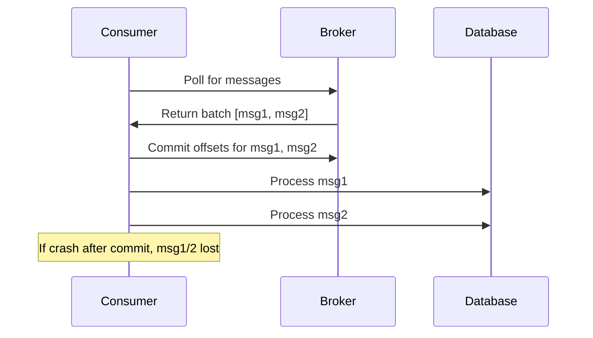

<!-- Generated by Groq via GitHub Actions -->
<!-- Topic ID: T074 -->
<!-- Category: Messaging & Event-Driven Architecture -->
<!-- Generated at UTC: 2026-10-10T07:23:09.364384+00:00 -->

# At-most-once delivery

## 1. What problem does this solve?

When a backend system receives a message (e.g., a user signup event, a payment notification, or a sensor reading), it must decide **how many times to process that message**.  
- **Problem**: If the same message is processed twice, side‑effects (e.g., charging a user twice, sending duplicate emails, or inserting duplicate rows) can corrupt data or break business rules.  
- **Why it matters**: In financial, medical, or e‑commerce systems, duplicate processing can lead to monetary loss, regulatory violations, or user frustration.  
- **What happens if it’s not used**:  
  - Duplicate records in databases.  
  - Double charges or double notifications.  
  - Inconsistent state across services.  
- **Real‑world appearance**:  
  - Payment gateways (e.g., Stripe) guarantee at‑most‑once for charge events.  
  - Email delivery services (SendGrid) use at‑most‑once to avoid duplicate emails.  
  - IoT platforms often drop duplicate sensor readings to keep storage costs low.

## 2. Mental model

**Analogy**: Think of a *single‑use ticket* for a concert.  
- You can **use it once** (enter the venue).  
- If you lose the ticket, you cannot re‑enter (ticket is gone).  
- If you try to use it twice, the system will reject the second attempt.

**Engineering model**:  
- **Consume** → **Mark as processed** → **Execute business logic**.  
- If the system crashes after marking but before executing, the message is lost (at‑most‑once).  
- If it crashes before marking, the message will be re‑queued and may be processed again (at‑least‑once).  
- At‑most‑once deliberately sacrifices reliability for simplicity and speed.

## 3. Deep explanation

| Aspect | Explanation |
|--------|-------------|
| **Internals** | Most message brokers expose two operations: *fetch* and *commit* (or *acknowledge*). In at‑most‑once, the consumer **commits** the offset **before** processing the message. |
| **Important terminology** | • **Offset** – broker‑assigned sequence number.<br>• **Commit** – persisting the offset to the broker.<br>• **Idempotency** – ability to apply the same operation multiple times without side‑effects (useful for fallback). |
| **Trade‑offs** | • **Pros**: Low latency, no duplicate processing, simple error handling.<br>• **Cons**: Potential data loss if processing fails after commit. |
| **Failure modes** | 1. **Crash after commit** → message lost.<br>2. **Crash before commit** → message re‑delivered → duplicate processing (unless idempotent). |
| **Limitations** | • Not suitable for critical data where loss is unacceptable.<br>• Requires the consumer to be idempotent or to tolerate occasional loss. |
| **Where it fits** | • Event sourcing pipelines where events are idempotent.<br>• Stateless microservices that can recover from missing events.<br>• Systems that can tolerate occasional data loss (e.g., analytics). |
| **Interaction with related concepts** | • **Exactly‑once**: adds transaction boundaries or two‑phase commits.<br>• **At‑least‑once**: commits after processing, risking duplicates.<br>• **Idempotency keys**: often paired with at‑most‑once to recover from accidental re‑processing. |

## 4. How it works

1. **Consumer polls** broker for a batch of messages.  
2. **Immediately commit** the offsets of the batch to the broker.  
3. **Process** each message in the batch.  
4. If processing fails, the message is **discarded** (lost).  
5. If processing succeeds, move to the next batch.



## 5. Practical implementation

Below is a minimal Node.js consumer using **KafkaJS** that demonstrates at‑most‑once semantics.  
It commits offsets **before** processing and uses a Redis set to deduplicate in case the consumer crashes before processing.

```ts
// atMostOnceConsumer.ts
import { Kafka, EachMessagePayload } from 'kafkajs';
import Redis from 'ioredis';

const kafka = new Kafka({
  clientId: 'order-service',
  brokers: ['kafka:9092'],
});

const consumer = kafka.consumer({ groupId: 'orders' });
const redis = new Redis(); // default localhost:6379

/**
 * Idempotent handler: writes order to DB only if not already processed.
 */
async function handleOrder(msg: EachMessagePayload) {
  const orderId = msg.message.key?.toString() ?? '';
  const orderData = JSON.parse(msg.message.value?.toString() ?? '{}');

  // Check Redis for deduplication key
  const alreadyProcessed = await redis.sismember('orders:processed', orderId);
  if (alreadyProcessed) {
    console.log(`Order ${orderId} already processed – skipping`);
    return;
  }

  // Persist to DB (pseudo‑code)
  await db.query('INSERT INTO orders (id, data) VALUES ($1, $2)', [orderId, orderData]);

  // Mark as processed
  await redis.sadd('orders:processed', orderId);
}

async function run() {
  await consumer.connect();
  await consumer.subscribe({ topic: 'orders', fromBeginning: false });

  await consumer.run({
    // `eachBatchAutoResolve` is true by default; we set it to false to control commit timing
    eachBatchAutoResolve: false,
    eachBatch: async ({ batch, resolveOffset, heartbeat, commitOffsetsIfNecessary }) => {
      // Commit offsets *before* processing
      await consumer.commitOffsets([
        { topic: batch.topic, partition: batch.partition, offset: (Number(batch.lastOffset()) + 1).toString() },
      ]);

      // Process each message
      for (const message of batch.messages) {
        try {
          await handleOrder({ topic: batch.topic, partition: batch.partition, message });
        } catch (err) {
          console.error('Processing failed', err);
          // In at-most-once we simply skip; the message is lost
        }
        // Resolve offset so consumer knows it was handled
        resolveOffset(message.offset);
      }

      await heartbeat();
      await commitOffsetsIfNecessary();
    },
  });
}

run().catch(console.error);
```

**Key lines**

- `consumer.commitOffsets([...])` – commits *before* processing.  
- Redis set `orders:processed` – protects against accidental re‑processing if the consumer crashes after commit but before processing.  
- `eachBatchAutoResolve: false` – gives us explicit control over when offsets are committed.

> **Tip**: In production, replace the Redis set with a durable deduplication store (e.g., a PostgreSQL table with a unique constraint on `order_id`).

## 6. Production considerations

| Concern | How at‑most‑once affects it | Mitigations |
|---------|---------------------------|-------------|
| **Scalability** | Low overhead: no transaction or idempotency logic per message. | Use partitioned topics and multiple consumer instances. |
| **Reliability** | Risk of data loss on crash after commit. | Acceptable for non‑critical events; otherwise add retry or fallback. |
| **Security** | No special security implications beyond broker auth. | Ensure broker and consumer are authenticated. |
| **Observability** | Harder to detect lost messages. | Emit metrics on processed vs. committed counts; use dead‑letter queues for manual inspection. |
| **Performance** | Highest throughput: commit is cheap. | Batch commits to reduce round‑trips. |
| **Error handling** | Errors after commit are silent. | Log failures; optionally publish to a “lost‑messages” topic for manual recovery. |
| **Resource usage** | Minimal: just a Redis set or DB table for dedup. | Keep dedup store small; purge old keys. |
| **Operational concerns** | Need to monitor broker health; consumer crashes lead to loss. | Use health checks, auto‑restart, and alerting on consumer lag. |
| **Failure recovery** | Lost messages cannot be recovered automatically. | Manual replay from source logs or external audit trail. |
| **Deployment** | Simple deployment; no need for distributed transaction managers. | Use container orchestration (Docker/K8s) with health probes. |

## 7. Common mistakes

| Mistake | Why it’s problematic |
|---------|----------------------|
| **Committing after processing** | Turns the consumer into at‑least‑once, causing duplicates. |
| **Assuming idempotency without testing** | Duplicate processing can still corrupt data if the handler isn’t truly idempotent. |
| **Ignoring broker retries** | Kafka may retry delivery; if you commit before processing, you’ll lose the message on a transient failure. |
| **Using in-memory dedup sets** | They are lost on restart, reintroducing duplicates. |
| **Not handling offset commit failures** | If commit fails, you may process the same batch twice. |
| **Over‑optimizing commit frequency** | Committing every message can hurt throughput; batch commits are better. |

## 8. Senior engineer perspective

When scaling at‑most‑once delivery:

- **Architecture decisions**  
  - Use **deduplication tables** with unique constraints instead of in‑memory sets.  
  - Partition topics to parallelize consumers.  
  - Consider a **dead‑letter queue** for messages that fail processing after commit.  
- **Trade‑offs**  
  - Acceptable data loss vs. complexity of exactly‑once.  
  - Cost of additional storage for dedup keys vs. risk of duplicates.  
- **Bottlenecks**  
  - Offset commit latency if broker is slow.  
  - Dedup store contention under high throughput.  
- **Failure scenarios**  
  - Broker outage → consumer stops, messages accumulate.  
  - Consumer crash after commit → lost messages.  
- **Monitoring**  
  - Lag metrics (`consumer_lag`).  
  - Ratio of committed vs. processed messages.  
  - Error rates in processing.  
- **Cost/performance**  
  - Batching commits reduces network overhead.  
  - Using Redis vs. Postgres for dedup: Redis is faster but volatile.  
- **When NOT to use**  
  - Financial transactions where loss is unacceptable.  
  - Regulatory data that must be preserved.  
  - Systems requiring audit trails of every event.

## 9. Interview questions

1. **Beginner**: *What is at‑most‑once delivery and how does it differ from at‑least‑once?*  
   *Answer*: At‑most‑once guarantees each message is processed no more than once; duplicates are avoided but messages can be lost. At‑least‑once may process a message multiple times but never loses it.

2. **Beginner**: *Why would you commit a message offset before processing it?*  
   *Answer*: To ensure the broker marks the message as delivered, preventing re‑delivery on consumer restart. It trades reliability for simplicity.

3. **Senior**: *Explain how you would design a system that needs at‑most‑once delivery for non‑critical analytics events but exactly‑once for financial transactions.*  
   *Answer*: Use separate topics/queues: one with at‑most‑once semantics and a dedup table; another with transactional guarantees (e.g., Kafka with transactional producer/consumer or a relational DB with ACID). Discuss partitioning, consumer groups, and idempotency.

4. **Senior**: *What are the main failure modes of an at‑most‑once consumer and how can you mitigate them?*  
   *Answer*: Crash after commit → loss; crash before commit → duplicate. Mitigations: commit before processing, use idempotent handlers, maintain dedup keys in durable store, monitor lag, use dead‑letter queues.

5. **Scenario/Debugging**: *You deployed an at‑most‑once consumer that suddenly stops processing new messages. Logs show that offsets are being committed but no processing occurs. What could be wrong?*  
   *Answer*: Possible causes: consumer crashed after commit, processing code threw an exception before `resolveOffset`, consumer is blocked on a resource (e.g., DB lock), or the consumer is not consuming due to group rebalancing. Check health probes, consumer lag, and exception logs.

## 10. Hands‑on task

**Task**: Build a small Node.js service that consumes a Kafka topic `user-registrations` using at‑most‑once semantics.  
- Commit offsets before processing.  
- Store processed user IDs in Redis to avoid accidental re‑processing if the consumer crashes after commit.  
- Log each processed user and the time it was processed.  
- Expose a `/metrics` endpoint (Prometheus) that reports the number of processed vs. committed messages.

**Deliverables**:  
- `consumer.ts` implementing the logic.  
- Dockerfile to run Kafka, Redis, and the consumer.  
- A simple script to produce test messages to `user-registrations`.  
- A README with instructions to run the stack locally.

## 11. Quick revision

- **At‑most‑once**: commit before processing → no duplicates, possible loss.  
- **Offset commit**: broker‑side marker of “delivered”.  
- **Deduplication**: idempotent handlers or persistent dedup keys.  
- **Trade‑off**: speed & simplicity vs. data loss.  
- **Common pitfall**: committing after processing → duplicates.  
- **Use cases**: analytics, logs, non‑critical events.  
- **Monitoring**: consumer lag, processed/committed ratio, error rates.  
- **Mitigation**: dead‑letter queue, durable dedup store, graceful shutdown.  
- **When to avoid**: financial, regulatory, audit‑required data.  
- **Key libraries**: KafkaJS, ioredis, Prometheus client.  
- **Deployment**: Docker/K8s with health probes, auto‑restart.

## 12. References

- [KafkaJS – Consumer](https://kafka.js.org/docs/consumers)  
- [Kafka – Exactly‑Once Semantics](https://kafka.apache.org/documentation/streams/streams-application-configuration.html#streams-application-configuration-transactional)  
- [Redis – Sets](https://redis.io/docs/data-types/set/)  
- [Prometheus – Client for Node.js](https://github.com/siimon/prom-client)  
- [Node.js – Streams and Event Loop](https://nodejs.org/api/stream.html)  
- [Kafka – Consumer Offsets](https://kafka.apache.org/documentation/#consumerconfigs_auto.commit.enable)  

---
