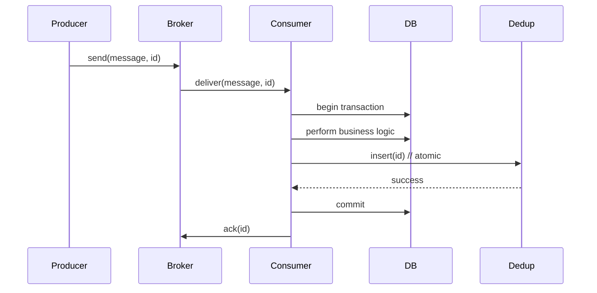

<!-- Generated by Groq via GitHub Actions -->
<!-- Topic ID: T075 -->
<!-- Category: Messaging & Event-Driven Architecture -->
<!-- Generated at UTC: 2026-10-10T17:56:18.703240+00:00 -->

# Exactly‑once semantics

## 1. What problem does this solve?

* **Duplicate processing** – A message can be delivered more than once (network retries, broker replication, consumer crashes).  
* **Lost processing** – A message can be dropped if the consumer fails before acknowledging it.  
* **State corruption** – Re‑processing the same event can corrupt aggregates, double‑charge a user, or create duplicate records.

**Why it matters**

* Financial services, inventory, booking systems, and any domain where *idempotency* is not enough need guarantees that an operation happens once.
* Without it, downstream systems may see inconsistent data, violating business rules and user expectations.

**What happens if it’s not used**

* Duplicate charges, double‑created orders, inventory over‑commitment, or stale data.
* Hard‑to‑debug bugs that appear only under load or failure conditions.

**Where it appears**

* Message brokers (Kafka, RabbitMQ, SQS) – “exactly‑once delivery” flags.  
* Event‑sourced systems – each event must be applied once.  
* Payment gateways – a payment must be captured only once.  
* Microservice orchestration – a saga step must not repeat.

---

## 2. Mental model

**Analogy – The Postal Service**

| Postal Service | Exactly‑once semantics |
|----------------|------------------------|
| A letter is stamped, placed in a bin, and the postal worker guarantees it will be delivered to the correct address **once**. If the delivery fails, the letter is retried until it reaches the mailbox. | A message is sent to a queue; the consumer guarantees it will process the message **once**. If the consumer crashes, the message is retried until the operation succeeds. |

**Engineering model**

1. **Producer** writes a message with a *unique id* (e.g., UUID).  
2. **Broker** stores the message and may replicate it.  
3. **Consumer** reads the message, performs the side‑effect, and **atomically** records the id as “processed”.  
4. If the consumer crashes before recording the id, the message is retried.  
5. If the consumer records the id *before* performing the side‑effect, a *deduplication* check prevents re‑execution.

---

## 3. Deep explanation

### Internals

| Component | Responsibility |
|-----------|----------------|
| **Message broker** | Stores and forwards messages; may provide transactional guarantees (e.g., Kafka’s “exactly‑once” semantics). |
| **Consumer** | Reads messages, performs business logic, writes to a persistent store, and records the message id. |
| **Deduplication store** | A table or key‑value store that keeps a record of processed ids. |
| **Transactional outbox** | A pattern where the producer writes the event to an outbox table *inside* the same transaction that updates the domain state. |

### Important terminology

* **Idempotent operation** – Re‑executing it yields the same result.  
* **Exactly‑once delivery** – The broker guarantees a message is delivered once to each consumer group.  
* **Exactly‑once processing** – The consumer guarantees the side‑effect occurs once.  
* **Transactional outbox** – Decouples event publishing from domain updates while preserving atomicity.  
* **Two‑phase commit (2PC)** – Classic distributed transaction protocol (rarely used in modern microservices).  

### Trade‑offs

| Trade‑off | Pros | Cons |
|-----------|------|------|
| **Strict 2PC** | Strong consistency | High latency, single point of failure |
| **Outbox + CDC** | Decoupled, scalable | Requires additional infrastructure (CDC tool) |
| **Idempotent handlers** | Simple, no extra storage | Must design every handler to be idempotent |
| **Exactly‑once broker** | Offloads complexity | Still need deduplication for side‑effects |

### Failure modes

1. **Consumer crash after processing but before recording id** – Duplicate processing on restart.  
2. **Consumer crash before processing** – Message is retried; safe if idempotent.  
3. **Broker partition** – Duplicate messages may be emitted.  
4. **Deduplication store failure** – Cannot confirm uniqueness; may lead to duplicates or missed events.

### Limitations

* No distributed system can guarantee *true* exactly‑once in the presence of network partitions without sacrificing availability (CAP theorem).  
* Requires additional storage and transaction boundaries.  
* Adds latency: the consumer must wait for the deduplication write to commit.

### Where it fits

* **Event‑driven architecture** – Each event is processed once to maintain aggregate consistency.  
* **Microservice communication** – Service A publishes an event; Service B consumes it exactly once.  
* **Database writes** – Avoid duplicate rows or double‑charged rows.

### Interaction with related concepts

* **Idempotency** – Exactly‑once is a stronger guarantee; idempotent handlers can be used as a fallback.  
* **Event sourcing** – Each event is an immutable record; duplicates break the event log.  
* **Saga patterns** – Compensation actions must be idempotent; exactly‑once ensures the saga step is not retried unnecessarily.  
* **CQRS** – Command handlers must be idempotent; query side can rely on event ordering.

---

## 4. How it works



* **Step 1** – Producer sends a message with a unique id.  
* **Step 2** – Broker delivers the message.  
* **Step 3** – Consumer starts a transaction that includes both the business logic and the deduplication record.  
* **Step 4** – If the transaction commits, the id is stored and the broker is acknowledged.  
* **Step 5** – If the consumer crashes before commit, the broker will retry; the dedup check prevents re‑execution.

---

## 5. Practical implementation

Below is a minimal Node.js example using **Kafka** (kafkajs) and **PostgreSQL** (pg).  
It demonstrates an outbox pattern with a deduplication table.

```ts
// src/consumer.ts
import { Kafka, EachMessagePayload } from 'kafkajs';
import { Pool } from 'pg';

const kafka = new Kafka({ brokers: ['localhost:9092'] });
const consumer = kafka.consumer({ groupId: 'orders' });

const pool = new Pool({
  connectionString: process.env.DATABASE_URL,
});

async function run() {
  await consumer.connect();
  await consumer.subscribe({ topic: 'order-events', fromBeginning: true });

  await consumer.run({
    eachMessage: async ({ topic, partition, message }: EachMessagePayload) => {
      const msgId = message.key?.toString(); // unique id
      const payload = JSON.parse(message.value?.toString() || '{}');

      // 1️⃣ Start a transaction
      const client = await pool.connect();
      try {
        await client.query('BEGIN');

        // 2️⃣ Check deduplication
        const { rowCount } = await client.query(
          'SELECT 1 FROM processed_events WHERE event_id = $1',
          [msgId]
        );
        if (rowCount > 0) {
          // Already processed – skip
          await client.query('COMMIT');
          return;
        }

        // 3️⃣ Perform business logic (e.g., create order)
        await client.query(
          'INSERT INTO orders (id, user_id, amount) VALUES ($1, $2, $3)',
          [payload.orderId, payload.userId, payload.amount]
        );

        // 4️⃣ Record the event id
        await client.query(
          'INSERT INTO processed_events (event_id, processed_at) VALUES ($1, NOW())',
          [msgId]
        );

        // 5️⃣ Commit transaction
        await client.query('COMMIT');

        // 6️⃣ Ack the message
        await consumer.commitOffsets([
          { topic, partition, offset: (parseInt(message.offset) + 1).toString() },
        ]);
      } catch (err) {
        await client.query('ROLLBACK');
        console.error('Processing failed', err);
        // Let the consumer retry (no ack)
      } finally {
        client.release();
      }
    },
  });
}

run().catch(console.error);
```

**Key points**

* The `processed_events` table holds the unique `event_id`.  
* The entire operation is wrapped in a single PostgreSQL transaction, ensuring atomicity.  
* If the consumer crashes after the business logic but before the dedup record, the transaction aborts and the message is retried.  
* If the consumer crashes after the dedup record but before the business logic, the transaction aborts, but the dedup record is *not* committed, so the message will be retried.  
* The consumer only acknowledges the message after the transaction commits, guaranteeing at‑least‑once delivery from Kafka and exactly‑once processing.

---

## 6. Production considerations

| Concern | What to watch for | Mitigation |
|---------|-------------------|------------|
| **Scalability** | Dedup table can grow large; index on `event_id`. | Partition the table, use `ON CONFLICT DO NOTHING` to avoid locking. |
| **Reliability** | Broker crashes, network partitions. | Use Kafka’s `enable.idempotence` and `transactional.id` for producer; enable `exactly_once` in consumer. |
| **Security** | Exposing event ids. | Encrypt sensitive payloads; use TLS for Kafka and DB connections. |
| **Observability** | Hard to see duplicate attempts. | Emit metrics (`processed_events_total`, `duplicate_events_total`). |
| **Performance** | Transaction overhead. | Batch writes, use `INSERT ... ON CONFLICT` to reduce round‑trips. |
| **Error handling** | Partial failures. | Retry with exponential backoff; circuit breaker for DB. |
| **Resource usage** | Extra storage for dedup table. | TTL on `processed_events` (e.g., 30 days) if idempotency window is limited. |
| **Operational concerns** | Schema migrations. | Use migration tools (Flyway, Prisma). |
| **Failure recovery** | Consumer stuck on a bad message. | Dead‑letter queue; manual intervention. |
| **Deployment** | Consistent configuration across environments. | Use environment variables, secrets manager. |

---

## 7. Common mistakes

| Mistake | Why it’s problematic |
|---------|----------------------|
| **Assuming idempotency is enough** | Idempotent handlers still need deduplication if the side‑effect is not naturally idempotent (e.g., sending an email). |
| **Auto‑committing Kafka offsets** | Offsets may be committed before the DB transaction, leading to lost processing. |
| **Using in‑memory dedup** | Process restarts lose state → duplicates. |
| **Ignoring transaction boundaries** | Partial writes can corrupt aggregates. |
| **Not handling broker retries** | Duplicate messages can be emitted; dedup table must handle them. |
| **Over‑optimizing for speed** | Skipping dedup checks for performance → duplicates. |
| **Using 2PC without understanding CAP** | May cause outages under network partitions. |

---

## 8. Senior engineer perspective

### What changes at scale?

* **Architecture decisions** – Choose between *Transactional outbox + CDC* (Kafka Connect) or *Kafka exactly‑once* with idempotent producers.  
* **Bottlenecks** – The deduplication store becomes a hotspot; consider sharding or a distributed cache (Redis).  
* **Failure scenarios** – Network partitions can cause duplicate messages; design for graceful degradation.  
* **Monitoring** – Track lag, duplicate rates, dedup table growth, and transaction commit times.  
* **Cost/performance** – Extra storage for dedup keys, extra DB connections, and potential lock contention.  
* **When NOT to use** – Simple CRUD services with low traffic; idempotent handlers may suffice.  

### Design checklist

1. **Unique event id** – UUID or deterministic hash.  
2. **Atomic write** – Same transaction for business logic + dedup.  
3. **Idempotent side‑effects** – Where possible, make operations naturally idempotent.  
4. **Retention policy** – Clean up dedup table after a safe window.  
5. **Testing** – Simulate crashes after each step to ensure recovery.  

---

## 9. Interview questions

1. **Beginner** – *What is the difference between idempotent operations and exactly‑once semantics?*  
   *Answer:* Idempotent means re‑executing yields the same result; exactly‑once guarantees the operation is performed only once, regardless of retries or failures.

2. **Beginner** – *Why do we need a deduplication table when using Kafka’s exactly‑once delivery?*  
   *Answer:* Kafka guarantees message delivery to the consumer, but the consumer’s side‑effect (e.g., DB write) may not be idempotent. The dedup table ensures the side‑effect is applied only once.

3. **Senior** – *Explain the outbox pattern and how it helps achieve exactly‑once semantics in a microservice architecture.*  
   *Answer:* The service writes both the domain change and the event to an outbox table within the same transaction. A separate CDC process streams the outbox to Kafka, guaranteeing that the event is published only if the domain change succeeded, thus decoupling event publishing from business logic while preserving atomicity.

4. **Senior** – *What are the trade‑offs between using Kafka’s transactional API versus a transactional outbox with CDC?*  
   *Answer:* Kafka transactions provide end‑to‑end atomicity but require the producer to be idempotent and can add latency. The outbox + CDC pattern decouples the producer from the broker, scales better, and works with any broker, but introduces extra infrastructure and a lag between the outbox write and event publication.

5. **Scenario/Debugging** – *A consumer processes a message, writes to the database, but crashes before committing the deduplication record. The message is retried and processed again, causing duplicate rows. How would you fix this?*  
   *Answer:* Wrap the business logic and dedup record insertion in a single database transaction. Commit only after both succeed. Alternatively, use `INSERT … ON CONFLICT DO NOTHING` on the dedup table and make the business logic idempotent.

---

## 10. Hands‑on task

**Task:**  
Implement a simple “order‑processor” service that consumes `order-created` events from a Kafka topic and writes orders to PostgreSQL, ensuring exactly‑once semantics.

1. Create a PostgreSQL table `orders` and `processed_events`.  
2. Write a Node.js consumer (using kafkajs) that:
   * Reads messages with a unique `event_id`.  
   * Starts a transaction, inserts the order, inserts the `event_id` into `processed_events`.  
   * Commits the transaction and acknowledges the message.  
3. Test by sending the same message twice and verifying only one order row is created.  
4. Add a simple metric (e.g., using `prom-client`) that counts duplicate attempts.

---

## 11. Quick revision

- **Exactly‑once** = message delivered *and* processed only once.  
- Requires **unique event ids** and **deduplication**.  
- Use **transactions** to atomically write business data + dedup record.  
- Kafka’s *exactly‑once* delivery is broker‑side; consumer must still ensure side‑effect idempotency.  
- **Outbox + CDC** decouples publishing from business logic.  
- **Idempotent handlers** are a fallback but not a replacement.  
- **Failure modes**: consumer crash before commit → retry; after commit → duplicate if dedup missing.  
- **Performance**: index `processed_events.event_id`; consider TTL.  
- **Monitoring**: track duplicate events, consumer lag, transaction commit times.  
- **Common pitfall**: auto‑committing offsets before DB commit.  
- **When not to use**: low‑traffic CRUD services; idempotent operations suffice.  

---

## 12. References

- Kafka – Exactly‑once semantics: https://kafka.apache.org/documentation/#exactly_once  
- KafkaJS documentation: https://kafka.js.org/docs  
- PostgreSQL – Transactions: https://www.postgresql.org/docs/current/transaction-iso.html  
- Outbox pattern: https://microservices.io/patterns/data/transactional-outbox.html  
- Prometheus client for Node.js: https://github.com/siimon/prom-client  
- Node.js pg module: https://node-postgres.com/  

*(All URLs are official or widely accepted resources.)*
