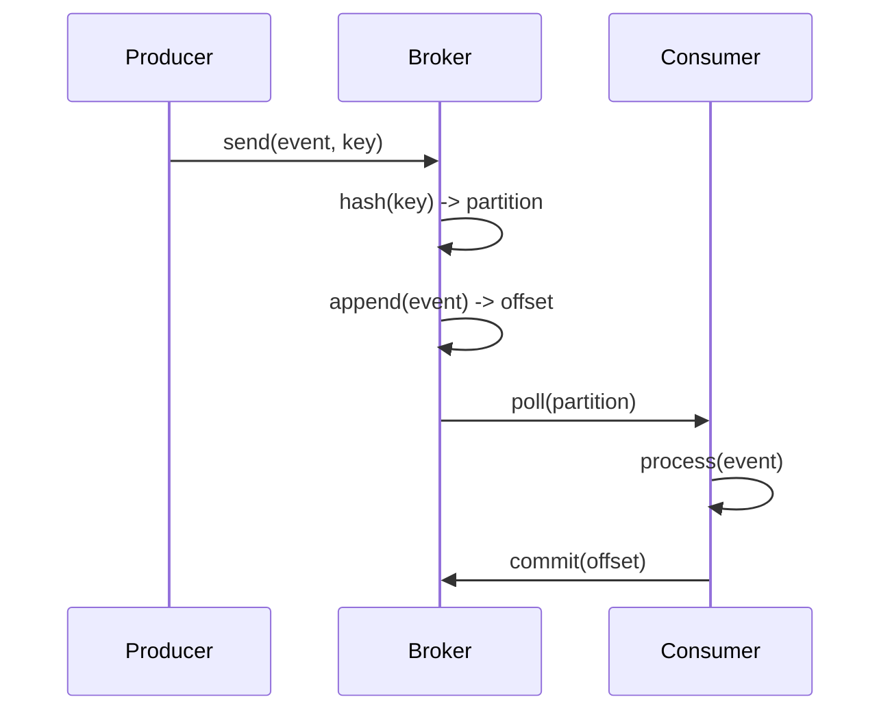

<!-- Generated by Groq via GitHub Actions -->
<!-- Topic ID: T076 -->
<!-- Category: Messaging & Event-Driven Architecture -->
<!-- Generated at UTC: 2026-10-10T17:56:18.703240+00:00 -->

# Ordering

## 1. What problem does this solve?

**Motivation**  
In distributed systems, operations often happen in parallel and messages can arrive out of the order they were sent. For many business scenarios the *sequence* of events matters: a payment must be processed after an order is created, inventory must be decremented after a successful payment, etc. Without a clear ordering guarantee, the system can end up in an inconsistent state, double‑charge a customer, or ship the wrong quantity of a product.

**What problem exists?**  
- Concurrent producers write to a shared channel (Kafka topic, Redis stream, HTTP queue).  
- Consumers read from that channel, but the underlying transport may deliver messages in any order.  
- Business logic that assumes a specific order (e.g., “first create, then update”) can fail.

**Why the problem matters**  
- **Data integrity**: Wrong order can corrupt state.  
- **User experience**: Duplicate or missing actions cause confusion.  
- **Compliance**: Financial systems must maintain audit trails in the correct order.  
- **Debugging**: Harder to reproduce bugs when order is nondeterministic.

**What happens if ordering is not used?**  
- Race conditions: Two consumers process the same event concurrently.  
- Inconsistent state: Inventory may go negative, orders may be double‑charged.  
- Hard-to‑track bugs: Non‑deterministic failures that appear only under load.

**Where this concept appears in real backend systems**  
- E‑commerce order pipelines (order → payment → inventory).  
- Event sourcing / CQRS architectures.  
- Microservice orchestration (Saga patterns).  
- Distributed caches that rely on sequential updates (e.g., Redis Streams).  
- AI inference pipelines where model updates must be applied in order.

---

## 2. Mental model

**Simple analogy**  
Think of a **train schedule** on a single track. Trains (messages) must arrive in the order they depart to avoid collisions. If two trains arrive at the same time, the schedule (ordering) ensures one waits until the other passes.

**Engineering model**  
- **Key‑based partitioning**: All messages with the same key go to the same partition (track).  
- **Sequential consumption**: A consumer reads messages from a partition in the order they were written.  
- **Ordering guarantee**: Within a partition, the broker guarantees that the consumer sees messages in the same order they were produced.  
- **Global ordering**: Requires all messages to share the same key or a special ordering protocol; otherwise, different partitions are independent.

---

## 3. Deep explanation

### Internals
- **Broker** (Kafka, Pulsar, NATS Streaming) stores messages in *partitions* (log segments).  
- Each partition is an append‑only ordered log.  
- Messages are assigned a monotonically increasing **offset**.  
- Consumers track the last committed offset to resume after failures.

### Important terminology
| Term | Meaning |
|------|---------|
| **At‑least‑once** | Consumer may receive a message multiple times. |
| **At‑most‑once** | Consumer may lose a message but never duplicate. |
| **Exactly‑once** | Consumer receives each message exactly once (hard to guarantee in distributed systems). |
| **Causal ordering** | If event A causally precedes event B, all consumers see A before B. |
| **Total ordering** | All consumers see all messages in the same global order. |
| **Partition key** | Value used to decide which partition a message goes to. |
| **Offset** | Position of a message within a partition. |
| **Consumer group** | Set of consumers that share the load of a topic. |

### Trade‑offs
| Aspect | Benefit | Cost |
|--------|---------|------|
| **Partition count** | Higher throughput, parallelism | Harder to maintain global ordering |
| **Key‑based ordering** | Simple, per‑key ordering | Requires careful key design |
| **Exactly‑once** | No duplicates | Complex transaction handling, higher latency |
| **Batching** | Throughput | Potential ordering gaps if batch boundaries cross partitions |

### Failure modes
- **Out‑of‑order delivery**: Happens when messages are produced to different partitions and consumers read them concurrently.  
- **Duplicate messages**: Due to retries or at‑least‑once semantics.  
- **Lost messages**: If broker crashes before replication or consumer fails to commit offset.  
- **Partition rebalancing**: During consumer group rebalancing, offsets may be lost if not persisted.

### Limitations
- Global ordering is expensive; most systems accept per‑key ordering.  
- Exactly‑once semantics require idempotent processing or transactional writes.  
- High throughput often forces trade‑offs with strict ordering.

### Where it fits in a backend architecture
- **Event‑driven microservices**: Services publish domain events; ordering ensures downstream services react correctly.  
- **CQRS**: Command handlers write to an event log; query side reads events in order to build read models.  
- **Saga orchestration**: Steps of a saga must execute in sequence; ordering guarantees correct compensation.

### Interaction with related concepts
- **Idempotency**: Needed when at‑least‑once delivery is used.  
- **Dead‑letter queues**: Capture messages that cannot be processed after retries.  
- **Transactional outbox**: Write events to a DB table in the same transaction as domain changes to guarantee ordering.  
- **Compensation actions**: Rely on ordering to roll back previous steps.

---

## 4. How it works

1. **Producer** serializes an event and assigns a **key** (e.g., `userId`).  
2. The broker hashes the key to pick a **partition**.  
3. The event is appended to the partition log, receiving an **offset**.  
4. **Consumer group** polls the partition.  
5. The consumer reads events sequentially, processes them, and **commits** the offset.  
6. If the consumer crashes, the group rebalances and another consumer resumes from the last committed offset, preserving order.



---

## 5. Practical implementation

Below is a minimal Node.js example using **KafkaJS** that demonstrates per‑key ordering.

```ts
// kafka-ordering.ts
import { Kafka, logLevel } from 'kafkajs';

const kafka = new Kafka({
  clientId: 'order-service',
  brokers: ['localhost:9092'],
  logLevel: logLevel.INFO,
});

const producer = kafka.producer();
const consumer = kafka.consumer({ groupId: 'order-group' });

async function run() {
  await producer.connect();
  await consumer.connect();

  // Consume from the same topic with per‑key ordering
  await consumer.subscribe({ topic: 'orders', fromBeginning: true });

  consumer.run({
    eachMessage: async ({ topic, partition, message }) => {
      const key = message.key?.toString() ?? 'unknown';
      const value = message.value?.toString() ?? '{}';
      console.log(`Received on partition ${partition} key=${key}: ${value}`);

      // Simulate idempotent processing
      await processOrder(JSON.parse(value));

      // Commit offset automatically after eachMessage resolves
    },
  });

  // Produce a batch of events for the same user (key)
  const userId = 'user-123';
  for (let i = 1; i <= 5; i++) {
    await producer.send({
      topic: 'orders',
      messages: [
        {
          key: userId,
          value: JSON.stringify({ orderId: i, userId, amount: 10 * i }),
        },
      ],
    });
    console.log(`Sent order ${i} for ${userId}`);
  }
}

async function processOrder(order: any) {
  // Idempotent write to PostgreSQL (pseudo‑code)
  // INSERT INTO orders (id, user_id, amount) VALUES (...) ON CONFLICT DO NOTHING;
  console.log(`Processing order ${order.orderId}`);
  // Simulate async DB write
  await new Promise((r) => setTimeout(r, 100));
}

run().catch(console.error);
```

**Key points**

- `key` ensures all messages for a user go to the same partition → per‑user ordering.  
- `consumer.run` automatically commits offsets after each message is processed.  
- If a consumer crashes, the group rebalances and another consumer continues from the last committed offset.  

### Using Redis Streams (alternative)

```ts
// redis-ordering.ts
import { createClient } from 'redis';

const client = createClient();
await client.connect();

const streamKey = 'orders';

async function produce(userId: string, orderId: number) {
  await client.xAdd(streamKey, '*', {
    userId,
    orderId: orderId.toString(),
  });
}

async function consume() {
  let lastId = '0-0';
  while (true) {
    const entries = await client.xRead(
      { key: streamKey, id: lastId },
      { block: 5000, count: 10 }
    );
    if (!entries) continue;
    for (const [stream, messages] of entries) {
      for (const [id, fields] of messages) {
        console.log(`Processing ${JSON.stringify(fields)} from ${id}`);
        lastId = id;
        // Process order idempotently
      }
    }
  }
}
```

Redis Streams guarantee ordering per stream; you can use consumer groups for parallelism while preserving order per consumer group.

---

## 6. Production considerations

| Concern | How ordering impacts it | Mitigation |
|---------|------------------------|------------|
| **Scalability** | Partition count limits parallelism; too few partitions → bottleneck. | Increase partitions, but keep key distribution balanced. |
| **Reliability** | Replication factor ensures durability; offset commits guarantee no reprocessing. | Use `acks=all` for producer, commit offsets only after successful processing. |
| **Security** | Sensitive data may be in messages; ordering may expose patterns. | Encrypt payloads, use TLS, apply ACLs on topics. |
| **Observability** | Lag metrics show ordering delays. | Export consumer lag, offset metrics to Prometheus. |
| **Performance** | Batching improves throughput but can introduce small ordering gaps. | Batch within partition, keep batch size tuned. |
| **Error handling** | Duplicate messages due to retries. | Idempotent writes, deduplication tables. |
| **Resource usage** | Large partitions consume disk; high throughput uses CPU. | Tune retention, compression, and consumer parallelism. |
| **Operational** | Rebalancing can pause consumers. | Use `session.timeout.ms` and `heartbeat.interval.ms` to reduce churn. |
| **Failure recovery** | Broker crash → need to replay from last committed offset. | Store offsets in a durable store (Kafka’s internal or external). |
| **Deployment** | Containerized brokers need persistent storage. | Use stateful sets or managed services. |

---

## 7. Common mistakes

| Mistake | Why it’s problematic |
|---------|----------------------|
| **Assuming global ordering** | Kafka guarantees ordering only within a partition; cross‑partition ordering is not preserved. |
| **Ignoring the key** | Without a key, messages are round‑robin across partitions → out‑of‑order per entity. |
| **Not committing offsets** | On restart, consumer re‑processes messages → duplicates. |
| **Using at‑most‑once semantics for critical events** | Messages may be lost, leading to missing state changes. |
| **Over‑loading a single consumer** | Causes high latency; ordering guarantees are per consumer, not per partition. |
| **Not handling duplicate events** | Idempotency is required when using at‑least‑once delivery. |
| **Using small batch sizes** | Increases overhead; may hurt throughput. |
| **Not monitoring lag** | High lag can indicate ordering bottlenecks or consumer lag. |

---

## 8. Senior engineer perspective

### What changes at scale?

- **Partition strategy**: Must balance throughput and ordering. Often use composite keys (e.g., `userId#orderId`) to keep related events together.  
- **Consumer group design**: Multiple consumers per group can process different partitions in parallel, but each partition remains ordered.  
- **Exactly‑once semantics**: Implemented via transactional outbox + Kafka transactions or via idempotent database writes.  
- **Monitoring**: Lag, throughput, error rates, and consumer health become critical.  
- **Cost**: More partitions → more broker resources; larger retention → more storage costs.  

### Design decisions

| Decision | Trade‑offs |
|----------|------------|
| **Kafka vs NATS** | Kafka offers strong ordering and durability; NATS is lighter but weaker ordering guarantees. |
| **Transactional outbox** | Adds complexity but ensures atomicity between domain changes and event publication. |
| **Global vs per‑entity ordering** | Global ordering is expensive; per‑entity ordering is usually sufficient. |
| **Offset storage** | Internal Kafka vs external store (e.g., PostgreSQL) affects recovery time. |
| **Batch size** | Larger batches improve throughput but increase latency for the first message. |

### Bottlenecks

- **Single partition**: All traffic funnels through one log → CPU, disk I/O bottleneck.  
- **Consumer lag**: If consumers cannot keep up, ordering is preserved but latency grows.  
- **Network partitions**: Can split a cluster, causing divergent orderings until healed.

### Failure scenarios

- **Broker crash**: Replicas take over; offsets may be lost if not committed.  
- **Network partition**: Consumers may read stale data; need to handle split‑brain.  
- **Consumer crash**: Offsets may be lost; rebalancing may cause duplicate processing.

### Monitoring

- **Consumer lag** (`kafka-consumer-lag`).  
- **Throughput** (`kafka-consumer-throughput`).  
- **Error rates** (`kafka-consumer-errors`).  
- **Replication lag** for brokers.

### When NOT to use ordering

- Low‑volume, simple CRUD services where eventual consistency is acceptable.  
- Stateless microservices that do not depend on event sequence.  
- Use a simple queue (e.g., RabbitMQ) if you need strict ordering but can tolerate lower throughput.

---

## 9. Interview questions

1. **Beginner**: *What is the difference between “at‑least‑once” and “at‑most‑once” delivery guarantees?*  
   *Answer*:  
   - *At‑least‑once*: Consumer may receive a message multiple times; must handle duplicates.  
   - *At‑most‑once*: Consumer may lose a message but never receives duplicates; risk of missing data.

2. **Beginner**: *How does a Kafka partition key affect message ordering?*  
   *Answer*:  
   - Messages with the same key are routed to the same partition.  
   - Within that partition, the broker guarantees the order of messages.  
   - Different keys may go to different partitions, breaking global ordering.

3. **Senior**: *Explain how you would implement exactly‑once semantics in a Kafka‑based system that writes to a relational database.*  
   *Answer*:  
   - Use a transactional outbox pattern: write domain changes and event to an outbox table in the same DB transaction.  
   - A separate Kafka producer reads the outbox and publishes events within a Kafka transaction.  
   - The consumer processes the event and marks the outbox row as processed.  
   - This ensures atomicity between DB write and event publication.

4. **Senior**: *What are the main trade‑offs when choosing the number of partitions for a topic that requires per‑user ordering?*  
   *Answer*:  
   - More partitions → higher parallelism and throughput but harder to keep key distribution balanced.  
   - Fewer partitions → easier to maintain ordering but risk of bottlenecks.  
   - Must consider key cardinality, expected load, and consumer group scaling.

5. **Scenario/Debugging**: *You notice that orders for a particular user are being processed out of sequence. What could be causing this and how would you investigate?*  
   *Answer*:  
   - Likely the user’s events are being routed to different partitions (wrong key).  
   - Check the producer’s key logic; ensure it uses a stable key (e.g., `userId`).  
   - Inspect the topic’s partition assignment; verify that all events for that user share the same key.  
   - Use Kafka’s `kafka-console-consumer` with `--partition` to see ordering per partition.  
   - If using multiple consumers, ensure they belong to the same consumer group and that rebalancing hasn’t caused duplicate processing.

---

## 10. Hands‑on task

**Goal**: Build a simple order service that consumes order events from Kafka, ensures per‑user ordering, writes to PostgreSQL, and exposes a REST endpoint to query the latest order status.

**Steps**

1. **Setup**  
   - Run a local Kafka broker (Docker compose).  
   - Create topic `orders` with 3 partitions.  
   - Spin up PostgreSQL (Docker).

2. **Producer**  
   - Implement a Node.js script that publishes 10 orders for two users (`user-1`, `user-2`) with the same key per user.  
   - Verify that all messages for a user go to the same partition.

3. **Consumer**  
   - Consume from `orders` topic.  
   - For each message, insert into `orders` table (`id`, `user_id`, `amount`, `status`).  
   - Use `ON CONFLICT DO NOTHING` to make it idempotent.

4. **REST API**  
   - Create a Next.js API route `/api/orders/:userId` that returns the latest order for the user.  
   - Use Prisma or `pg` client to query PostgreSQL.

5. **Testing**  
   - Produce events out of order (e.g., send order 3 before order 2).  
   - Verify that the consumer processes them in the correct order per user.  
   - Simulate a consumer crash and restart; ensure no duplicate orders.

6. **Observability**  
   - Log consumer lag and offset commits.  
   - Expose metrics via `/metrics` endpoint.

**Deliverables**:  
- `producer.ts`, `consumer.ts`, `pages/api/orders/[userId].ts`.  
- Docker compose file.  
- README with instructions.

---

## 11. Quick revision

- Ordering guarantees are **per‑partition**; global ordering requires all messages share the same key.  
- Use a **partition key** to route related events to the same partition.  
- Kafka guarantees **in‑order delivery** within a partition.  
- **Exactly‑once** semantics need transactional outbox or idempotent writes.  
- **Consumer lag** is the primary metric for ordering health.  
- **Rebalancing** can pause consumers; tune session timeout.  
- **Duplicate messages** are common with at‑least‑once; implement idempotency.  
- **Partition count** balances throughput vs ordering complexity.  
- **Monitoring**: offset lag, throughput, error rates, replication lag.  
- **Security**: TLS, ACLs, encryption of payloads.  
- **Scalability**: add partitions, scale consumer groups, but keep key distribution balanced.  
- **Failure recovery**: commit offsets after processing, use external offset store if needed.  

---

## 12. References

- Kafka documentation – Ordering guarantees: https://kafka.apache.org/documentation/#ordering  
- KafkaJS – Producer and consumer examples: https://kafka.js.org/docs/producer  
- Redis Streams ordering: https://redis.io/docs/manual/data-types/streams/  
- PostgreSQL idempotent inserts: https://www.postgresql.org/docs/current/sql-insert.html#SQL-INSERT-ON-CONFLICT  
- Kafka transactional outbox pattern: https://github.com/streamnative/kafka-transactional-outbox  
- Prometheus Kafka exporter: https://github.com/danielqsj/kafka_exporter  
- NATS vs Kafka comparison: https://nats.io/blog/nats-vs-kafka/  
- Docker Compose for Kafka: https://github.com/bitnami/bitnami-docker-kafka/blob/main/docker-compose.yml

---
